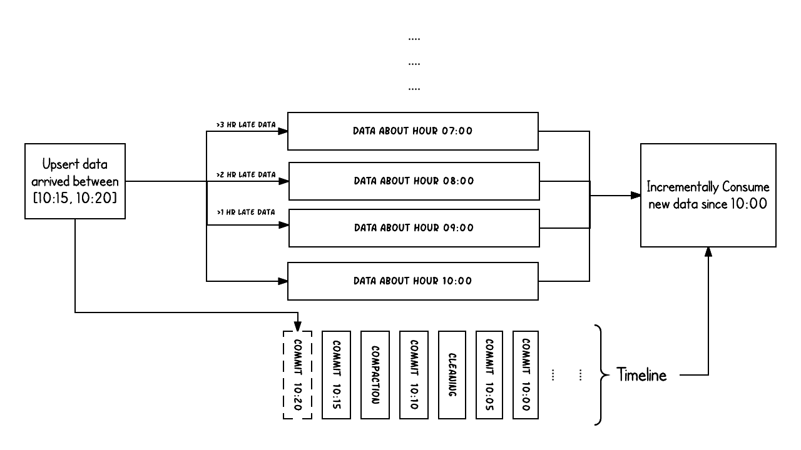
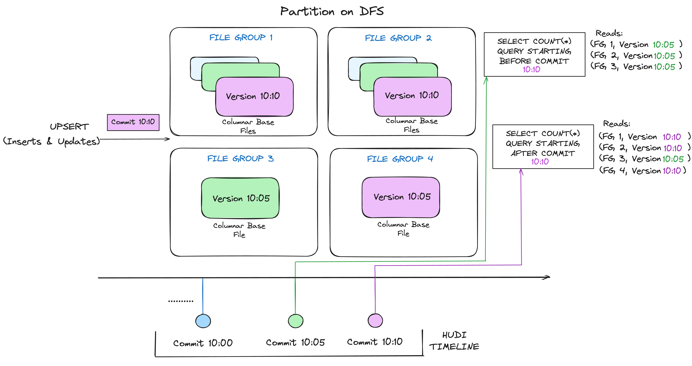
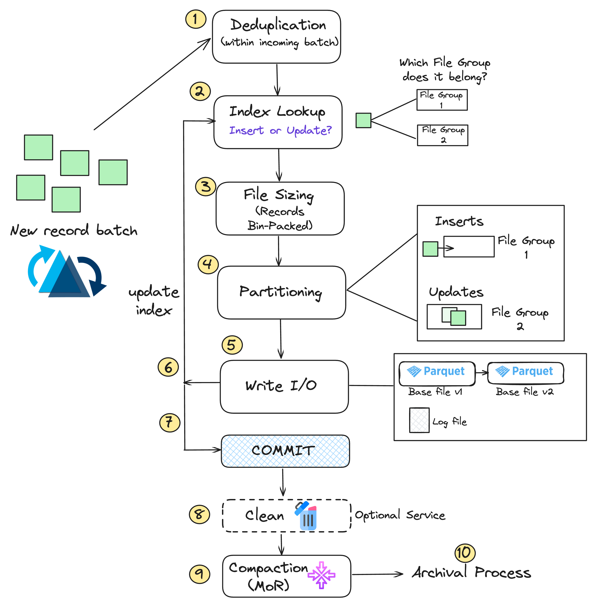
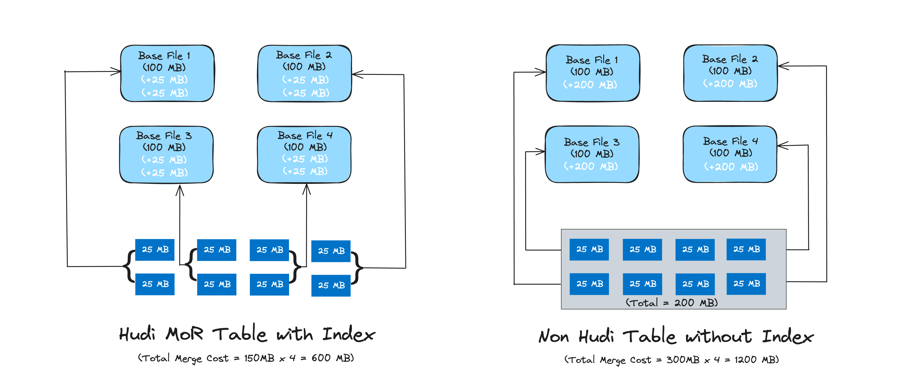
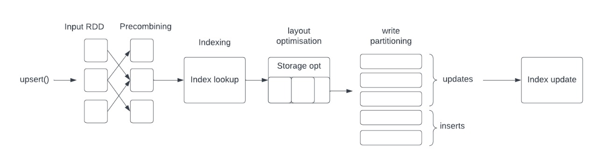
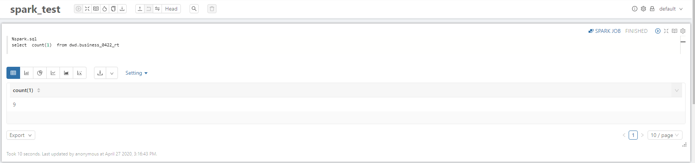
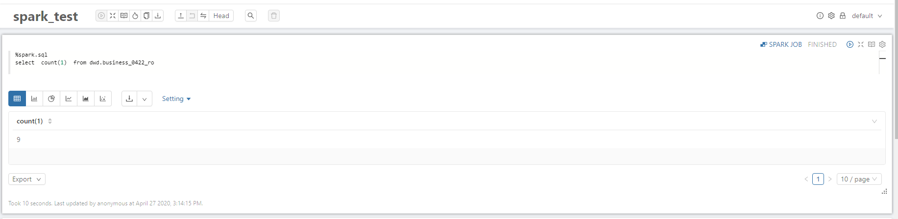
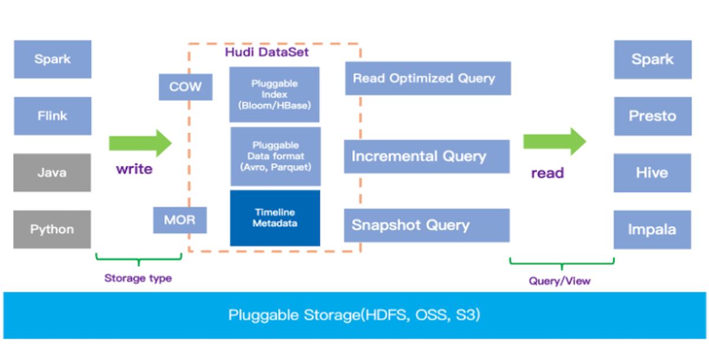
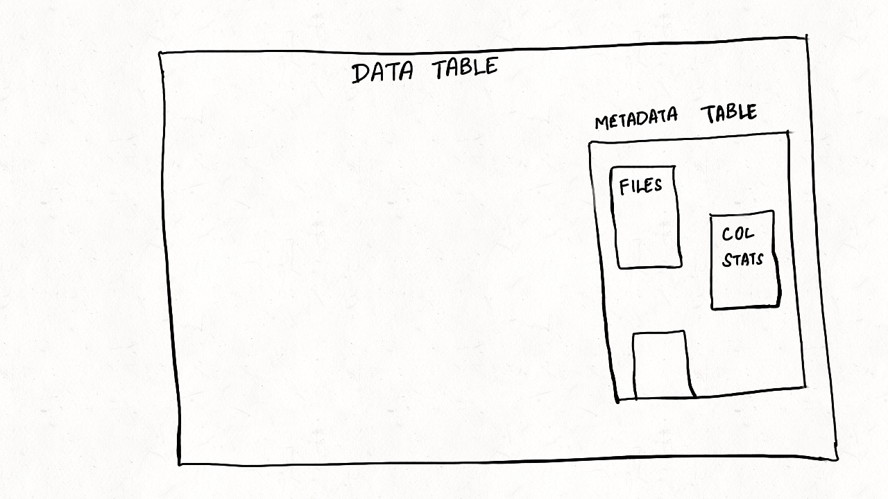

# Apache Hudi 组件介绍

## Hudi 是什么

Apache Hudi (发音为 "Hoodie")，全称 Hadoop Upserts Deletes and Incrementals，是一个开源的、事务性、流式数据湖平台。它旨在将数据库和数据仓库的核心功能（如 ACID 事务、增量数据处理、数据版本管理）直接引入到数据湖（如 HDFS、S3 等）中，使得用户可以在数据湖上高效地进行数据的插入、更新、删除和增量读取。

Hudi 的核心目标是解决传统数据湖在处理动态变化数据方面的不足。传统数据湖通常采用不可变的文件存储，对于数据的更新和删除操作非常低效，往往需要重写整个数据集或分区。Hudi 通过引入先进的数据管理技术，使得数据湖能够像数据库一样处理变更数据，同时保留数据湖的开放性、可扩展性和成本效益。

Hudi 不仅适用于流式工作负载，也能够高效地支持批处理场景下的增量数据流水线。它可以与多种流行的查询引擎（如 Apache Spark, Apache Flink, Presto, Trino, Apache Hive 等）无缝集成，为数据分析和数据科学提供强大的支持。

总结来说，Apache Hudi 主要解决以下关键问题：
*   **数据湖中的增量更新与删除**：提供高效的记录级别更新和删除能力。
*   **事务保证**：为数据湖操作提供 ACID 事务特性。
*   **数据版本与回溯**：支持数据的时间旅行查询。
*   **流式摄取与处理**：简化从流式数据源到数据湖的实时数据同步。
*   **Schema 演进**：支持数据表结构的变更。
*   **统一批处理与流处理**：为数据湖提供统一的数据处理范式。

## 核心概念

理解 Hudi 的核心概念对于有效使用它至关重要：

### 时间轴 (Timeline)
Hudi 的核心是其时间轴 (Timeline)，它记录了在 Hudi 表上执行的所有操作 (称为 Instants)。时间轴使得 Hudi 能够提供数据版本控制和原子性保证。

*   **Instants**: 时间轴上的每个原子操作，代表某个时间点表的状态或对表的操作。每个 Instant 包含：
    *   **Instant Time**: 操作的提交时间，通常是一个单调递增的时间戳。
    *   **Instant Action (操作类型)**：
        *   `COMMITS`: 将一批记录原子写入到表中。这是最常见的操作。
        *   `DELTA_COMMIT`: 仅在 Merge-On-Read 表中发生，将一批记录原子写入到增量日志文件中。
        *   `CLEAN`: 后台活动，用于删除数据表中不再需要的旧文件版本。
        *   `COMPACTION`: 后台活动，用于合并 Merge-On-Read 表中的基础文件和日志文件，以优化查询性能。
        *   `ROLLBACK`: 表示某个 `COMMIT` 或 `DELTA_COMMIT` 操作失败并已回滚，会删除写入过程中产生的部分文件。
        *   `SAVEPOINT`: 将某些文件组标记为"已保存"，防止被 `CLEAN` 操作删除，用于灾难恢复或将数据集还原到特定时间点。
        *   `RESTORE`: 将表恢复到某个之前的 `SAVEPOINT` 状态。
        *   `INDEXING`: (较新版本) 后台活动，用于构建或更新表的索引。
        *   `SCHEMA_COMMIT`: (较新版本) 原子地更新表 schema。
        *   `REPLACE`: 原子地替换表中的某些文件组，通常用于Clustering等操作。
    *   **Instant State (即时状态)**：
        *   `REQUESTED`: 表示操作已被请求但尚未初始化。
        *   `INFLIGHT`: 表示操作当前正在执行。
        *   `COMPLETED`: 表示操作已成功完成。

时间轴元数据存储在表的基础路径下的 `.hoodie` 目录中。

### 文件布局 (File Layout)
Hudi 表在存储层有特定的文件组织结构：
*   **Base Path**: Hudi 表的根目录。
*   **Partition Path**: 在 Base Path 下，数据按分区组织，形成子目录 (e.g., `BasePath/date=2023-01-01/`)
*   **File Group**: 在每个分区内，数据被组织成多个文件组 (File Group)。每个文件组由一个唯一的文件 ID (File ID) 标识。
*   **File Slice**: 一个文件组包含一个或多个文件切片 (File Slice)。每个文件切片代表该文件组的一个版本，由一个提交即时时间 (Commit Instant Time) 唯一标识。文件切片是 Hudi 实现数据版本管理和时间旅行的基础。

    *   对于 COW 表，一个文件切片通常只包含一个基础文件 (e.g., `.parquet`)。
    *   对于 MOR 表，一个文件切片包含一个可选的基础文件 (e.g., `.parquet`) 和多个日志文件 (e.g., `.log.x_y-z-w`)

Hudi 采用 MVCC (多版本并发控制) 设计。例如，Compaction 操作会合并基础文件和日志文件以产生新的文件切片 (新的基础文件)，而 Cleaning 操作会删除不再需要的旧文件切片。

### 表类型 (Table Types)
Hudi 支持两种主要的表类型，它们在数据写入方式、查询性能和数据新鲜度之间提供了不同的权衡：

#### Copy On Write (COW)
*   **写入原理**: 当数据写入时，任何需要更新的记录所在的文件会被完整地复制一份，并在新副本中应用更新。新数据直接写入新的 Parquet (或其他基础文件格式) 文件。因此，COW 表的文件切片只包含基础文件，没有日志文件。
    
*   **优点**:
    *   读取性能高：查询时直接读取列式存储的基础文件，无需合并。
    *   实现简单，写路径相对直接。
*   **缺点**:
    *   写入放大：即使只更新少量记录，也需要重写整个文件。这可能导致较高的写入延迟和计算开销，尤其对于大文件和频繁更新的场景。
    *   不适合高频更新的小批量写入。
*   **适用场景**:
    *   读多写少的场景。
    *   对数据新鲜度要求不高，可以接受较高写入延迟的批处理作业。
    *   例如，每日ETL作业，数据一次性写入，后续查询较多。

#### Merge On Read (MOR)
*   **写入原理**: 数据写入时，更新操作会写入到增量日志文件 (delta logs / log files) 中，而新插入的数据可以根据配置写入日志文件或新的基础文件。基础文件 (Parquet) 和日志文件 (Avro) 共同构成了一个文件切片。查询时，MOR 表需要动态地将基础文件和相关的日志文件进行合并，以提供最新的数据视图。
    
*   **Compaction (压缩)**: MOR 表依赖一个后台的 Compaction 过程，定期将日志文件合并到基础文件中，生成新的基础文件版本，以优化查询性能并控制日志文件数量。
*   **优点**:
    *   写入延迟低：更新操作仅追加到日志文件，速度快。
    *   适合高频更新和流式摄取。
    *   写入放大较小。
*   **缺点**:
    *   读取时需要合并，可能导致查询延迟相对较高（对于未压缩部分）。
    *   架构更复杂，需要管理 Compaction 过程。
*   **适用场景**:
    *   写多读也多的场景。
    *   对数据新鲜度要求较高，需要低延迟写入的流式或近实时场景。
    *   例如，CDC 数据同步、实时用户画像更新。

### 索引机制 (Indexing)
索引在 Hudi 中扮演着至关重要的角色，它负责在写入（尤其是 Upsert）过程中快速定位记录的位置（即记录键所在的 File ID）。高效的索引是实现快速 Upsert 的关键。

*   **作用**: 将记录键 (Record Key) 和分区路径 (Partition Path) 映射到对应的文件组 ID (File Group ID)。
*   **类型**: Hudi 提供了多种可插拔的索引实现：
    *   **Bloom Index (默认)**: 使用 Bloom Filter 来判断一个记录键是否存在于某个文件中。它分为：
        *   `hoodie.index.type=BLOOM` (Non-Global Bloom Index): 在分区内查找，速度快，但要求记录键在分区内唯一。
        *   `hoodie.index.type=GLOBAL_BLOOM` (Global Bloom Index): 在整个表中查找，可以保证全局唯一性，但随着表增大，索引开销会增加。
    *   **Simple Index**: 与 Bloom Index 类似，但它直接比较记录键，而不是依赖 Bloom Filter。
        *   `hoodie.index.type=SIMPLE` (Non-Global)
        *   `hoodie.index.type=GLOBAL_SIMPLE` (Global)
    *   **HBase Index**: `hoodie.index.type=HBASE`。将索引数据存储在外部的 Apache HBase 表中。提供全局一致性，对于大规模表的 Upsert 性能较好，但需要维护一个 HBase 集群。
    *   **Bucket Index**: `hoodie.index.type=BUCKET`。基于哈希分桶的静态索引，写入时根据记录键的哈希值确定文件组，无需查找。适用于预先知道桶数量且记录键分布均匀的场景。
    *   **Flink State Index**: `hoodie.index.type=FLINK_STATE_BACKEND`。专为 Flink 设计，使用 Flink 的状态后端存储索引，避免了 Bloom Filter 的假阳性问题。
    *   **Record Index (Spark)**: (较新版本) 尝试通过直接读取记录键来构建索引，适用于特定场景。
    *   **No Index**: (不推荐用于 Upsert) 有时不使用索引直接进行写操作，如纯追加场景。


选择合适的索引类型取决于数据特性、表大小、更新频率、查询模式以及对一致性的要求。

### 写操作 (Write Operations)
Hudi 支持多种写操作，可以通过 `hoodie.datasource.write.operation` 参数配置：
*   **`UPSERT` (默认)**: 插入或更新。如果记录键已存在，则更新记录；如果不存在，则插入新记录。这是 Hudi 最常用的操作，依赖索引机制。
    
*   **`INSERT`**: 仅插入新数据。如果记录键已存在，行为取决于具体配置（可能抛出错误或跳过）。它比 `UPSERT` 快，因为它通常会跳过索引查找步骤。适用于确认输入数据都是新增的场景，或者允许重复记录的场景。
*   **`BULK_INSERT`**: 批量插入。专为大数据集的初始加载或批量导入设计。它通常采用基于排序的写入算法，以优化大规模数据写入的性能和文件大小，但可能不严格保证文件大小。
*   **`DELETE`**: 删除表中与输入记录匹配的记录。
*   **`BOOTSTRAP`**: 用于将现有的 Parquet/ORC 数据集首次转换为 Hudi 表，同时保留原始数据。
*   **`DELETE_PARTITION`**: 删除指定分区的数据。

### 记录负载 (Record Payload)
当发生记录更新时 (例如 Upsert 操作中遇到相同的记录键)，Hudi 需要知道如何合并新旧两条记录。记录负载 (`HoodieRecordPayload`) 定义了这种合并逻辑。
*   默认实现是 `OverwriteWithLatestAvroPayload`，它会用新记录完全覆盖旧记录。
*   `EmptyHoodieRecordPayload` 用于硬删除，当与 `UPSERT` 操作结合时，会将匹配的记录从存储中物理删除。
*   用户可以实现自定义的 `HoodieRecordPayload` 来定义复杂的合并逻辑，例如部分更新、计数器累加等。

### 查询类型 (Query Types)
Hudi 表支持三种主要的查询类型，以满足不同的数据访问需求：
*   **快照查询 (Snapshot Query)**:
    *   查询表在某个特定时间点 (通常是最新提交时间点) 的完整快照。
    *   对于 COW 表，它直接读取基础文件。
    *   对于 MOR 表，它会动态地合并基础文件和对应的日志文件，以反映最新的数据状态（可能会有几分钟的延迟，取决于 Compaction 频率）。
        
    *   提供最新的数据视图。
*   **增量查询 (Incremental Query)**:
    *   只拉取自上次查询以来发生变更 (插入、更新、删除) 的数据。
    *   需要指定一个开始的提交时间 (`hoodie.datasource.read.begin.instanttime`)。
    *   非常适用于构建增量 ETL 流水线和流式处理。
*   **读优化查询 (Read Optimized Query)**:
    *   主要针对 MOR 表。它只查询最新的已压缩的基础文件，忽略未合并的日志文件。
        
    *   查询性能高，接近直接查询 Parquet/ORC 表的性能。
    *   但数据可能不是最新的，其新鲜度取决于上一次 Compaction 的完成时间。
    *   对于 COW 表，读优化查询等同于快照查询。

### 表服务 (Table Services)
Hudi 提供了一系列后台服务来维护表的健康、性能和存储效率：
*   **Compaction (压缩)**:
    *   仅适用于 MOR 表。
    *   定期将增量日志文件合并到对应的基础文件中，创建新的基础文件版本。

    *   目的：提高查询性能（特别是读优化查询），控制日志文件数量和大小，回收存储空间。
    *   可以配置为同步或异步执行。
*   **Cleaning (清理)**:
    *   删除数据湖中不再需要的旧版本文件切片，以回收存储空间。
    *   基于配置的保留策略（例如，保留最近 N 个提交，或保留一定时间窗口内的数据）。
    *   可以配置为同步或异步执行。
*   **Clustering (聚类)**:
    *   一种优化技术，通过根据用户定义的聚类策略（例如按特定列排序）重写数据文件，来改善数据在存储上的物理布局。

    *   目的：提高查询性能，特别是对于范围查询或需要特定排序的查询。
    *   可以替换旧的 Compaction 策略，或与 Compaction 结合使用。
*   **Archiving (归档)**:
    *   将时间轴上较旧的、已完成的 Instant 元数据从主时间轴移动到归档文件中。
    *   目的：保持 `.hoodie` 目录下的元数据文件数量可控，提高元数据读取性能。
*   **Indexing (索引构建/更新)**: (较新版本支持异步索引)
    *   对于某些索引类型 (如 Metadata Table Index)，可能需要后台作业来构建和更新索引。

这些服务可以配置为自动运行，也可以手动触发。

## 核心架构

Apache Hudi (Hadoop Upserts Deletes and Incrementals) 是一种用于在 Hadoop 分布式文件系统 (HDFS) 或云存储 (如 AWS S3) 上管理大型分析数据集的开源数据湖技术。它提供了原子性、一致性、隔离性和持久性 (ACID) 语义，支持记录级别的插入、更新、删除操作，并能进行增量数据处理。

理解 Hudi 的架构对于在类似 DataSophon 这样的平台中有效利用它至关重要。

## 核心组件与概念

 
*(图片来源: Apache Hudi 官方文档)*

上图展示了 Hudi 的高级架构，主要包括数据平面、元数据管理、表服务以及与计算引擎的集成。

### 1. 存储层 (Storage Layer)

*   **基础文件格式**: Hudi 将数据存储在分布式文件系统 (如 HDFS, S3) 中。基础数据文件通常采用列式存储格式，如 Apache Parquet 或 Apache ORC。
    *   **Parquet**: 默认且推荐的基础文件格式，提供高效的压缩和编码，以及谓词下推能力。
    *   **ORC**: 另一种支持的列式格式。
*   **目录结构**: Hudi 表在文件系统上有一个明确定义的目录结构：
    ```
    <basePath>/
      <partitionPath1>/
        <fileId1_commitTime1_writeToken1>.parquet  // 文件切片 (File Slice)
        <fileId1_commitTime2_writeToken2>.parquet
        <fileId2_commitTime3_writeToken3>.parquet
        .hoodie_partition_metadata                // 分区元数据
      <partitionPath2>/
        ...
      .hoodie/                                  // Hudi 元数据目录
        archived/                               // 归档的时间轴 Instants
        metadata/                               // Hudi 元数据表 (MDT)
        .aux/                                   // 辅助文件目录 (如 savepoint, bootstrap)
        <timestamp>.commit                      // 完成的 Commit Instant
        <timestamp>.deltacommit                 // 完成的 Delta Commit Instant (MOR)
        <timestamp>.compaction.requested        // Compaction 请求
        <timestamp>.compaction.inflight         // Compaction 进行中
        <timestamp>.clean.requested             // Cleaning 请求
        <timestamp>.clean.inflight              // Cleaning 进行中
        ...
    ```
    *   `<basePath>`: Hudi 表的根路径。
    *   `<partitionPath>`: 分区路径 (例如 `year=2023/month=10/day=26`)。
    *   `.hoodie`: 存放 Hudi 表所有元数据和时间轴信息的关键目录。

### 2. 数据组织 (Data Organization)

*   **Hoodie Record**: Hudi 中的基本数据单元，由唯一记录键 (`hoodie_record_key`) 和提交时间 (`hoodie_commit_time`) 唯一标识。每条记录还包含一个提交序列号 (`hoodie_commit_seqno`)。
*   **File Group**: Hudi 表中数据组织的核心单元。在一个分区内，一个 File Group 由一个唯一的 `File ID` 标识。它包含了一系列的文件切片 (File Slices)。
*   **File Slice (文件切片)**: 代表在某个特定提交时间点 (`commitTime`)，属于某个 File Group 的数据版本。一个文件切片可以由以下组成：
    *   **Copy On Write (COW) 表**: 一个基础文件 (例如 `.parquet`)。
    *   **Merge On Read (MOR) 表**: 一个可选的基础文件 (例如 `.parquet`) 和一系列的日志文件 (例如 `.log.x_y-z-w`)，这些日志文件记录了自上一次 Compaction 以来对该基础文件的更改。
*   **Timeline (时间轴)**: Hudi 的核心概念，用于维护对表执行的所有操作的元数据。它是一系列按时间顺序排列的 Instants (瞬间)。时间轴存储在 `.hoodie` 目录下。
    *   **Instant (瞬间)**: 代表在特定时间点对 Hudi 表执行的一个原子操作。每个 Instant 都有一个状态：
        *   `REQUESTED`: 操作已被请求，但尚未开始。
        *   `INFLIGHT`: 操作正在进行中。
        *   `COMPLETED`: 操作已成功完成 (生成 `.commit`, `.deltacommit`, `.clean.completed`, `.compaction.completed` 等文件)。
    *   **常见的 Instant 类型**: `COMMITS` (数据写入), `DELTA_COMMIT` (MOR 表的增量写入), `CLEAN` (旧文件版本清理), `COMPACTION` (MOR 表的日志文件合并), `ROLLBACK` (回滚失败的提交), `SAVEPOINT` (标记不会被清理的提交点), `RESTORE` (恢复到某个 Savepoint), `BOOTSTRAP` (引导现有表)。
*   **索引 (Index)**: Hudi 使用索引来高效地将传入的记录键映射到其在存储中的位置 (即对应的 File Group)，从而实现快速的 Upsert 和 Delete 操作。常见的索引类型：
    *   **Bloom Index (默认)**: 使用 Bloom 过滤器来判断一个记录键是否存在于某个文件中。如果 Bloom 过滤器指示可能存在，则进一步读取文件内容确认。
    *   **Simple Index**: 将传入记录与存储中的记录进行连接 (Join) 来定位 File Group。
    *   **HBase Index**: 使用外部 HBase 表来存储索引映射。
    *   **Bucket Index**: 基于记录键的哈希值将记录分配到固定的桶 (File Group)。
    *   **Flink State Index (Flink)**: Flink 专用的，利用 Flink 状态后端存储索引。
    *   **Record Index (实验性)**: 直接在元数据表中存储记录键到文件位置的映射，以实现更快的点查找，但会增加元数据大小。

### 3. 表类型 (Table Types)

Hudi 支持两种主要的表类型，它们在数据写入、查询性能和数据新鲜度之间提供了不同的权衡：

*   **Copy On Write (COW)**:
    *   **写入**: 当数据更新时，涉及到的文件会被完整地复制和重写，新数据与旧数据合并后写入新版本的文件。旧版本文件在清理策略下会被删除。
    *   **读取**: 查询简单，直接读取最新版本的基础文件。读取性能高。
    *   **优点**: 读取性能好，查询简单。
    *   **缺点**: 写入放大较高 (每次更新都重写整个文件)，写入延迟较高。
    *   **适用场景**: 读取密集型工作负载，对写入延迟不敏感的场景。

*   **Merge On Read (MOR)**:
    *   **写入**: 更新和插入操作首先写入到增量的日志文件 (delta logs / row-based logs) 中，基础文件 (columnar-based) 不会立即重写。
    *   **Compaction (压缩)**: 一个异步或同步的过程，将日志文件中的更改合并到基础文件中，创建新的基础文件版本。
    *   **读取**: 提供两种查询视图：
        *   **读优化查询 (Read Optimized Query)**: 只查询最新的已压缩的基础文件。数据可能有延迟 (取决于 Compaction 频率)，但查询性能高。
        *   **快照查询/实时查询 (Snapshot Query / Real-time Query)**: 查询时动态合并基础文件和对应的日志文件，提供最新的数据视图。数据新鲜度高，但查询延迟可能较高，需要额外的合并开销。
    *   **优点**: 写入速度快，写入放大低。提供数据新鲜度和查询性能之间的权衡。
    *   **缺点**: 查询逻辑相对复杂 (需要合并)，Compaction 过程需要额外管理和资源。
    *   **适用场景**: 写入密集型工作负载，对数据新鲜度有较高要求的流式场景。

### 4. 写路径 (Write Path)

当数据通过 Spark、Flink 或 HoodieDeltaStreamer 写入 Hudi 表时，大致流程如下：

1.  **输入数据**: 一批新的或更新的记录 (RDD/DataFrame/DataStream)。
2.  **键生成 (Key Generation)**: 从每条记录中提取记录键 (`recordKey`) 和分区路径 (`partitionPath`)。
3.  **索引查找 (Index Lookup)**: 对于 `upsert` 或 `delete` 操作，使用配置的索引机制查找每个记录键当前所在的 File Group 和文件切片。
    *   如果是新记录 (Insert)，可能会分配到一个新的 File Group 或现有 File Group (如果存在小文件处理逻辑)。
4.  **数据分发/分桶 (Data Distribution/Bucketing)**: 根据分区路径和 File ID (如果记录键已存在于某个 File Group)，将记录分发到对应的任务进行处理。
5.  **写入数据**: 
    *   **COW**: 如果是更新，读取旧文件切片，与新数据合并，写入新的文件切片。如果是插入，直接写入新的文件切片。
    *   **MOR**: 
        *   如果是对现有 File Group 的更新/插入，追加到该 File Group 最新的日志文件中。
        *   如果是新的 File Group，可能会先创建基础文件 (如果策略如此配置)，然后写入日志文件。
6.  **提交 (Commit)**: 写入完成后，Hudi 客户端会向时间轴写入一个 `COMPLETED` 的 Instant (如 `.commit` 或 `.deltacommit`)，其中包含写入操作的元数据 (如更新了哪些文件、写入了多少记录等)。这个过程是原子性的。

### 5. 读路径 (Read Path)

查询 Hudi 表时，Hudi 的 InputFormat (针对 Spark MR, Hive) 或 Connector (针对 Spark DataSource, Flink, Presto/Trino) 会解析时间轴和文件结构来提供数据。

*   **COW 表查询**: 直接读取每个 File Group 中最新提交的基础文件。
*   **MOR 表查询**:
    *   **读优化视图**: 只读取每个 File Group 中最新的已压缩的基础文件。
    *   **快照/实时视图**: 对于每个 File Group，读取其最新的基础文件，并应用其后的所有未压缩的日志文件，动态合并数据返回给查询引擎。

### 6. 表服务 (Table Services)

Hudi 提供了一系列后台服务来维护表的健康、性能和存储效率。这些服务可以自动调度或手动触发。

*   **Compaction (压缩)**: 仅 MOR 表。将日志文件合并到基础文件。
*   **Cleaning (清理)**: 删除旧的、不再需要的文件版本以回收存储空间。
*   **Clustering (聚类)**: 重新组织数据文件的物理布局 (如排序、合并小文件) 以优化查询性能。
*   **Archiving (归档)**: 将旧的时间轴 Instant 元数据归档，保持主时间轴的精简。
*   **Bootstrap**: 将现有非 Hudi 数据集转换为 Hudi 表。
*   **Savepoint/Restore**: 用于数据恢复和回滚。

### 7. 元数据管理 (Metadata Management)

*   **时间轴 (Timeline)**: 如前所述，是 Hudi 元数据的核心，存储在 `.hoodie` 目录下。
*   **Hudi 元数据表 (Metadata Table - MDT)**: 为了解决直接列出大规模分区和文件 (listing) 带来的性能瓶颈，Hudi 引入了元数据表。这是一个内部的 Hudi 表 (通常是 COW 或 MOR 类型)，它将文件系统的元数据 (如文件列表、分区列表) 索引化存储。
    *   **功能**: 加速文件查找，避免对底层文件系统进行昂贵的 `list` 操作，尤其是在有大量分区和文件的表上。
    *   **内容**: 主要包括 `files` 分区 (存储文件列表和统计信息)、`partitions` 分区 (存储分区列表)、`bloom_filters` 分区 (存储 Bloom Filter 元数据，加速索引查找)。
    *   **启用**: 通过配置 `hoodie.metadata.enable=true`。
    *   **一致性**: MDT 与主数据表的时间轴同步更新，确保元数据的一致性。
    
*   **Hive Metastore 同步**: Hudi 可以将表的 Schema 和分区信息同步到 Hive Metastore，使得 Hudi 表可以被 Hive, Presto, SparkSQL (通过 Hive Metastore) 等工具查询。

### 8. 与计算引擎的集成

Hudi 设计为可插拔的，可以与多种大数据处理引擎集成：

*   **Apache Spark**: 最早也是最成熟的集成。通过 Spark DataSource API (读写 Hudi 表) 和 `HoodieDeltaStreamer` (数据摄取) 进行深度集成。Hudi 的表服务 (Compaction, Cleaning, Clustering) 通常也作为 Spark 作业运行。
*   **Apache Flink**: 快速发展的集成。通过 Flink SQL Connector (DDL, DML) 和 DataStream API (读写 Hudi 表) 提供支持。Flink 流处理的特性使其非常适合 Hudi MOR 表的低延迟摄取和增量处理。
*   **Apache Hive**: 主要通过 Hive Metastore 同步和 Hudi InputFormat 实现查询集成。可以直接使用 HiveQL 查询 Hudi 表。
*   **Presto / Trino**: 通过专门的 Hudi Connector 查询 Hudi 表，通常也依赖 Hive Metastore 获取表元数据。
*   **其他引擎**: 社区也在探索与其他引擎的集成，如 Apache Impala。

## 总结

Apache Hudi 的架构围绕其核心的时间轴概念构建，通过精心设计的数据组织 (File Groups, File Slices) 和表类型 (COW, MOR) 来提供 ACID 事务、增量处理和高效的 Upsert/Delete 功能。其索引机制、可插拔的表服务以及与主流计算引擎的集成，使其成为构建和管理大规模数据湖的强大工具。DataSophon 这样的平台可以通过管理底层的 Spark/Flink 计算引擎和存储，简化 Hudi 表的部署和运维。

## 适用场景

Apache Hudi 的强大功能使其适用于多种大数据应用场景：

*   **构建实时数据湖 (Real-time Data Lake)**:
    *   将来自 Kafka、数据库 CDC 等实时数据源的数据高效摄取到数据湖中，并支持近实时的更新和删除。
    *   为下游分析和报表提供新鲜的数据。
*   **CDC (Change Data Capture) 数据同步**:
    *   捕获源数据库 (如 MySQL, PostgreSQL) 的变更数据，并将其应用到数据湖中的 Hudi 表，保持数据湖与源系统同步。
*   **增量 ETL/ELT 流水线**:
    *   替代传统的全量批处理 ETL 作业，通过 Hudi 的增量查询和 Upsert 能力，只处理自上次运行以来发生变化的数据，显著提高 ETL 效率，降低资源消耗。
*   **GDPR/CCPA 等数据隐私合规性**:
    *   Hudi 支持记录级别的删除和更新，使得企业能够更容易地满足数据隐私法规的要求，例如处理用户数据删除请求或修正请求。
*   **流式数据分析与特征工程**:
    *   结合 Flink 或 Spark Streaming，对 Hudi 表进行流式聚合、窗口计算、特征提取，支持实时推荐、欺诈检测等应用。
*   **统一批处理与流处理分析 (Lambda/Kappa 架构简化)**:
    *   通过 Hudi 提供的快照查询和增量查询能力，可以在同一份数据存储上同时支持批处理分析和近实时流处理分析，简化数据架构。
*   **近实时数据仓库**:
    *   在数据湖上构建具有数据仓库功能（如事务、Schema 管理、数据更新）的分析平台。

总而言之，任何需要在数据湖中进行频繁数据更新、删除，或者需要构建高效增量数据管道的场景，都可以考虑使用 Apache Hudi。

## Hudi 与其他数据湖技术的比较 (简要)

Hudi 与 Apache Iceberg 和 Delta Lake 是当前主流的三大数据湖表格式技术。它们都致力于解决传统数据湖在数据管理方面的痛点，但在设计理念和特性实现上有所差异：

*   **Apache Iceberg**:
    *   由 Netflix 开源，更侧重于提供一个开放的、高性能的表格式规范，用于管理超大规模的分析数据集。
    *   强调元数据管理、Schema 演进、分区演进、隐藏分区等。
    *   其核心是表格式规范，可以被多种计算引擎实现和集成。
    *   通常不直接提供像 Hudi 那样内置的 Upsert 写操作优化和表服务，但可以通过计算引擎（如 Spark）实现类似功能。
*   **Delta Lake**:
    *   由 Databricks 开源，与 Apache Spark 深度集成。
    *   核心是基于事务日志（Delta Log）的 ACID 事务保证和数据版本控制。
    *   提供了 Upsert (Merge)、Delete、Update 等操作，主要通过 Spark 实现。
    *   生态系统和商业支持相对成熟，尤其在 Databricks 平台上。

**Hudi 的独特之处可能在于**:
*   更早关注流式摄取和增量处理，提供了丰富的表服务 (Compaction, Cleaning, Clustering)。
*   提供了 Copy-On-Write 和 Merge-On-Read 两种表类型，以适应不同场景的读写需求。
*   可插拔的索引机制是其 Upsert 性能的关键。

选择哪种技术取决于具体的应用场景、团队技术栈、性能需求以及对生态集成的偏好。三者都在快速发展，并相互借鉴特性。 