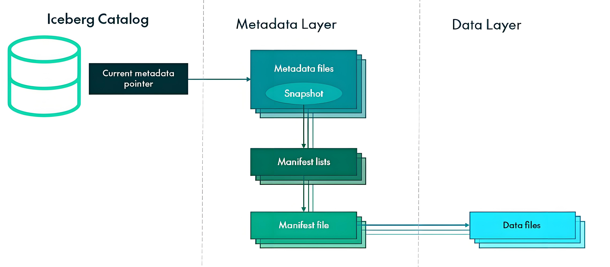
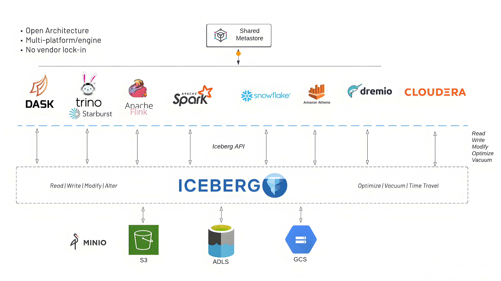

# Apache Iceberg 组件介绍

## Iceberg 是什么

Apache Iceberg 是一种开源的高性能表格式系统，专为超大规模的分析数据集设计。它为数据湖提供了快速的查询性能和可靠的数据管理能力，解决了传统数据湖在处理变更数据和提供数据一致性方面的诸多挑战。

Iceberg 最初由 Netflix 开发，后来捐赠给 Apache 软件基金会，现已成为 Apache 的顶级项目。它提供了类似于数据库表的功能，包括模式演化、ACID 事务、时间旅行、回滚和分区布局演化等，同时保留了数据湖开放格式的优势。

Iceberg 的核心特性包括：
* **ACID 事务**：确保并发写入的原子性，支持多表事务，消除数据不一致问题
* **模式演化**：支持灵活的字段添加、重命名、重排序等，与查询引擎无缝兼容
* **分区演化**：允许分区方案变更而不影响查询或需要大规模数据迁移
* **时间旅行**：能够访问数据的历史版本，用于审计、回滚或修复错误
* **隐式分区剪枝**：通过分区谓词智能选择需要扫描的文件，大幅提升查询性能
* **数据版本控制**：维护数据文件的完整历史记录，支持回滚到任意版本
* **向后兼容**：保证老版本读取器仍能访问数据，即使模式或分区已经演化

与传统的 Hive 表相比，Iceberg 解决了分区布局问题、查询规划复杂性、并发写入冲突、模式变更阻力等诸多痛点，使数据湖更加可靠、高效且易于管理。

## 核心概念

深入理解 Iceberg 表格式的核心概念有助于更好地使用和管理它：

### 表格式设计

Iceberg 表格式设计解决了传统数据湖中的许多根本性问题：

#### 表布局
传统 Hive 表使用目录结构表示分区，而 Iceberg 维护了一个文件清单，记录每个数据文件的精确内容和位置。这种设计带来几个重要优势：
* **隐式分区剪枝**：查询计划可以精确确定需要读取的文件，而不必扫描分区文件夹
* **分区演化**：分区方案可以随时变更，不需要重写数据
* **隐藏分区**：对用户隐藏分区细节，简化查询编写

#### 数据文件
Iceberg 支持常见的列式文件格式，包括：
* **Parquet**：默认且推荐的格式，提供最佳的查询性能
* **ORC**：另一种支持的列式格式
* **Avro**：主要用于行式处理场景

每个数据文件包含行范围和值统计信息，用于高效的查询规划和过滤。

### 元数据层次结构

Iceberg 采用分层的元数据设计，保证了数据一致性和高性能：

#### 快照 (Snapshots)
快照是表状态的时间点视图，每次写入操作都会创建一个新的快照。每个快照都有：
* 唯一的快照ID
* 时间戳
* 表模式
* 一个或多个清单文件列表

#### 清单 (Manifests)
清单是元数据文件，记录了一组数据文件的详细信息，包括：
* 文件路径
* 文件格式和大小
* 分区信息
* 列级别统计信息（最小值、最大值、空值计数）
* 文件状态（已添加、已存在或已删除）

#### 清单列表 (Manifest Lists)
清单列表是更高层次的元数据，跟踪表中所有有效的清单文件。它使得 Iceberg 可以快速找到任何快照中的所有文件，而不需要读取每个清单。

#### 元数据文件 (Metadata Files)
元数据文件是 Iceberg 表的入口点，包含：
* 当前快照信息
* 快照历史记录
* 模式信息
* 表属性
* 其他元数据

#### 表元数据 JSON 文件
表元数据 JSON 文件是指向最新元数据文件的指针，是表的真正"入口点"。

### 表演化与模式演化

Iceberg 支持多种表演化能力，使数据管理更加灵活：

#### 模式演化
Iceberg 支持以下模式更改：
* **添加列**：向表中添加新字段
* **重命名列**：更改字段名称
* **重排列**：更改字段顺序
* **删除列**：移除不再需要的字段
* **类型转换**：在兼容范围内更改字段类型

所有这些更改都可以在不重写数据的情况下进行，并且对现有查询透明。

#### 分区演化
Iceberg 允许在不重新组织数据的情况下更改分区方案：
* 可以添加或删除分区字段
* 可以更改分区转换（例如，从日期到月份）
* 新数据使用新分区方案，旧数据保持原样

### 数据操作与维护

Iceberg 提供了多种数据操作和维护功能：

#### 写操作
* **追加 (Append)**：添加新文件到表
* **替换 (Replace)**：原子性地替换表中的文件
* **删除 (Delete)**：删除与过滤条件匹配的记录
* **合并 (Merge)**：根据条件更新或删除记录

#### 表维护
* **数据压缩**：合并小文件以优化存储和查询性能
* **数据重写**：重写数据以应用新的排序或分区方案
* **快照过期**：删除不再需要的旧快照，释放存储空间
* **孤立文件清理**：删除不再被任何有效快照引用的文件

## 架构与集成

### Iceberg 架构设计

Iceberg 的架构设计使得它可以与多种计算引擎集成，同时保持一致的数据访问和管理能力：

#### 核心库与API
* **Table API**：核心表操作接口，包括读取、写入和元数据访问
* **Catalog API**：创建、修改和查找表的接口
* **Expressions**：谓词和表达式API，用于过滤和投影

#### 引擎集成
Iceberg 与主流大数据计算引擎有深度集成：
* **Apache Spark**：作为数据源提供读写支持
* **Apache Flink**：支持流式读写
* **Apache Hive**：通过HiveQL访问Iceberg表
* **Presto/Trino**：高性能交互式查询
* **Amazon Athena**：无服务器查询支持
* **Snowflake**：商业云数据仓库集成

#### 目录服务 (Catalogs)
Iceberg 表可以通过多种目录进行管理：
* **Hive Metastore**：利用现有Hive元数据存储
* **AWS Glue**：与AWS生态系统集成
* **REST Catalog**：基于HTTP的集中式目录
* **JDBC Catalog**：基于数据库的目录
* **自定义目录**：可扩展实现自定义目录

#### 存储集成
Iceberg 可以在各种存储系统上运行：
* **HDFS**：传统Hadoop分布式文件系统
* **Amazon S3**：云对象存储
* **Google Cloud Storage**：GCP对象存储
* **Microsoft Azure Blob Storage**：Azure对象存储
* **本地文件系统**：用于测试和开发

### 表服务与优化

Iceberg 提供了多种表服务来优化数据管理：

#### 自动文件管理
* **小文件压缩**：自动合并小文件，提高查询性能
* **数据整理**：根据排序键重组数据，优化读取性能
* **数据迁移**：将数据从一个位置移动到另一个位置

#### 并发控制
* **乐观并发控制**：允许多个写入者同时操作表，冲突时进行重试
* **提交锁**：可选的悲观锁定机制，用于高并发环境
* **流水线提交**：优化提交过程，减少元数据操作

#### 性能优化
* **统计信息收集**：自动收集列级别统计信息
* **Z-Order排序**：多维排序技术，提高多列过滤性能
* **位置感知分割**：优化任务分配，减少数据移动
* **向量化执行**：支持现代CPU的向量化操作

## 适用场景

Apache Iceberg 特别适合以下场景：

### 大规模数据湖建设
* **PB级数据存储**：有效管理超大规模数据集
* **多部门数据共享**：提供一致的数据视图和访问方式
* **数据治理**：支持数据溯源、审计和合规需求

### 流式数据处理
* **CDC数据摄入**：高效处理变更数据捕获流
* **流批一体**：同一表可同时支持流处理和批处理
* **实时分析**：快速反映最新数据变化

### 数据科学与机器学习
* **可重现实验**：通过时间旅行确保实验数据一致性
* **特征工程**：高效生成和管理机器学习特征
* **模型训练与验证**：提供稳定的数据版本

### 数据仓库现代化
* **混合负载支持**：同时支持ETL、报表和交互式分析
* **云迁移**：简化从传统数据仓库向云数据湖的迁移
* **多引擎支持**：灵活选择最适合特定任务的计算引擎

### 合规与数据治理
* **GDPR合规**：支持数据删除权，可精确删除特定记录
* **数据版本控制**：提供完整的数据变更历史
* **审计能力**：跟踪所有数据更改

## Iceberg 与其他表格式的比较

与其他开源表格式相比，Iceberg 有其独特优势：

| 特性 | Apache Iceberg | Apache Hudi | Delta Lake |
|-----|---------------|------------|-----------|
| **初始开发者** | Netflix | Uber | Databricks |
| **元数据管理** | 多级元数据结构，弹性扩展 | 基于时间轴的元数据 | 基于事务日志的元数据 |
| **模式演化** | 完全支持，类型安全 | 支持，有一些限制 | 支持，有一些限制 |
| **分区演化** | 完全支持，对查询透明 | 有限支持，需要特殊处理 | 有限支持 |
| **ACID事务** | 完全支持，包括多表事务 | 支持表级ACID | 支持表级ACID |
| **存储格式** | Parquet, Avro, ORC | Parquet, Avro | Parquet |
| **社区活跃度** | 高，多公司参与 | 高，多公司参与 | 高，主要由Databricks推动 |
| **引擎支持** | Spark, Flink, Hive, Trino等多种 | Spark, Flink, Hive | 主要是Spark，其他有限支持 |
| **特殊功能** | 隐式分区剪枝，行级操作 | 增量处理，CDC | 扩展功能如Z-Order |

## 结论

Apache Iceberg 代表了数据湖技术的新一代进步，通过解决传统数据湖架构中的根本性问题，它为企业提供了构建高性能、高可靠性分析平台的强大基础。其开放格式、强大的版本控制、灵活的演化能力以及与主流计算引擎的广泛集成，使得 Iceberg 成为现代数据架构的理想选择。

无论是处理大规模批量数据，还是构建实时数据流水线，Iceberg 都能提供一致的数据视图和高效的性能。随着越来越多组织采用多引擎战略和混合云/多云环境，Iceberg 的开放性和互操作性将变得更加重要，帮助企业避免厂商锁定，同时保持数据的一致性和可靠性。 