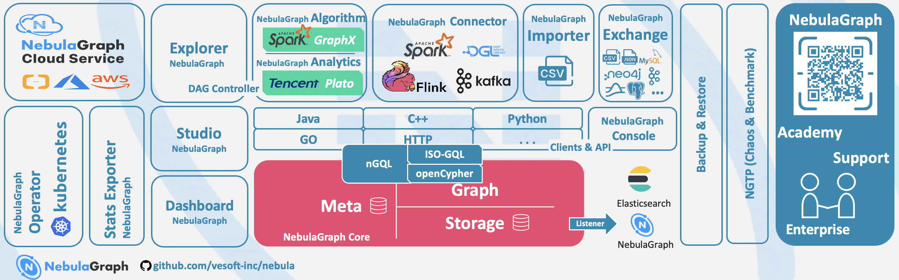
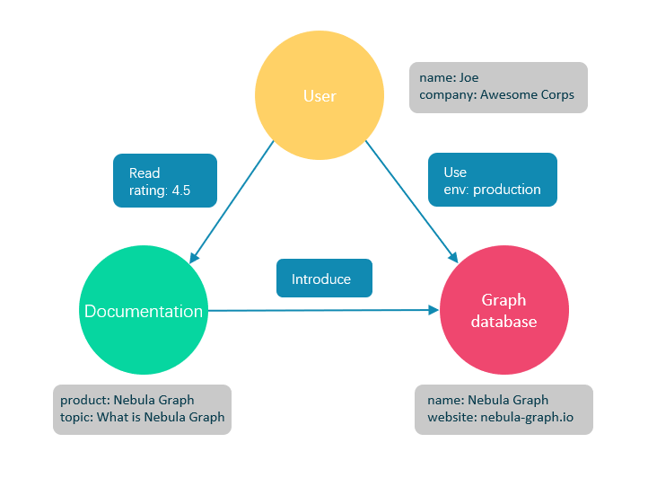

# NebulaGraph 组件介绍

## 什么是 NebulaGraph

NebulaGraph 是一款开源的、分布式的、易扩展的原生图数据库，能够承载包含数千亿个点和数万亿条边的超大规模数据集，并且提供毫秒级查询。作为一个典型的图数据库，NebulaGraph 可以将丰富的关系通过边及其类型和属性自然地呈现。

## 视频介绍

通过以下视频，您可以快速了解 NebulaGraph 的核心概念和特性：

    

        <iframe style="position: absolute; width: 100%; height: 100%; left: 0; top: 0;" src="../images/259888281_nb2-1-16.mp4" frameborder="no" scrolling="no" allowfullscreen="true"></iframe>
    

## 系统架构

NebulaGraph 采用计算存储分离的分布式架构，具有高可扩展性、高可用性和高性能等特点。

### 架构组件

- **Meta 服务**：管理用户账号、集群拓扑、Schema 信息和集群运维等元数据
- **Graph 服务**：处理查询请求，负责解析、优化和执行查询
- **Storage 服务**：存储数据并提供数据读写接口，支持水平扩展

## 图数据库概述

图数据库是专门存储庞大的图形网络并从中检索信息的数据库。它可以将数据高效存储为点（Vertex）和边（Edge），并在点和边上附加属性（Property）。

与传统关系型数据库相比，图数据库在处理复杂关联关系时具有显著优势：
- 直观的数据建模方式
- 高效的关系查询性能
- 灵活的数据结构扩展
- 自然的数据关系表达

## 核心特性

### 高性能

- 基于 C++ 开发，提供毫秒级查询
- 存储引擎针对图数据结构优化
- 支持数据动态压缩
- 高效的图遍历和分析能力

### 高可扩展

- 存储计算分离架构
- 支持在线动态扩缩容
- 支持多数据中心部署
- 弹性伸缩能力强

### 高可用性

- 支持多副本数据同步
- 自动故障转移
- 数据强一致性保证
- 完善的备份恢复机制

### 企业特性

- ACID 事务支持
- 细粒度访问控制
- 多租户隔离
- 完整审计日志

### 开发友好

- 类 SQL 查询语言（nGQL）
- 丰富的客户端 SDK
- 完善的运维工具
- 详尽的技术文档

## 生态集成

### 数据工具

- **NebulaGraph Studio**：可视化操作界面
- **NebulaGraph Console**：命令行客户端
- **NebulaGraph Exchange**：数据导入工具
- **NebulaGraph Algorithm**：图算法工具集

### 大数据集成

- **Apache Spark 连接器**
- **Apache Flink 连接器**
- **Apache HBase 适配器**
- **Elasticsearch 插件**

## 应用场景

### 金融风控

- 欺诈检测
- 风险评估
- 信用分析
- 反洗钱分析

### 智能推荐

- 社交推荐
- 商品推荐
- 内容推荐
- 广告投放

### 知识图谱

- 智能问答
- 知识推理
- 语义分析
- 辅助决策

### 社交网络

- 社区发现
- 影响力分析
- 路径分析
- 关系推荐

### 智慧交通

- 路径规划
- 交通预测
- 调度优化
- 物流分析

## 企业实践

众多知名企业在生产环境中成功应用 NebulaGraph：
- 腾讯
- 美团
- 京东
- 快手
- 360
- 网易
- 小米

## 相关资源

### 官方资源

- [官方网站](https://www.nebula-graph.com.cn/)
- [技术文档](https://docs.nebula-graph.com.cn/)
- [GitHub 仓库](https://github.com/vesoft-inc/nebula)
- [技术博客](https://nebula-graph.com.cn/posts/)

### 社区资源

- [社区论坛](https://discuss.nebula-graph.com.cn/)
- [开发者认证](https://www.nebula-graph.com.cn/certification)
- [案例学习](https://nebula-graph.com.cn/cases/)
- [培训课程](https://nebula-graph.com.cn/training/)

## 总结

NebulaGraph 作为一款高性能的分布式图数据库，凭借其卓越的性能、高可扩展性和丰富的企业级特性，能够有效解决复杂关系数据的存储和查询需求。其活跃的社区生态和完善的工具链，使其成为构建大规模图应用的理想选择。