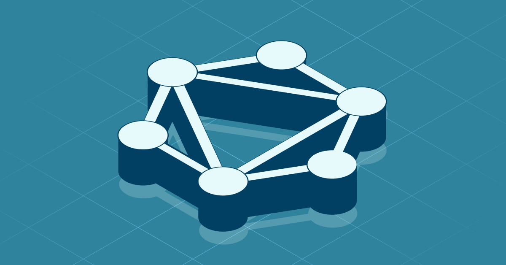

 # Neo4j 组件介绍

## 组件概述

Neo4j 是全球领先的图数据库管理系统，专为高效存储、查询和管理高度互联数据而设计。作为一种原生图数据库，Neo4j 将数据以图的形式（节点、关系和属性）进行组织，能够直观地表达复杂的数据关系，并提供卓越的查询性能。

在 DataSophon 大数据平台中，Neo4j 作为核心数据存储组件，为应用程序提供了处理高度关联数据的强大能力，使得关系型数据的查询、分析和可视化变得简单高效。其独特的图数据模型和高效的查询语言 Cypher，使得 Neo4j 成为处理复杂关系数据的理想选择。

Neo4j 采用原生图存储技术，不同于传统关系型数据库通过表和外键模拟关系，它直接将关系作为首类实体进行存储和处理，从而在处理高度互联数据时展现出卓越的性能优势。

## 核心特性

### 原生图技术

- **图存储引擎**：专为图数据模型优化的原生存储引擎，在处理互连数据时性能卓越
- **原生图处理**：支持高效的图算法和数据遍历，无需复杂的连接操作
- **索引无关邻接**：关系遍历不依赖索引，查询速度与数据总量无关，仅与实际遍历的数据量相关

### 查询语言与工具

- **Cypher 查询语言**：直观、声明式的图查询语言，类似 SQL 但专为图操作优化
- **图数据科学库**：内置超过 65 种图算法，支持路径查找、中心性计算、社区检测等高级分析
- **APOC 扩展**：丰富的过程库，提供 550+ 实用函数和过程，增强图处理能力

### 扩展性与性能

- **水平扩展架构**：支持通过 Neo4j Fabric 和集群模式实现大规模数据处理
- **ACID 事务**：保证数据完整性和一致性
- **高性能读写**：针对关系数据查询优化，提供毫秒级响应时间
- **内存优化**：支持内存缓存和持久化存储的平衡配置

### 集成与开发

- **丰富的驱动程序**：支持多种编程语言（Java、Python、JavaScript、.NET、Go 等）
- **REST API**：提供完整的 HTTP API 接口，便于系统集成
- **GraphQL 支持**：原生支持 GraphQL 接口，简化前端数据获取
- **数据导入工具**：提供多种数据导入方式，支持 CSV、JSON、XML 等格式

### 可视化与分析

- **Neo4j Browser**：基于 Web 的交互式环境，用于查询执行和结果可视化
- **Neo4j Bloom**：无代码图数据探索和可视化工具，支持业务用户直观分析数据关系
- **仪表板集成**：支持与 Tableau、Power BI 等 BI 工具集成

### 安全特性

- **细粒度访问控制**：支持基于角色的访问控制机制
- **数据加密**：支持静态数据加密和传输加密
- **审计日志**：详细记录系统操作，便于安全审计和合规管理

## 适用场景

### 知识图谱

Neo4j 是构建知识图谱的理想选择，能够高效存储和查询复杂的语义关系网络。企业可以利用知识图谱整合多源异构数据，建立统一的知识体系，支持智能搜索、推荐系统和决策支持。

<!-- 知识图谱示例图片 -->

### 推荐系统

基于图的推荐引擎能够利用节点间的多维关系，提供更加精准和个性化的推荐。Neo4j 可以有效捕捉用户兴趣、产品特征和上下文信息之间的复杂关联，实现基于内容、协同过滤和知识的混合推荐策略。

<!-- 推荐系统架构图片 -->

### 欺诈检测

图数据库在金融欺诈检测中表现出色，能够快速识别可疑交易模式和异常关联。Neo4j 支持实时分析交易网络，发现隐藏的欺诈团伙和复杂欺诈链条，大幅降低误报率并提高检测效率。

<!-- 欺诈检测模式图片 -->

### 网络与 IT 运维

Neo4j 能够建模复杂的 IT 基础设施拓扑和依赖关系，支持网络管理、配置管理和故障分析。通过图模型，运维团队可以直观了解系统组件间的依赖关系，快速定位故障根因，优化资源配置。

<!-- IT 基础设施图模型图片 -->

### 身份与访问管理

在企业安全领域，Neo4j 可用于建模复杂的身份、角色、权限和资源之间的关系网络。这种方法使得权限分析、异常访问检测和零信任安全模型实施变得更加直观和高效。

<!-- 身份与访问管理图图片 -->

### 供应链管理

Neo4j 能够清晰表达产品、组件、供应商和物流节点之间的复杂关系，支持供应链可视化、风险分析和优化。在面对供应链中断时，图数据库可以快速找出替代路径和关键依赖点。

<!-- 供应链图模型图片 -->

### 生物医学研究

在生命科学领域，Neo4j 广泛应用于药物研发、疾病研究和精准医疗。图数据库可以高效存储和分析基因、蛋白质、疾病和药物之间的复杂关系网络，加速新药发现和个性化治疗方案制定。

<!-- 生物医学知识图谱图片 -->

## 系统架构

Neo4j 提供了灵活多样的部署架构选项，从单机实例到全球分布式集群，能够满足不同规模和需求的应用场景。

### 核心组件架构

Neo4j 的核心架构由以下主要组件构成：

#### 存储引擎层

- **原生图存储**：专为高效存储图数据而设计的存储引擎
- **属性图模型**：支持节点、关系、属性和标签的灵活数据模型
- **事务管理器**：确保 ACID 事务特性，保障数据一致性
- **页缓存**：管理内存缓存和磁盘存储的交互，优化性能
- **索引管理**：支持多种索引类型，包括全文索引、范围索引和空间索引

#### 查询执行层

- **Cypher 解释器**：解析和优化 Cypher 查询语句
- **查询计划器**：生成最优的查询执行计划
- **执行引擎**：高效执行图操作和算法
- **结果管理器**：处理和格式化查询结果

#### 服务层

- **API 服务**：提供 REST、Bolt 和 GraphQL 接口
- **扩展管理**：管理 APOC、GDS 等扩展库
- **安全管理**：实现身份验证和授权控制
- **监控服务**：收集系统性能指标和运行状态

#### 客户端层

- **Neo4j Browser**：Web 界面，用于交互式查询和可视化
- **Neo4j Bloom**：用于业务探索的图可视化工具
- **语言驱动**：多语言 SDK，便于应用程序集成
- **ETL 工具**：数据导入和迁移工具

### 部署架构

Neo4j 支持多种部署架构，适应不同的可用性和可扩展性需求：

#### 单实例架构

最简单的部署方式，适用于开发环境和小规模应用：

<!-- Neo4j 单实例架构图片 -->

#### 因果集群架构

企业级高可用部署方案，提供数据冗余和负载均衡：

<!-- Neo4j 因果集群架构图片 -->

因果集群主要特点：

- **核心服务器组**：使用 Raft 协议保证一致性，通常部署奇数个核心节点
- **只读副本**：可横向扩展的读取实例，提升查询性能
- **自动故障转移**：实现高可用性，核心节点故障时自动选举新领导者
- **因果一致性**：确保事务按正确顺序应用，即使在分布式环境中

#### Neo4j Fabric 架构

用于超大规模图数据管理的联邦架构，支持数据分片和跨实例查询：

<!-- Neo4j Fabric 架构图片 -->

Fabric 主要特点：

- **图数据分片**：基于业务逻辑将数据划分到多个数据库
- **统一查询接口**：单一入口点执行跨数据库查询
- **查询联合处理**：将查询分发到相关分片并合并结果
- **全局事务支持**：在多个数据库间维护事务一致性

#### Neo4j Aura（云服务）架构

完全托管的数据库即服务 (DBaaS) 解决方案：

<!-- Neo4j Aura 架构图片 -->

Aura 主要特点：

- **全托管服务**：无需基础设施管理，自动扩展和维护
- **多云支持**：在多个云平台上提供服务
- **企业级安全**：提供数据加密、备份和恢复
- **弹性扩展**：按需调整资源分配

## 数据模型

Neo4j 采用属性图模型 (Property Graph Model)，这是一种直观而强大的方式来表示互联数据：

<!-- 属性图模型图片 -->

### 核心数据元素

- **节点 (Nodes)**：表示实体，可以包含属性和标签
- **关系 (Relationships)**：连接节点，始终有方向，有特定类型，可包含属性
- **属性 (Properties)**：存储在节点和关系上的键值对数据
- **标签 (Labels)**：用于对节点分组和分类
- **路径 (Paths)**：由节点和关系构成的序列

### 索引与约束

Neo4j 支持多种索引和约束机制，优化查询性能并确保数据完整性：

- **节点索引**：加速基于属性的节点查找
- **关系索引**：优化关系属性的过滤操作
- **全文索引**：支持文本搜索功能
- **空间索引**：优化地理空间查询
- **唯一性约束**：确保属性值在标签范围内唯一
- **存在性约束**：确保特定属性必须存在
- **节点键约束**：基于多个属性的唯一性约束

## 与大数据生态集成

Neo4j 可以无缝集成到 DataSophon 大数据平台的整体架构中，与其他组件协同工作：

### Spark 集成

通过 Neo4j-Spark-Connector，可以在 Spark 作业中直接读写 Neo4j 数据，支持：

- 将图数据加载到 Spark DataFrame
- 从 Spark 分析结果更新图数据
- 将 GraphX 和 Neo4j 图模型结合使用

<!-- Neo4j Spark 集成图片 -->

### Kafka 集成

Neo4j-Kafka-Connect 组件允许实时数据流与图数据库的集成：

- 将 Kafka 事件流写入 Neo4j 图
- 从 Neo4j 变更捕获到 Kafka 主题
- 构建实时图分析管道

<!-- Neo4j Kafka 集成图片 -->

### 数据集成

Neo4j 提供多种数据导入和迁移工具：

- **ETL 工具**：对接各类数据源的专用导入工具
- **LOAD CSV**：直接在 Cypher 中从 CSV 导入数据
- **APOC 过程**：支持从 JSON、XML、关系数据库等多种格式导入
- **Neo4j 数据导入器**：高性能批量导入工具

### 可视化集成

Neo4j 可与多种数据可视化工具集成：

- **Neo4j Bloom**：原生图探索和可视化
- **Tableau 连接器**：在 Tableau 中分析图数据
- **Power BI 连接器**：构建图数据仪表板
- **自定义可视化**：使用 D3.js、Neovis.js 等库创建专用可视化

## 性能考量

在使用 Neo4j 时，有几个关键因素影响系统性能：

### 硬件推荐

- **内存**：Neo4j 性能高度依赖内存配置，建议为图数据库分配充足内存
- **CPU**：多核处理器可提升并行查询性能
- **存储**：SSD 存储可显著提升数据库性能，特别是对随机访问操作
- **网络**：集群部署中，节点间需要低延迟、高带宽网络连接

### 性能优化

- **索引策略**：根据查询模式创建适当索引
- **查询优化**：使用 PROFILE 和 EXPLAIN 分析和优化 Cypher 查询
- **内存配置**：调整堆内存和页缓存配置平衡性能
- **分区策略**：在大规模部署中，合理设计数据分区方案

### 可扩展性策略

- **垂直扩展**：增加单机资源（内存、CPU）
- **水平扩展**：增加集群节点数量
- **数据分片**：使用 Neo4j Fabric 实现数据分片
- **读写分离**：利用只读副本分担读取负载

## 安全性

Neo4j 提供全面的安全功能，保护图数据和系统安全：

### 身份验证

- **本地认证**：基于用户名和密码的内置认证机制
- **LDAP/Active Directory 集成**：企业级目录服务集成
- **Kerberos 支持**：单点登录集成
- **证书认证**：基于 TLS 客户端证书的认证

### 授权

- **基于角色的访问控制**：内置角色管理系统
- **细粒度权限**：可控制数据库、过程和图元素级别的访问
- **多数据库权限隔离**：在多租户环境中分隔权限范围
- **自定义权限管理**：通过插件扩展授权机制

### 数据保护

- **传输加密**：TLS/SSL 加密通信
- **静态数据加密**：加密存储的数据
- **敏感数据处理**：保护个人信息和敏感属性
- **审计日志**：记录系统操作和访问行为

## 运维管理

Neo4j 提供多种工具和功能，简化数据库运维：

### 监控与诊断

- **内置指标**：性能计数器和健康状态指标
- **Prometheus 集成**：收集和可视化性能指标
- **日志管理**：详细的系统日志和查询日志
- **诊断工具**：问题排查和性能分析工具

### 备份与恢复

- **在线备份**：不停机的热备份机制
- **增量备份**：减少备份数据量和时间
- **点对点副本**：灾难恢复解决方案
- **自动备份调度**：企业版提供自动备份管理

### 升级策略

- **就地升级**：直接升级现有实例
- **滚动升级**：在集群环境中无停机升级
- **版本兼容性**：确保客户端和服务端兼容性
- **升级测试**：测试环境验证升级兼容性

## 总结

Neo4j 作为 DataSophon 大数据平台的图数据库组件，提供了强大的关系数据处理能力，特别适合处理高度互联的复杂数据结构。其原生图技术、高性能查询和灵活的部署选项，使其成为知识图谱、推荐系统、欺诈检测等场景的理想选择。

通过与大数据生态系统的无缝集成，Neo4j 可以在统一的数据平台中发挥关键作用，为复杂关系数据提供高效的存储、查询和分析能力。无论是单机部署还是大规模分布式环境，Neo4j 都能提供稳定可靠的图数据管理服务，帮助企业充分挖掘数据关系中的价值和洞察。