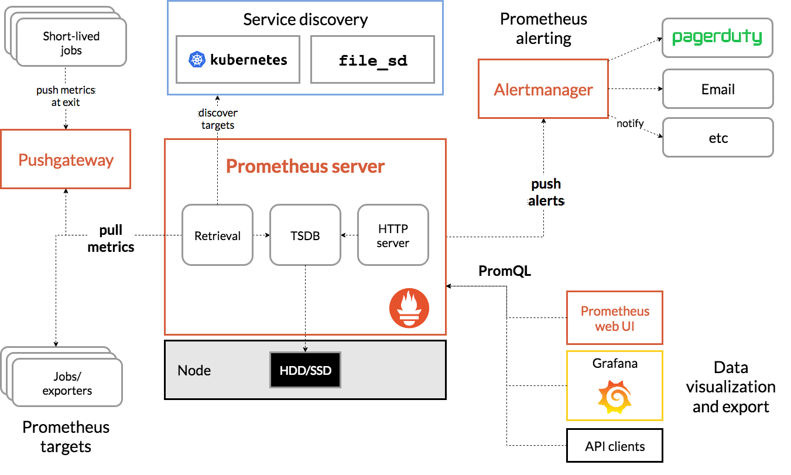

# Prometheus 组件介绍

## Prometheus 是什么

Prometheus 是一个开源的系统监控和告警工具包，最初由 SoundCloud 开发，现在已经成为 Cloud Native Computing Foundation（CNCF）的第二个项目（继 Kubernetes 之后）。Prometheus 以时间序列数据的形式收集和存储指标，非常适合用于监控动态云环境中的微服务和容器。

Prometheus 采用拉取（Pull）模式获取指标数据，可以通过服务发现自动发现监控目标，并支持强大的多维数据模型和灵活的查询语言 PromQL。其设计理念注重可靠性、可扩展性和易用性，使其成为现代云原生架构中监控系统的首选解决方案。

## 核心特性

### 多维数据模型

- **时间序列数据**：每个时间序列由指标名称和键值对标签（labels）唯一标识
- **强大的标签系统**：通过标签可以实现多维度的数据分析和聚合
- **灵活的查询**：使用 PromQL 查询语言进行复杂的数据查询和分析
- **高维聚合**：支持按标签进行聚合、分组和筛选

### 灵活的数据采集

- **Pull 模式**：主动从目标拉取数据，简化了配置并提高了系统可靠性
- **丰富的采集器**：内置 Node Exporter、Blackbox Exporter 等多种数据采集工具
- **Push Gateway**：支持短期任务和批处理作业的数据推送
- **服务发现**：支持多种服务发现机制，如 Kubernetes、Consul、DNS 等
- **自定义收集器**：可以编写自定义的 Exporter 来收集特定系统的指标

### 高效的存储

- **本地时间序列数据库**：高效存储时间序列数据
- **可配置的采样和保留策略**：灵活控制数据存储期限和精度
- **高效压缩算法**：优化存储空间使用
- **可扩展存储**：支持远程读写 API，可对接长期存储系统如 Thanos、Cortex 等

### 强大的查询能力

- **PromQL 查询语言**：专为时间序列数据设计的强大函数式查询语言
- **即时向量**：查询特定时间点的数据
- **范围向量**：查询一段时间内的数据
- **函数和运算符**：支持丰富的数学运算、聚合、预测等函数
- **灵活的图表和仪表盘**：通过内建的表达式浏览器或 Grafana 可视化查询结果

### 完善的告警机制

- **灵活的告警规则**：基于 PromQL 表达式配置告警规则
- **告警管理器**：处理告警分组、抑制、静默等
- **多种通知渠道**：支持邮件、Slack、PagerDuty、钉钉等多种通知方式
- **告警抑制**：避免告警风暴，减少重复告警

### 高可用设计

- **简单部署**：单二进制文件部署，无外部依赖
- **水平扩展**：支持联邦集群，实现大规模监控
- **高可用配置**：通过复制实例实现高可用
- **自我监控**：内置对自身组件的监控能力

## 架构详解

Prometheus 的架构设计简洁而强大，主要由以下几个核心组件组成：



### 核心组件

#### Prometheus Server

Prometheus Server 是整个系统的核心，主要负责：

- **数据抓取**：定期从配置的监控目标拉取指标数据
- **数据存储**：将采集到的数据存储在本地时间序列数据库中
- **数据查询**：通过 PromQL 提供对时间序列数据的查询能力
- **规则评估**：执行配置的记录规则和告警规则
- **服务发现**：发现和管理监控目标
- **API 服务**：提供 HTTP API 供外部访问数据

Prometheus Server 的内部组件包括：

- **检索器 (Retrieval)**：负责从监控目标拉取数据
- **存储引擎 (Storage)**：负责数据持久化
- **PromQL 引擎**：处理查询请求
- **规则评估器 (Rule Evaluator)**：评估告警规则
- **HTTP 服务器**：提供 UI 和 API 服务

#### Exporters (数据采集器)

Exporter 是一种特殊的服务，用于从第三方系统收集指标并将其转换为 Prometheus 支持的格式。常见的 Exporter 包括：

- **Node Exporter**：收集主机级别的指标（CPU、内存、磁盘、网络等）
- **MySQL Exporter**：收集 MySQL 数据库的指标
- **JMX Exporter**：收集 Java 应用程序的 JMX 指标
- **Blackbox Exporter**：进行黑盒监控（探针、HTTP、TCP 等）
- **HDFS Exporter**：收集 Hadoop HDFS 的指标
- **Redis Exporter**：收集 Redis 数据库的指标

#### Pushgateway

Pushgateway 允许短期作业和批处理作业将其指标推送到 Prometheus，解决了 Prometheus 拉取模型下短生命周期服务的监控问题。主要功能包括：

- **接收推送的指标**：通过 HTTP 接口接收客户端推送的指标数据
- **临时存储**：保存推送的指标数据直到被 Prometheus 抓取
- **指标分组**：根据标签对指标进行分组管理
- **提供抓取端点**：为 Prometheus 提供标准的抓取端点

#### Alertmanager

Alertmanager 负责处理由 Prometheus 服务器发送的告警，包括：

- **告警分组**：将相关的告警组合在一起
- **抑制机制**：当某些告警已经触发时，抑制其他相关告警
- **静默功能**：临时禁用特定的告警
- **路由**：基于标签将告警路由到不同的接收者
- **通知**：通过多种渠道发送告警通知（如邮件、Slack、钉钉等）

#### 可视化工具

虽然 Prometheus 提供了基本的表达式浏览器和图表功能，但通常与 Grafana 等工具结合使用以获得更强大的可视化能力：

- **Grafana**：最常用的可视化工具，支持丰富的图表类型和仪表板模板
- **表达式浏览器**：Prometheus Web UI 中的基本查询和可视化工具
- **控制台模板**：通过 Go 模板语言定制的控制台视图

### 数据流

Prometheus 系统中的数据流向如下：

1. **数据采集**：
   - Prometheus 服务器定期（通常每 15 秒或 30 秒）从监控目标抓取指标
   - 监控目标可以是直接暴露 Prometheus 格式指标的应用，也可以是各种 Exporter
   - 对于不适合拉取模型的场景，客户端可以通过 Pushgateway 推送指标

2. **数据处理和存储**：
   - 采集到的数据经过标签处理和重新标记后存储在时间序列数据库中
   - 按照配置的保留策略定期清理过期数据
   - 通过记录规则可以预先计算常用查询，提高查询效率

3. **数据查询和可视化**：
   - 用户可以通过 Web UI、API 或 Grafana 等工具查询数据
   - 使用 PromQL 语言执行复杂的查询和计算
   - 查询结果可以显示为图表、表格或原始数据

4. **告警处理**：
   - Prometheus 服务器评估告警规则，当条件满足时生成告警
   - 告警发送到 Alertmanager
   - Alertmanager 处理分组、抑制和路由，然后发送通知

## 数据模型

Prometheus 采用的是高度结构化的时间序列数据模型，这种模型非常适合存储和查询度量指标数据。

### 时间序列数据

Prometheus 中的每个时间序列都由以下部分组成：

- **指标名称 (Metric Name)**：描述被监控系统的某个特征（如 `http_requests_total`）
- **标签 (Labels)**：键值对形式的元数据，用于区分不同维度（如 `method="GET", status="200"`）
- **样本 (Sample)**：具体的时间戳和值对

完整的时间序列标识符由指标名称和标签集唯一确定，例如：

```
http_requests_total{method="GET", status="200", instance="10.0.0.1:8080"}
```

### 指标类型

Prometheus 客户端库支持四种核心指标类型：

1. **计数器 (Counter)**：
   - 单调递增的累积指标，只能增加或重置为零
   - 典型用例：请求数量、错误数量、已完成任务数
   - 例如：`http_requests_total{method="GET"}`

2. **仪表 (Gauge)**：
   - 可以任意上升和下降的单一数值
   - 典型用例：温度、内存使用量、并发请求数
   - 例如：`node_memory_MemAvailable_bytes`

3. **直方图 (Histogram)**：
   - 对观测值进行采样并按可配置的桶计数
   - 同时提供所有观测值的总和和计数
   - 典型用例：请求持续时间、响应大小
   - 例如：`http_request_duration_seconds`

4. **摘要 (Summary)**：
   - 类似于直方图，但提供基于滑动时间窗口的可配置分位数
   - 典型用例：请求延迟的特定百分位数
   - 例如：`http_request_duration_seconds`

## PromQL 查询语言

PromQL (Prometheus Query Language) 是 Prometheus 的查询语言，专为时间序列数据分析设计。

### 基本概念

#### 数据类型

PromQL 支持以下数据类型：

- **即时向量 (Instant Vector)**：一组时间序列，每个时间序列包含单个样本（特定时间点的值）
- **范围向量 (Range Vector)**：一组时间序列，每个时间序列包含一段时间内的样本
- **标量 (Scalar)**：简单的浮点值
- **字符串 (String)**：简单的字符串值（很少使用）

#### 选择器

使用指标名称和标签选择器查询时间序列：

```
http_requests_total{status="200", method="GET"}
```

支持的标签匹配操作符：

- `=`：精确匹配
- `!=`：不等于匹配
- `=~`：正则表达式匹配
- `!~`：正则表达式不匹配

### 运算符

PromQL 支持丰富的运算符：

- **算术运算符**：`+`, `-`, `*`, `/`, `%`, `^`
- **比较运算符**：`==`, `!=`, `>`, `<`, `>=`, `<=`
- **逻辑运算符**：`and`, `or`, `unless`
- **聚合运算符**：`sum`, `min`, `max`, `avg`, `stddev`, `count`, `count_values`, `topk`, `bottomk`, `quantile`
- **连接运算符**：`by`, `without`, `on`, `ignoring`

### 函数

PromQL 提供了多种函数：

- **速率和增量函数**：`rate`, `irate`, `increase`, `delta`
- **预测函数**：`predict_linear`, `holt_winters`
- **历史数据函数**：`changes`, `resets`, `deriv`
- **标签和指标操作函数**：`label_join`, `label_replace`, `absent`, `scalar`
- **数学函数**：`abs`, `ceil`, `floor`, `round`, `clamp_min`, `clamp_max`

### 查询示例

```
# 5分钟内HTTP请求率
rate(http_requests_total{job="api-server"}[5m])

# 按实例分组的CPU使用率
avg by (instance) (rate(node_cpu_seconds_total{mode!="idle"}[1m]))

# 预测4小时后磁盘将满
predict_linear(node_filesystem_free_bytes{mountpoint="/"}[1h], 4 * 3600) < 0

# 95%请求延迟
histogram_quantile(0.95, sum(rate(http_request_duration_seconds_bucket[5m])) by (le))
```

## 适用场景

Prometheus 在以下场景中表现出色：

### 微服务和容器监控

- **容器编排平台监控**：监控 Kubernetes、Docker Swarm 等平台的各个组件
- **微服务健康检查**：监控微服务的可用性、延迟和错误率
- **动态环境适应**：通过服务发现自动适应动态变化的容器环境
- **多维度分析**：通过标签系统分析服务间依赖和性能瓶颈

### 应用程序监控

- **应用性能监控（APM）**：跟踪应用响应时间、吞吐量和错误率
- **自定义业务指标**：监控业务关键指标如注册用户数、交易量等
- **接口监控**：监控 API 和服务接口的性能和可用性
- **依赖服务监控**：监控应用依赖的数据库、缓存、消息队列等服务

### 基础设施监控

- **服务器资源监控**：跟踪 CPU、内存、磁盘 IO、网络等资源使用情况
- **网络设备监控**：监控交换机、路由器等网络设备性能
- **存储系统监控**：监控分布式存储系统的容量和性能
- **大数据平台监控**：监控 Hadoop、Spark 等大数据处理框架

### DevOps 与 SRE 实践

- **服务水平目标（SLO）跟踪**：监控服务级别指标如可用性、延迟等
- **错误预算管理**：跟踪和管理服务的错误预算消耗
- **持续集成/持续部署监控**：监控 CI/CD 流程的健康状况
- **事件响应支持**：提供实时数据支持事件响应和故障排除

### 云环境监控

- **多云环境监控**：统一监控跨云环境的服务和资源
- **弹性伸缩监控**：监控自动伸缩触发条件和效果
- **云资源使用**：监控云资源的使用情况和成本
- **无服务器架构监控**：监控 FaaS (Function as a Service) 的执行和性能

## Prometheus 与其他监控系统的比较

| 系统 | 数据模型 | 数据收集方式 | 存储方式 | 查询语言 | 可扩展性 | 适用场景 |
|------|----------|--------------|----------|----------|----------|----------|
| **Prometheus** | 多维时间序列 | 主动拉取 | 本地时序数据库 | PromQL | 联邦集群 | 容器、微服务、动态环境 |
| **Grafana Loki** | 日志数据 | 推送 | 分布式存储 | LogQL | 水平扩展 | 日志聚合和分析 |
| **InfluxDB** | 时间序列 | 主要推送 | 专用时序数据库 | InfluxQL/Flux | 商业版支持集群 | IoT、实时分析 |
| **Nagios** | 状态检查 | 主动检查 | 关系型数据库 | 无专用查询语言 | 有限 | 传统基础设施监控 |
| **Elastic Stack** | 文档索引 | 主要推送 | Elasticsearch | Lucene/KQL | 水平扩展 | 日志和APM |
| **Zabbix** | 项目和指标 | 主动/被动混合 | 关系型数据库 | 自定义 | 代理分布式 | 企业基础设施监控 |

## 企业最佳实践

### 部署规模与高可用

#### 单实例部署

适用于小型环境（< 1000 个指标）的简单部署：

- 单个 Prometheus 服务器实例
- 本地存储
- 基础告警
- 通常与 Grafana 结合使用

#### 高可用部署

对于关键系统，推荐的高可用配置：

- 多个 Prometheus 实例监控相同的目标
- Alertmanager 集群模式
- 使用外部存储如 Thanos 或 Cortex
- 复制和分片机制

#### 大规模部署

对于大型环境（> 100,000 个指标）：

- 分层采集架构
- 地域和功能分片
- 联邦集群
- 长期存储分离
- 专用查询层

### 告警策略

#### 告警金字塔

分层设计告警，按严重性划分：

- **P0 (严重)**：立即响应，全天候呼叫
- **P1 (高)**：工作时间内快速响应
- **P2 (中)**：下一个工作日处理
- **P3 (低)**：计划内处理

#### 告警规则最佳实践

- **有意义的命名**：清晰描述告警内容
- **详细的注释**：包含问题描述、影响和解决方案
- **防噪音机制**：适当的阈值和for子句避免抖动
- **合理分组**：按服务或功能域分组告警

### 长期存储方案

对于需要长期保留数据的场景，常见的解决方案：

- **Thanos**：提供全局查询视图、长期存储和高可用
- **Cortex**：多租户、水平扩展的Prometheus解决方案
- **VictoriaMetrics**：高性能、经济高效的时序数据库
- **远程写入**：将数据推送到InfluxDB、TimescaleDB等支持OpenTSDB协议的数据库

## 总结

Prometheus 作为云原生环境中的主流监控系统，凭借其强大的数据模型、灵活的查询语言、高效的存储和可扩展的架构，为现代应用和基础设施监控提供了完整解决方案。它特别适合于动态环境下的微服务和容器监控，能够帮助团队更好地理解系统行为、预测趋势、快速排查问题。

随着技术生态的发展，Prometheus 已经形成了一个完整的监控生态系统，包括各种集成工具、扩展组件和最佳实践。对于追求高可用、可观测性和自动化运维的组织来说，Prometheus 是一个不可或缺的工具。 