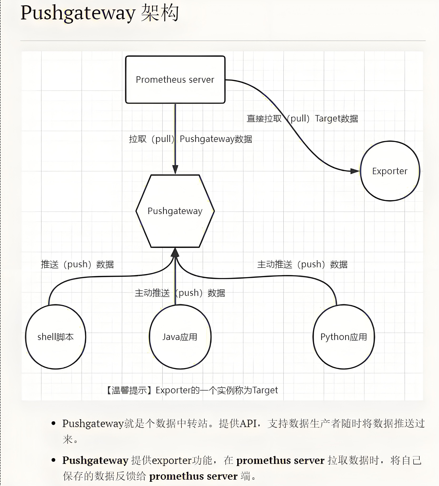

# Pushgateway 组件介绍

## Pushgateway 是什么

Pushgateway 是 Prometheus 生态系统中的一个重要组件，专门用于解决短暂作业和批处理任务的指标收集问题。在 Prometheus 的标准拉取（Pull）模型中，监控目标需要持续运行并暴露指标端点以便 Prometheus 定期抓取。然而，对于那些生命周期短暂或执行完就终止的任务（如批处理作业、定时脚本等），标准的拉取模式就无法很好地工作。

Pushgateway 通过提供一个中间服务，接收这些短暂作业主动推送（Push）的指标数据，然后将这些数据保存下来，并暴露一个标准的 Prometheus 指标端点，供 Prometheus 服务器定期抓取。这样就解决了短暂作业无法被 Prometheus 直接监控的问题。

## 核心特性

### 主动推送模式

- **接收推送的指标**：通过 HTTP 接口接收客户端推送的指标数据
- **支持多种客户端库**：提供多种语言的客户端库，方便集成到不同应用程序中
- **兼容 Prometheus 数据格式**：推送的数据与 Prometheus 原生格式兼容
- **灵活的指标组织**：支持通过作业名称和实例名称组织指标

### 持久存储与指标管理

- **临时存储**：将推送的指标保存在内存中，并持久化到磁盘
- **指标生命周期管理**：支持手动或自动过期清理过时指标
- **标签管理**：支持在推送时添加或修改指标标签
- **指标分组**：根据作业和实例进行指标分组

### 与 Prometheus 集成

- **标准的暴露端点**：提供 `/metrics` 端点供 Prometheus 抓取
- **元数据兼容**：保持与 Prometheus 指标元数据的兼容性
- **自我监控指标**：提供关于 Pushgateway 自身状态的指标
- **支持 Prometheus 高可用**：可以配置为多个 Prometheus 服务器的抓取目标

### 安全性与可靠性

- **支持 TLS**：可配置 HTTPS 进行安全通信
- **认证机制**：支持基本认证保护推送接口
- **指标验证**：对推送的指标进行格式验证
- **容错能力**：能够在网络或系统故障时保留指标数据

## 架构详解

Pushgateway 的架构设计简洁而高效，主要由以下几个核心部分组成：



### 核心组件

#### HTTP 服务器

负责接收客户端的指标推送请求和 Prometheus 的抓取请求：

- **推送接口**：接收 POST/PUT/DELETE 请求，处理客户端推送的指标
- **指标暴露接口**：提供 GET 请求，响应 Prometheus 的抓取
- **API 接口**：提供管理和查询接口
- **Web UI**：提供简单的 Web 界面，显示当前存储的指标

#### 存储管理器

负责指标数据的内存存储和持久化：

- **内存存储**：高效地在内存中管理指标数据
- **持久化**：定期将内存中的数据持久化到磁盘
- **恢复机制**：在重启时从磁盘恢复数据
- **过期清理**：管理指标的生命周期，清理过期指标

#### 指标处理器

处理指标数据的核心逻辑：

- **指标解析**：解析客户端推送的指标数据
- **标签处理**：处理和验证指标标签
- **指标合并**：将新推送的指标与已存在的指标合并
- **指标转换**：将存储的指标转换为 Prometheus 格式

### 工作流程

Pushgateway 的工作流程可以分为两个主要部分：

#### 指标推送流程

1. **客户端准备**：短暂作业或批处理任务通过客户端库收集指标
2. **指标推送**：客户端通过 HTTP POST/PUT 请求将指标推送到 Pushgateway
3. **数据接收**：Pushgateway 的 HTTP 服务器接收请求
4. **指标处理**：验证和解析推送的指标
5. **标签处理**：根据配置添加或修改标签
6. **数据存储**：将指标保存到内存存储
7. **持久化**：定期将数据持久化到磁盘

#### 指标抓取流程

1. **Prometheus 请求**：Prometheus 服务器按配置的时间间隔向 Pushgateway 发送抓取请求
2. **数据准备**：Pushgateway 从存储中读取所有当前指标
3. **格式转换**：将存储的指标转换为 Prometheus 指标格式
4. **响应生成**：生成包含所有指标的响应
5. **数据返回**：将指标数据返回给 Prometheus
6. **指标处理**：Prometheus 处理抓取的指标，应用标签和规则

## 使用场景

Pushgateway 在以下场景中特别有用：

### 批处理作业监控

- **定时任务**：监控 cron 作业和定时执行的脚本
- **ETL 流程**：监控数据提取、转换和加载任务
- **数据备份任务**：监控备份作业的执行情况和性能
- **离线计算**：监控离线数据处理或批量计算任务

### 短生命周期服务

- **CI/CD 流水线作业**：监控持续集成/部署流程中的各个步骤
- **单次执行脚本**：监控管理脚本的执行情况
- **临时测试程序**：收集临时测试的指标数据
- **一次性迁移任务**：监控数据迁移或系统升级任务

### 防火墙后的服务

- **内网服务**：收集无法被外部 Prometheus 直接访问的服务指标
- **边缘计算节点**：收集分布在不同网络环境的边缘节点指标
- **受限环境中的应用**：收集在安全限制环境中运行的应用指标
- **动态 IP 环境**：收集没有固定地址的服务指标

### 特殊网络拓扑

- **NAT 后的服务**：收集在 NAT 后无法直接访问的服务指标
- **多层网络架构**：在复杂网络环境中穿透多层网络收集指标
- **临时网络连接**：通过临时建立的网络连接推送指标
- **间歇性连接**：在网络连接不稳定的环境中确保指标不丢失

## 集成与使用模式

### 与批处理系统集成

#### 与 Jenkins 集成

通过在 Jenkins 流水线中收集和推送构建指标：

- **构建执行时间**：收集每个构建步骤的执行时间
- **构建成功率**：跟踪构建成功和失败的比率
- **测试覆盖率**：推送测试覆盖率指标
- **代码质量指标**：推送静态代码分析结果

#### 与数据处理框架集成

在 Spark、Hadoop 等大数据处理框架中使用：

- **作业执行指标**：收集处理作业的执行时间和资源使用情况
- **数据处理量**：监控处理的数据量和速率
- **错误率**：跟踪数据处理错误
- **资源使用情况**：监控计算资源的利用率

### 使用模式

#### 单次推送模式

适用于简单批处理任务，只在任务完成时推送一次指标：

```
START --> Execute Job --> Collect Metrics --> Push to Pushgateway --> END
```

这种模式简单直接，但只提供任务最终状态的信息。

#### 增量更新模式

适用于长时间运行的批处理任务，定期更新进度指标：

```
START --> Initialize --> Push Initial Metrics
  |
  V
Execute Step 1 --> Update Metrics --> Push Update
  |
  V
Execute Step 2 --> Update Metrics --> Push Update
  |
  V
...
  |
  V
Complete Job --> Final Metrics Update --> Push Final Update --> END
```

这种模式提供了任务执行过程中的更详细信息。

#### 多实例采集模式

适用于分布式批处理，多个实例同时向 Pushgateway 推送指标：

```
Worker 1 --> Execute Task --> Push Metrics
Worker 2 --> Execute Task --> Push Metrics
...
Worker N --> Execute Task --> Push Metrics
                                  |
                                  V
                        Pushgateway Aggregates
                                  |
                                  V
                        Prometheus Scrapes
```

这种模式可以聚合分布式任务的指标。

## Pushgateway 与其他解决方案的比较

| 方法 | 优点 | 缺点 | 适用场景 |
|------|------|------|----------|
| **Pushgateway** | 专为短暂作业设计、与 Prometheus 集成良好、支持多种客户端 | 可能成为单点故障、指标持久化需要管理 | 批处理作业、CI/CD 流水线、定时任务 |
| **直接 Push 到远程存储** | 绕过 Prometheus、可以实现更长的存储周期 | 配置复杂、失去 Prometheus 生态优势 | 需要长期存储的批处理指标 |
| **文件服务指标输出** | 简单、无需额外服务 | 需要额外的收集机制、不易管理 | 极简环境、临时解决方案 |
| **内置定时抓取程序** | 保持 Pull 模式、无需额外组件 | 配置复杂、时机可能不准确 | 可预测的短暂作业 |
| **使用第三方消息队列** | 高可用、解耦、可扩展 | 增加系统复杂性、需要额外组件 | 高要求的企业级环境 |

## 最佳实践与注意事项

### 部署建议

#### 高可用配置

对于关键系统，建议：

- **多实例部署**：部署多个 Pushgateway 实例
- **负载均衡**：使用负载均衡器分发推送请求
- **独立存储**：使用共享存储或独立存储确保数据一致性
- **监控 Pushgateway**：对 Pushgateway 本身进行监控

#### 资源配置

根据负载调整资源：

- **内存配置**：根据预期的指标数量分配足够内存
- **CPU 配置**：处理大量并发推送请求时需要足够的 CPU 资源
- **磁盘配置**：提供足够的磁盘空间用于持久化存储
- **网络配置**：确保网络带宽满足推送和抓取需求

### 安全性考虑

保护 Pushgateway 免受未授权访问：

- **启用认证**：保护推送 API 接口
- **使用 TLS**：加密传输中的数据
- **网络隔离**：将 Pushgateway 部署在安全网络中
- **API 访问控制**：限制管理 API 的访问

### 常见陷阱与解决方案

#### 指标过期问题

问题：指标永久保留导致过时信息

解决方案：
- 实现定期清理策略
- 使用时间戳标签标记指标时效
- 配置 Prometheus 端的指标过滤

#### 标签冲突

问题：不同作业使用相同标签导致冲突

解决方案：
- 使用独立的作业和实例命名
- 为不同的推送源设计标签命名约定
- 使用 grouping_key 正确分组指标

#### 单点故障风险

问题：Pushgateway 成为监控系统的单点故障

解决方案：
- 部署多个 Pushgateway 实例
- 实现客户端重试和故障转移机制
- 配置适当的告警以快速发现问题

#### 指标污染

问题：旧的指标无法被清除，导致数据污染

解决方案：
- 使用精确的作业和实例标识
- 在推送前执行适当的删除操作
- 实现自动清理过期指标的机制

## Pushgateway 与整体监控架构

在完整的监控架构中，Pushgateway 作为拉取模型的补充，与其他组件协同工作：

### 典型监控架构

```
                   ┌───────────────┐
                   │   短暂作业    │
                   └───────┬───────┘
                           │ Push
                           ▼
┌───────────┐     ┌───────────────┐     ┌───────────────┐
│  Exporter │◄────│  Pushgateway  │◄────│  Prometheus   │
└─────┬─────┘     └───────────────┘     └───────┬───────┘
      │ Pull                                    │ Query
      │                                         │
      │           ┌───────────────┐             │
      └──────────►│  Prometheus   │◄────────────┘
                  └───────┬───────┘
                          │ Alert
                          ▼
                  ┌───────────────┐     ┌───────────────┐
                  │ Alertmanager  │────►│  通知渠道    │
                  └───────────────┘     └───────────────┘
                          │ Visualize
                          ▼
                  ┌───────────────┐
                  │    Grafana    │
                  └───────────────┘
```

### 与其他组件的关系

#### 与 Prometheus 的关系

- Pushgateway 作为 Prometheus 的抓取目标
- Prometheus 定期从 Pushgateway 抓取指标
- Prometheus 处理和存储这些指标，应用规则和告警

#### 与 Alertmanager 的关系

- Prometheus 基于 Pushgateway 提供的指标生成告警
- Alertmanager 处理这些告警并发送通知
- 可以针对批处理作业配置特定的告警规则和处理流程

#### 与 Grafana 的关系

- Grafana 通过 Prometheus 查询 Pushgateway 的指标
- 可以创建专门的仪表板展示批处理作业指标
- 支持批处理作业性能和结果的可视化分析

## 总结

Pushgateway 作为 Prometheus 生态系统的重要补充，解决了短暂作业和批处理任务的监控挑战。通过提供一个简单而强大的推送机制，它弥补了传统拉取模型在特定场景下的不足，使 Prometheus 的监控能力更加全面。

Pushgateway 的主要价值在于：

- **扩展监控覆盖范围**：将监控扩展到短暂作业和批处理任务
- **简化集成复杂度**：提供简单的 HTTP 接口，易于集成到各种系统
- **保持一致的监控体验**：与 Prometheus 无缝集成，保持统一的查询和告警体验
- **增强监控灵活性**：在拉取模型难以实现的场景中提供替代方案

然而，使用 Pushgateway 时需要谨慎考虑指标生命周期管理、高可用配置和安全性设计，以确保其在生产环境中的稳定性和可靠性。通过合理配置和使用最佳实践，Pushgateway 可以成为完整监控解决方案中的重要组成部分。 