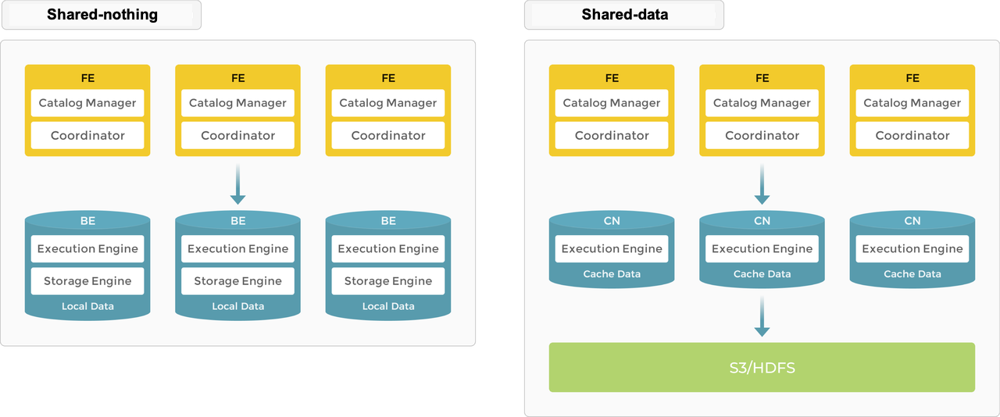

# StarRocks 组件介绍

## 什么是StarRocks

StarRocks是一种高性能的分析型数据库，专为实时分析处理(OLAP)而设计。它以极高的查询性能、良好的扩展性和易用性而闻名，能够在海量数据上提供毫秒级的查询响应。StarRocks起源于百度的Palo项目（开源为Apache Doris），后经过重新设计和架构优化，成为一个独立的开源项目。它融合了现代MPP数据库架构与列式存储引擎的优势，为企业提供一站式的实时数据分析解决方案。

## 核心特性与优势

### 卓越的查询性能

StarRocks具备领先的查询性能表现：

- **向量化执行引擎**：采用SIMD指令集优化，能够同时处理多条数据记录
- **智能查询优化器**：基于成本的优化器(CBO)，能生成最优执行计划
- **列式存储**：高效的数据压缩和列式编码，减少I/O开销
- **多级缓存机制**：包括元数据缓存、索引缓存和数据缓存，加速查询执行
- **并行查询处理**：充分利用多核CPU和分布式集群资源

### 丰富的索引技术

StarRocks支持多样化的索引技术，适应不同查询模式：

- **稀疏索引**：加速数据扫描过程
- **ZoneMap索引**：记录每个数据块的最大值和最小值，跳过不必要的数据块扫描
- **BloomFilter索引**：快速判断指定值是否存在
- **Inverted索引**：支持多维全文检索
- **Bitmap索引**：高效处理等值查询和多列组合查询

### 强大的数据更新能力

与传统的OLAP系统不同，StarRocks支持灵活的数据更新操作：

- **实时更新**：支持行级别的插入、删除和更新操作
- **Primary Key模型**：提供主键去重和UPSERT语义
- **事务支持**：确保数据一致性和隔离性
- **Change Data Capture (CDC)**：支持从上游系统捕获变更数据
- **批量数据更新**：高效处理大规模数据更新场景

### 流批一体的数据导入

StarRocks提供多种数据导入方式，满足不同数据集成需求：

- **流式导入**：支持通过HTTP REST API、MySQL协议等方式实时导入数据
- **批量导入**：支持从HDFS、S3等外部存储系统导入大批量数据
- **Connector导入**：提供Flink、Spark等连接器简化数据导入
- **外部表**：支持通过Hive Catalog、JDBC、Elasticsearch等接入外部数据

### 卓越的扩展性

StarRocks设计了弹性可扩展的架构：

- **水平扩展**：可以通过增加计算节点线性提升系统性能
- **负载均衡**：自动进行数据分布和负载平衡
- **高可用性**：支持多副本机制，确保数据可靠性
- **弹性资源管理**：支持资源组隔离和动态调整

### 易用性和兼容性

StarRocks注重用户体验和生态兼容：

- **兼容MySQL协议**：使用熟悉的SQL语法，无需学习新的查询语言
- **无模式转换**：支持直接查询原始数据，无需ETL转换
- **丰富的数据类型**：支持结构化、半结构化数据类型
- **广泛的工具支持**：兼容主流BI工具和数据分析平台
- **开箱即用**：简单的部署和配置过程

## 核心架构

StarRocks采用分层架构设计，主要包含以下组件：

### 节点类型

StarRocks集群由两种类型的节点组成：

#### FE (Frontend)

FE节点主要负责：
- **元数据管理**：管理表结构、分区信息、副本信息等元数据
- **查询规划**：解析SQL语句并生成执行计划
- **集群管理**：监控BE节点状态，协调数据分布
- **客户端接入**：提供MySQL协议服务和HTTP服务
- **权限认证**：管理用户权限和访问控制

FE节点采用主从架构：
- 一个Leader节点：负责元数据写入和集群管理
- 多个Follower节点：提供读服务和高可用备份
- Observer节点（可选）：只读节点，用于扩展查询服务

#### BE (Backend)

BE节点主要负责：
- **数据存储**：存储实际数据及索引
- **查询执行**：执行FE下发的查询计划
- **数据导入**：执行数据导入任务
- **数据复制**：维护多副本数据一致性
- **计算加速**：提供向量化计算能力

### 数据分布与复制

StarRocks采用分片(Tablet)作为数据分布的基本单位：

1. **分片机制**：表按照分区(Partition)和分桶(Bucket)进行水平拆分
   - 分区：通常按照时间或范围进行数据的逻辑分区
   - 分桶：在每个分区内，按照Hash或Range方式将数据切分为多个Tablet

2. **多副本机制**：每个Tablet可配置多个副本，默认3个
   - 副本自动分布在不同BE节点上
   - 采用Raft协议保证副本一致性
   - 支持自动修复和均衡

### 存储引擎

StarRocks采用自研的列式存储引擎：

1. **数据组织**：
   - 按列存储：相同列的数据物理上存储在一起
   - 分段存储：数据按照Rowset和Segment进行组织
   - 索引结构：包含稀疏索引、ZoneMap、BloomFilter等

2. **数据压缩**：
   - 轻量级编码：Run Length、Dictionary、Frame of Reference等
   - 通用压缩算法：LZ4、ZSTD等
   - 自适应压缩策略：根据数据特点选择最优压缩方式

3. **数据更新机制**：
   - 主键模型：支持行级别的更新和删除
   - 版本链管理：基于MVCC机制处理并发访问
   - 合并策略：后台自动进行数据文件合并优化

### 查询引擎

StarRocks的查询处理引擎包含以下关键技术：

1. **SQL解析与优化**：
   - 语法解析：将SQL转换为抽象语法树
   - 逻辑优化：谓词下推、常量折叠、子查询重写等
   - 物理优化：基于成本的执行计划选择
   - 统计信息：收集并利用列级别的统计信息

2. **向量化执行**：
   - 批处理：每次处理多行数据
   - SIMD加速：利用CPU的向量指令集
   - Pipeline执行：流水线化处理减少中间结果

3. **分布式执行**：
   - 并行执行：多节点协同完成查询
   - 本地计算：数据本地化处理减少网络传输
   - 动态分区裁剪：运行时跳过无关数据分区

## 数据模型

StarRocks支持多种表模型，适应不同的业务场景：

### 明细模型(Duplicate Key)

- **特点**：允许数据中包含完全相同的行
- **适用场景**：原始数据存储，要求保留所有记录
- **存储效率**：通过列存压缩节省空间
- **查询性能**：适合大范围扫描和聚合分析

### 聚合模型(Aggregate Key)

- **特点**：按照指定的列对数据进行预聚合
- **适用场景**：数据立方体、指标分析
- **存储效率**：高度压缩，大幅减少存储空间
- **查询性能**：针对聚合查询有极高的性能

### 更新模型(Unique Key)

- **特点**：提供主键约束，保证记录唯一性
- **适用场景**：需要频繁更新的维度表、事实表
- **更新操作**：支持UPSERT语义，自动去重
- **查询性能**：针对点查询和小范围查询优化

### 主键模型(Primary Key)

- **特点**：最新的表模型，提供完整的事务支持
- **适用场景**：需要严格数据一致性的业务场景
- **更新操作**：支持行级别的INSERT、UPDATE、DELETE操作
- **存储特性**：基于LSM树设计，优化更新性能

## 适用场景

StarRocks凭借其卓越的性能和灵活性，适用于多种数据分析场景：

### 实时数据仓库

作为现代实时数据仓库的核心引擎：
- **实时数据集成**：从多种数据源快速导入数据
- **灵活的Schema变更**：支持动态添加或修改列
- **多模式查询**：同时支持报表分析和即席查询
- **秒级数据刷新**：保证数据的最新性
- **PB级数据规模**：处理企业级数据体量

### 用户行为分析

处理高并发的用户行为分析场景：
- **会话分析**：追踪用户会话和行为路径
- **事件分析**：分析用户交互事件序列
- **留存分析**：计算用户留存率和活跃度
- **漏斗分析**：跟踪用户转化路径和转化率
- **A/B测试**：比较不同策略的效果

### 广告与营销分析

支持复杂的广告和营销数据分析：
- **广告投放分析**：评估广告展示和点击效果
- **转化归因**：多触点归因分析
- **受众分析**：精细化人群画像和定向
- **ROI计算**：计算营销投入回报率
- **实时监控**：监控营销活动实时效果

### 物联网数据分析

处理高吞吐的物联网数据流：
- **设备监控**：分析设备状态和性能数据
- **异常检测**：识别设备异常行为模式
- **预测性维护**：预测设备故障和维护需求
- **时序数据分析**：分析传感器数据趋势
- **地理空间分析**：结合位置数据进行分析

### 金融风控与合规

满足金融领域的严格要求：
- **实时风控**：毫秒级响应的风险评估
- **欺诈检测**：识别可疑交易模式
- **合规报告**：生成监管所需的合规报告
- **客户360视图**：整合客户各渠道数据
- **信用评分**：实时计算客户信用水平

### 业务智能与报表

为企业BI和报表提供强大支持：
- **仪表板**：构建实时业务监控仪表板
- **自助分析**：支持业务用户自助数据探索
- **报表生成**：自动化生成业务报表
- **多维分析**：支持上钻、下钻、切片等OLAP操作
- **数据可视化**：与主流BI工具无缝集成

## 与其他技术对比

### StarRocks vs Apache Doris

StarRocks和Apache Doris有共同的起源，但在多方面有显著差异：

| 特性 | StarRocks | Apache Doris |
|-----|-----------|--------------|
| 查询引擎 | 全新的向量化执行引擎 | 传统的火山模型执行引擎 |
| 更新能力 | 支持Primary Key模型，完整CRUD | 主要支持Unique Key模型 |
| 分布式连接 | 支持多种高效Join算法 | 连接性能相对较弱 |
| 物化视图 | 支持异步物化视图 | 支持同步物化视图 |
| 查询优化器 | 基于CBO的优化器 | 基于规则的优化器 |
| 湖仓一体 | 内置数据湖分析功能 | 主要关注数据仓库场景 |

### StarRocks vs ClickHouse

作为两种流行的分析型数据库，它们各有特点：

| 特性 | StarRocks | ClickHouse |
|-----|-----------|------------|
| 易用性 | 兼容MySQL协议，易于使用 | 专有协议，学习曲线较陡 |
| 更新能力 | 支持灵活的数据更新 | 更新操作受限，主要针对追加场景 |
| 扩展性 | 原生分布式架构 | 需要额外配置实现可靠分布式 |
| 分析能力 | 擅长通用OLAP分析 | 在特定场景下性能极高 |
| 管理难度 | 集中式管理，易于维护 | 分散管理，运维复杂度较高 |
| 多表JOIN | 优化的分布式JOIN性能 | JOIN性能较为受限 |

### StarRocks vs Apache Druid

| 特性 | StarRocks | Apache Druid |
|-----|-----------|--------------|
| 定位 | 通用OLAP引擎 | 主要针对时间序列分析 |
| SQL支持 | 完整SQL支持 | SQL支持有限制 |
| 灵活性 | 支持多种表模型 | 固定的数据模型 |
| 实时性 | 秒级数据刷新 | 亚秒级数据刷新 |
| 复杂查询 | 强大的复杂查询能力 | 主要优化简单聚合查询 |
| 部署难度 | 相对简单 | 组件多，配置复杂 |

## 生态系统集成

StarRocks构建了丰富的生态系统，实现与各类数据技术的无缝集成：

### 数据源集成

StarRocks可以从多种数据源导入数据：

- **文件系统**：HDFS、S3、阿里云OSS等
- **消息队列**：Kafka、Pulsar等
- **数据库**：MySQL、PostgreSQL、Oracle等
- **数据处理**：Spark、Flink、DataX等
- **其他存储**：Hive、Iceberg、Hudi等

### 集成工具

- **StarRocks Connector for Flink**：支持从Flink实时写入数据
- **StarRocks Connector for Spark**：支持从Spark批量导入数据
- **StarRocks Connector for DataX**：支持通过DataX导入各类数据源
- **CDC工具集成**：支持Debezium、Canal等CDC工具

### 数据导出与分析工具

StarRocks可以与各类数据分析工具集成：

- **BI工具**：Tableau、Power BI、Superset等
- **数据科学工具**：Jupyter、Python生态
- **可视化工具**：Grafana、Redash等
- **ETL工具**：Airflow、Kettle等

### API与协议支持

StarRocks提供多种接入方式：

- **MySQL协议**：兼容MySQL客户端和驱动
- **HTTP REST API**：支持程序化接入
- **JDBC/ODBC驱动**：支持各类应用集成
- **Thrift API**：支持高性能RPC调用

## 性能优化与最佳实践

### 数据导入优化

- **选择合适的导入方式**：根据数据量和实时性需求选择Stream Load、Broker Load或Routine Load
- **批量导入**：合理设置批量大小，通常建议50MB-200MB
- **分区设计**：按照查询模式设计合理的分区策略
- **并行度控制**：调整并行导入任务数量，避免资源竞争

### 查询优化

- **合理的表设计**：选择适合业务场景的表模型
- **索引优化**：为高频查询条件创建合适的索引
- **分区裁剪**：确保查询可以利用分区信息减少扫描数据量
- **合理使用物化视图**：为常见聚合查询创建物化视图
- **查询重写**：优化复杂SQL，避免子查询和过度复杂的表达式

### 集群配置优化

- **硬件配置**：SSD存储、高内存和多核CPU的配置能显著提升性能
- **内存管理**：合理配置查询内存限制和缓存大小
- **并发控制**：根据硬件资源调整最大并发查询数
- **资源隔离**：使用资源组隔离不同业务负载
- **BE与FE比例**：通常BE:FE比例为4:1到8:1较为合适

## 未来发展趋势

StarRocks正在不断发展，未来的重点方向包括：

- **湖仓一体**：增强对数据湖的直接查询能力
- **AI集成**：与人工智能和机器学习工作负载更好地集成
- **全球分布**：支持地理分布式部署和多区域数据管理
- **自治运维**：增强自动化管理和自优化能力
- **云原生**：提供更完善的云原生部署和管理体验

## 总结

StarRocks作为一款高性能的分析型数据库，通过其卓越的查询性能、灵活的数据更新能力、强大的扩展性和易用性，为企业提供了一站式的实时数据分析解决方案。它能够处理从TB到PB级别的数据规模，支持毫秒级的交互式查询，同时保持数据的实时更新能力。

无论是构建实时数据仓库、用户行为分析系统，还是复杂的业务智能平台，StarRocks都能够满足苛刻的性能和可靠性要求。随着数据分析需求的不断增长和演变，StarRocks将继续创新，为更多企业的数据驱动决策提供强大支持。 