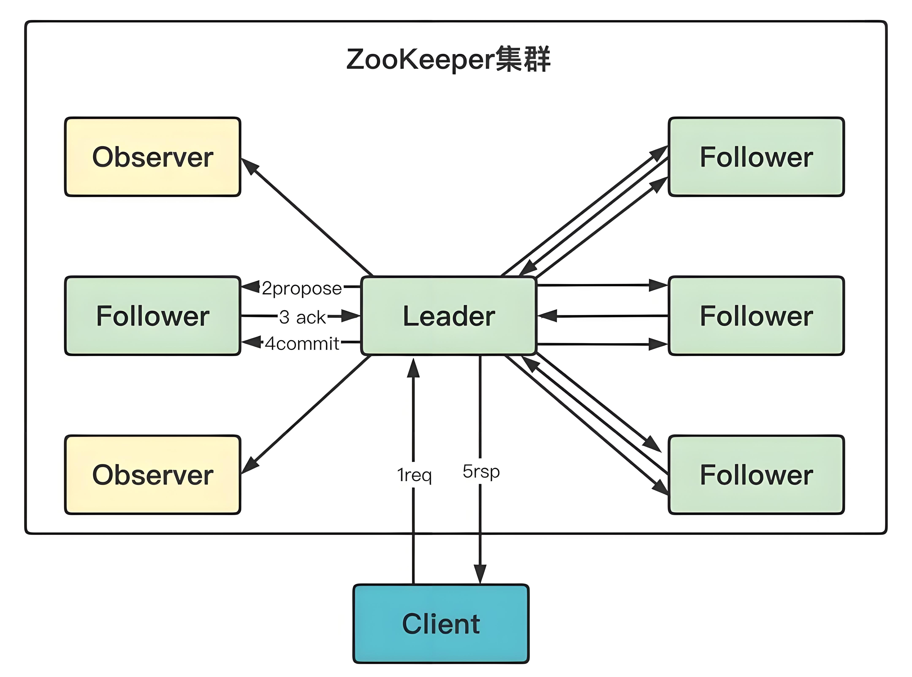

# ZooKeeper 组件介绍

## ZooKeeper 是什么

ZooKeeper 是一个开源的分布式协调服务，最初由 Yahoo 开发，后来成为 Apache 软件基金会的顶级项目。它提供了一组简单的原语，分布式应用程序可以基于这些原语实现更高级的服务，如配置管理、分布式同步、组成员资格和命名服务等。

ZooKeeper 的设计目标是提供一个简单且高性能的协调内核，使开发人员能够专注于核心应用逻辑，而不必处理分布式系统中的各种复杂挑战，如竞态条件、死锁、不一致状态等。ZooKeeper 通过其独特的数据模型和保证机制，成为了构建可靠分布式系统的基础组件。

## 核心特性

### 简单的数据模型

- **层次命名空间**：类似文件系统的目录树结构，便于组织和访问
- **轻量级数据节点**：每个节点（ZNode）可以存储少量数据（通常不超过1MB）
- **动态节点类型**：支持永久节点、临时节点和顺序节点
- **原子操作**：确保对数据的读写操作是原子性的
- **简单的API**：提供简洁明确的接口，降低学习和使用成本

### 可靠的协调服务

- **顺序一致性**：客户端的更新请求按发送顺序应用
- **原子性**：更新操作要么成功要么失败，没有中间状态
- **单一系统映像**：无论连接到哪个服务器，客户端看到的数据视图都是一致的
- **可靠性**：一旦更新成功，它将持久化直到被覆盖
- **及时性**：系统保证在一定时间范围内，客户端能够看到最新的数据

### 高性能设计

- **内存数据存储**：所有数据保存在内存中，确保高吞吐量和低延迟
- **顺序磁盘写入**：通过顺序写入提高持久化性能
- **读取请求本地处理**：任何服务器都可以处理读请求，无需协调
- **写入请求中心化处理**：所有写入通过领导者处理，确保顺序性
- **观察者模式（Observers）**：可用于提高读性能，不参与投票过程

### 分布式协调能力

- **领导者选举**：自动选择一个服务器作为领导者协调写操作
- **群组成员管理**：跟踪集群中的活跃成员
- **分布式锁**：提供互斥访问资源的机制
- **分布式屏障**：同步分布式进程的执行
- **优先级队列**：支持基于顺序节点的优先级处理

### 监听机制

- **Watch机制**：客户端可以在数据节点上设置监听器
- **一次性触发**：监听事件触发一次后自动移除
- **异步通知**：数据变化时异步通知客户端
- **轻量级设计**：不保存事件历史，减少服务器负担
- **近实时响应**：快速通知数据变化事件

### 高可用架构

- **集群部署**：支持多服务器集群部署
- **过半数机制**：只要大多数服务器可用，服务就能继续
- **快速故障恢复**：自动检测并处理服务器故障
- **动态重配置**：支持不停机调整集群配置
- **可扩展性**：可以根据需求增加服务器提高可用性

## 架构详解

ZooKeeper 采用简洁而高效的架构设计，主要包括服务器集群和客户端两部分。

### 服务器架构

ZooKeeper 服务器集群通常由奇数个节点组成，最少3个节点，通常为3、5、7个节点，它们共同维护了整个服务的状态。

#### 角色分类

ZooKeeper 服务器节点有三种角色：

- **领导者（Leader）**：
  - 处理所有写请求并将更改广播给追随者
  - 负责处理系统配置变更
  - 维护集群内部心跳检测
  - 参与读请求的处理
  - 在选举过程中接收选票并确定结果

- **追随者（Follower）**：
  - 接收客户端的读请求并返回结果
  - 将写请求转发给领导者处理
  - 参与领导者选举投票
  - 在领导者故障时参与新一轮选举
  - 从领导者接收状态更新并保持同步

- **观察者（Observer）**：
  - 接收客户端的读请求并返回结果
  - 将写请求转发给领导者处理
  - 不参与投票和选举过程
  - 从领导者接收状态更新并保持同步
  - 用于提高读取性能和系统可扩展性

#### 数据一致性保证

ZooKeeper 使用 ZAB（ZooKeeper Atomic Broadcast）协议确保服务器间数据一致性：

- **领导者选举**：当领导者失效时，追随者会选举出新的领导者
- **发现阶段**：新领导者确定最新的系统状态
- **同步阶段**：确保所有服务器同步到最新状态
- **广播阶段**：领导者接收新的写请求，并以事务形式广播给所有追随者

#### 数据存储

ZooKeeper 的数据存储机制包括：

- **内存数据库**：所有数据存储在内存中，保证读取的高性能
- **事务日志**：所有更新操作先写入事务日志，然后应用到内存数据库
- **快照机制**：定期将内存数据库的完整状态写入磁盘快照文件
- **日志清理**：通过快照实现对事务日志的定期清理，防止无限增长

### 客户端架构

ZooKeeper 客户端是轻量级的，主要负责与服务器集群通信：

- **会话管理**：维护与服务器的长连接和会话状态
- **请求处理**：发送读写请求并处理响应
- **Watch管理**：注册和处理数据变化的通知
- **自动重连**：在服务器故障时自动连接其他服务器
- **负载均衡**：在多服务器间分散连接负载

### 通信协议

ZooKeeper 使用自定义的二进制协议进行客户端-服务器和服务器-服务器间通信：

- **会话建立**：客户端与服务器间建立TCP长连接
- **心跳机制**：客户端定期向服务器发送心跳以维持会话
- **请求-响应模式**：所有操作基于请求-响应模式进行
- **通知机制**：服务器通过回调通知客户端数据变化
- **批量处理**：允许客户端发送批量请求提高效率

## 数据模型

ZooKeeper 的数据模型类似于文件系统，但有其独特之处。

### 层次命名空间

ZooKeeper 维护着一个类似于标准文件系统的命名空间，组织为一个树形结构：

- **根节点**：所有路径都从根节点 `/` 开始
- **绝对路径**：每个节点由从根到该节点的完整路径标识
- **层次组织**：允许将相关节点组织在一起，便于管理
- **路径分隔**：使用斜杠 `/` 分隔路径中的节点名称
- **命名规则**：节点名称可以使用Unicode字符，但有一些限制

### ZNode特性

每个ZNode（ZooKeeper的数据节点）具有以下特性：

- **数据存储**：每个节点可以存储最多1MB的数据
- **元数据**：包含版本号（数据版本、子节点版本、ACL版本）、时间戳等
- **ACL**：访问控制列表，定义了谁可以执行哪些操作
- **临时/持久标志**：节点可以是临时的（会话结束后自动删除）或持久的
- **顺序标志**：节点可以自动附加递增的序列号

### 节点类型

ZooKeeper支持四种类型的ZNode：

1. **持久节点（Persistent）**：
   - 显式创建和删除
   - 在创建它的客户端的会话结束后仍然存在
   - 适用于配置信息等需要长期存在的数据

2. **临时节点（Ephemeral）**：
   - 创建它的会话结束时自动删除
   - 不能有子节点
   - 适用于表示临时状态、会话存活检测等

3. **持久顺序节点（Persistent Sequential）**：
   - 持久节点的基础上增加顺序特性
   - 创建时自动附加单调递增的序列号
   - 适用于实现分布式锁、有序处理等场景

4. **临时顺序节点（Ephemeral Sequential）**：
   - 临时节点的基础上增加顺序特性
   - 创建时自动附加单调递增的序列号
   - 适用于临时队列、领导者选举等场景

### 版本控制

ZooKeeper 对每个ZNode维护多个版本号：

- **dataVersion**：数据内容的修改次数
- **cversion**：子节点的修改次数
- **aclVersion**：ACL的修改次数
- **条件更新**：客户端可以基于版本号实现条件更新，防止竞态条件
- **乐观锁**：版本机制实现了乐观锁模式，无需显式加锁

## 应用场景

ZooKeeper 在分布式系统中有广泛的应用场景：

### 配置管理

- **集中配置**：在ZooKeeper中存储应用程序的配置信息
- **动态更新**：通过修改ZooKeeper中的配置，实现对所有应用实例的实时更新
- **版本管理**：利用节点版本记录配置变更历史
- **环境隔离**：通过不同路径管理不同环境（开发、测试、生产）的配置
- **变更通知**：应用程序监听配置节点，配置变更时立即获得通知

### 命名服务

- **服务注册**：服务提供者在特定路径创建节点注册自己
- **服务发现**：服务消费者通过查询发现可用服务列表
- **负载均衡**：客户端可以通过ZooKeeper实现简单的负载均衡
- **地址管理**：管理服务的网络地址和端口信息
- **服务依赖**：构建服务间的依赖关系图

### 分布式协调

- **领导者选举**：使用临时节点实现主备切换和领导者选举
- **分布式锁**：基于临时顺序节点实现互斥访问控制
- **分布式屏障**：同步分布式系统中多个进程的执行进度
- **双重屏障**：确保组内所有进程同时进入和退出临界区
- **队列管理**：实现分布式先进先出队列或优先级队列

### 集群管理

- **成员关系**：跟踪集群中的活跃节点
- **健康检查**：通过临时节点检测节点存活状态
- **分区分配**：实现工作负载的动态分配
- **主备切换**：在主节点故障时自动选举新的主节点
- **集群扩缩容**：管理集群节点的动态加入和退出

### 消息通知

- **发布/订阅**：实现基于主题的消息发布和订阅
- **事件分发**：使用监听机制分发系统事件
- **状态变更通知**：监控重要资源的状态变化
- **任务分派**：分发任务给工作节点
- **结果汇总**：收集和聚合分布式计算结果

## ZooKeeper 与其他技术的比较

| 技术 | 一致性模型 | 数据存储 | API复杂度 | 性能特点 | 适用场景 |
|------|-----------|---------|-----------|---------|----------|
| **ZooKeeper** | 强一致性（CP） | 内存+持久化 | 中等 | 读多写少场景高性能 | 配置管理、服务发现、分布式协调 |
| **etcd** | 强一致性（CP） | 持久化存储 | 简单 | 小规模数据高性能 | Kubernetes、配置管理 |
| **Consul** | 强一致性（CP） | 持久化存储 | 复杂 | 服务发现优化 | 服务网格、健康检查、配置管理 |
| **Eureka** | 最终一致性（AP） | 内存+复制 | 简单 | 可用性优先 | 云原生服务发现 |
| **Redis** | 最终一致性（AP） | 内存+持久化 | 简单 | 极高性能 | 缓存、简单协调、消息系统 |

### 与 etcd 的比较

- **相似点**：
  - 都基于强一致性设计
  - 都支持层次数据模型
  - 都提供监听机制
  
- **区别**：
  - etcd 使用 gRPC API，ZooKeeper 使用自定义协议
  - etcd 基于 Raft 算法，ZooKeeper 基于 ZAB 协议
  - etcd 对 HTTP/2 和 REST 接口有更好的支持
  - ZooKeeper 历史更悠久，生态系统更成熟

### 与 Consul 的比较

- **相似点**：
  - 都支持服务发现和配置管理
  - 都提供健康检查机制
  - 都支持多数据中心
  
- **区别**：
  - Consul 提供内置的 DNS 接口
  - Consul 有更强的服务网格功能
  - ZooKeeper 专注于核心协调服务
  - Consul 提供更现代的 Web UI 和 API

## 企业实践案例

ZooKeeper 在各行业的企业级应用中发挥着重要作用：

### 互联网企业

大型互联网公司使用 ZooKeeper 管理其复杂的服务生态系统：

- **服务注册中心**：管理成千上万的微服务实例
- **配置中心**：集中管理多个应用的配置信息
- **分布式锁服务**：协调对共享资源的访问
- **领导者选举**：确保高可用服务的主备切换
- **任务调度系统**：分发任务到多个工作节点

### 金融机构

金融领域使用 ZooKeeper 构建高可用、强一致性的系统：

- **交易系统协调**：确保分布式交易系统的一致性
- **会话管理**：跟踪用户会话状态
- **分布式ID生成**：生成全局唯一的交易ID
- **限流控制**：协调系统访问速率限制
- **金融网关路由**：动态管理API网关的路由规则

### 电信行业

电信公司利用 ZooKeeper 管理其网络服务组件：

- **网络设备配置**：集中管理网络设备配置
- **服务激活**：协调新服务的激活流程
- **故障检测**：实现分布式系统的故障检测
- **资源分配**：管理网络资源的动态分配
- **流量控制**：协调网络流量控制策略

### 大数据平台

ZooKeeper 是大数据生态系统的核心组件：

- **Hadoop 高可用**：HDFS NameNode 和 YARN ResourceManager 的高可用
- **HBase 协调服务**：管理 Region 服务器和元数据
- **Kafka 管理**：协调 Kafka 的代理、主题和消费者组
- **Storm 任务分配**：管理 Storm 的拓扑和任务分配
- **Solr 云配置**：管理 Solr 的分片和副本配置

## ZooKeeper 最佳实践

### 集群规划

- **服务器数量**：使用奇数个服务器（通常 3、5、7 个），避免脑裂
- **资源分配**：为 ZooKeeper 分配足够的内存和快速磁盘
- **网络配置**：服务器间使用低延迟、高带宽、稳定的网络连接
- **独立部署**：为关键任务应用提供专用的 ZooKeeper 集群
- **地理分布**：在多个数据中心部署以提高可用性

### 性能优化

- **配置调优**：根据工作负载调整 JVM 和系统参数
- **快照频率**：根据写操作频率调整快照间隔
- **客户端连接数**：控制每个服务器的客户端连接数
- **数据大小控制**：保持节点数据量小，大数据应存储在外部系统
- **读写分离**：使用观察者节点分担读负载

### 运维管理

- **监控指标**：监控关键指标如延迟、连接数、队列大小
- **日志管理**：定期轮转和归档日志文件
- **定期备份**：备份数据和配置文件
- **版本升级**：遵循滚动升级策略，保证服务不中断
- **安全策略**：实施认证、授权和加密措施

## 总结

ZooKeeper 作为一个可靠的分布式协调服务，通过其简单而强大的数据模型和保证机制，解决了分布式系统中的诸多挑战。它的高性能、高可用性和简单的 API 使其成为构建分布式系统的理想基础组件。

在大数据生态系统中，ZooKeeper 发挥着核心作用，为 Hadoop、HBase、Kafka 等系统提供必要的协调服务。在微服务架构中，它同样是服务发现、配置管理和分布式锁等功能的重要支撑。

随着分布式系统的不断发展，ZooKeeper 也在不断演进，加入更多功能来满足新的需求，如动态重配置、TTL 节点等。虽然有了 etcd、Consul 等新兴的替代方案，但 ZooKeeper 凭借其成熟的生态系统和经过验证的可靠性，仍然是分布式协调领域的重要选择。 