# Hue 用户指南
## 概念

### 界面

该布局简化了界面，是一个反应灵敏的单页应用程序。

[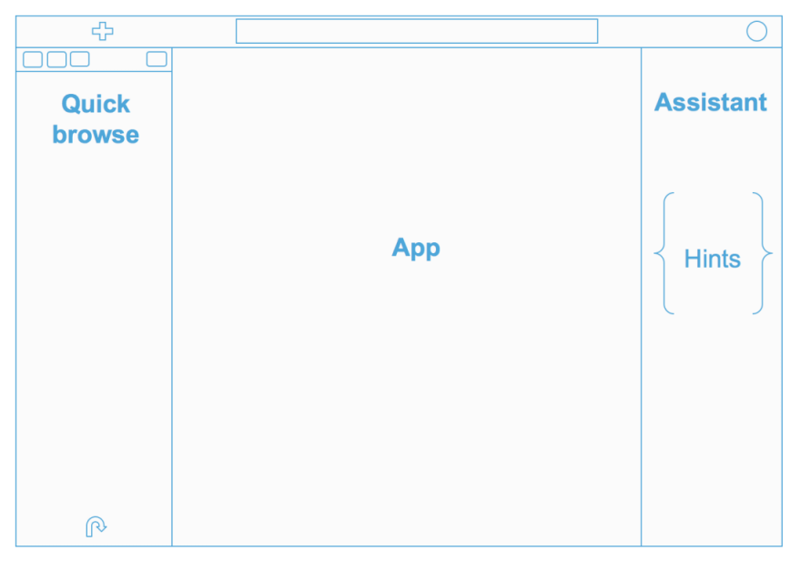](https://docs.gethue.c/docs/images/hue-4-interface-concept.png)

从上到下我们有：

-   快速操作（蓝色大按钮）、右侧的全局搜索和通知区域
-   一个可折叠的汉堡菜单，提供到各种应用程序的链接和快速导入数据的方式
-   左侧扩展的快速浏览
-   主应用程序区域，乐趣所在 ;)
-   当前应用程序的右侧助手面板。它提供实时帮助，并取决于当前选定的应用程序。例如，在 Hive 编辑器中，它会显示查询中使用的表的快速浏览、关于如何编写更好查询的建议、SQL 语言和 UDF 内置文档。

更多信息请参阅 [Hue 4 用户界面详解](http://gethue.com/the-hue-4-user-interface-in-detail/)。

#### 顶部搜索

您是否曾经努力记住与项目相关的表名？查找这些列或视图是否花费了太多时间？Hue 现在使您可以轻松搜索集群中所有数据库中的任何表、视图或列。凭借搜索数万个表的能力，您可以快速找到与您的需求相关的表，从而更快地发现数据。

新的搜索栏始终位于屏幕顶部，如果 Hue 配置为访问元数据服务器，它还提供文档搜索和元数据搜索。

[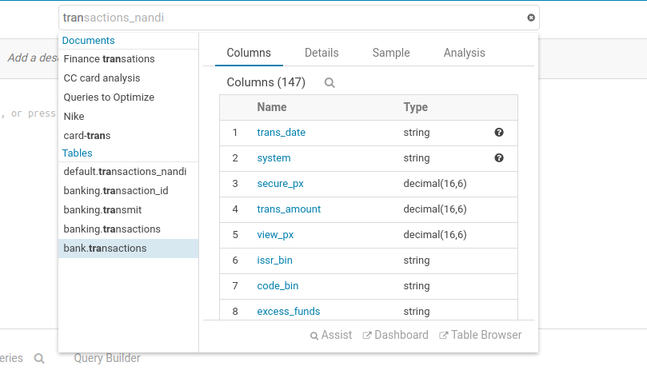](https://cdn.gethue.com/uploads/2016/04/table_search.png)

#### 左侧助手

随时随地获取所需数据。

在左侧助手面板中查找您的文档、HDFS 和 S3 文件等，右键单击项目将显示操作列表，您还可以将文件拖放到编辑器中以获取路径等等。

[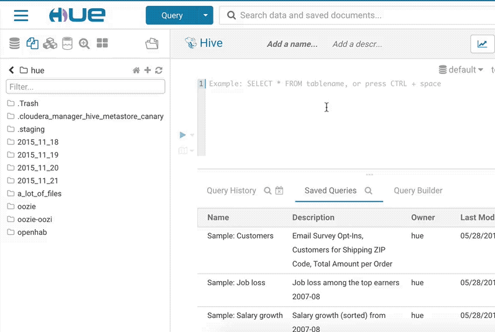](https://cdn.gethue.com/uploads/2018/05/HDFS_Context_Change_Path_2.gif)

#### 右侧助手

此助手内容取决于所选应用程序的上下文，并将显示当前表或可用的 UDF。

此弹出窗口提供了一种快速查看数据示例以及数据库、表和列的其他统计信息的方法。您可以从 SQL 助手中打开弹出窗口，或右键单击任何 SQL 对象（表、列、函数……）。

[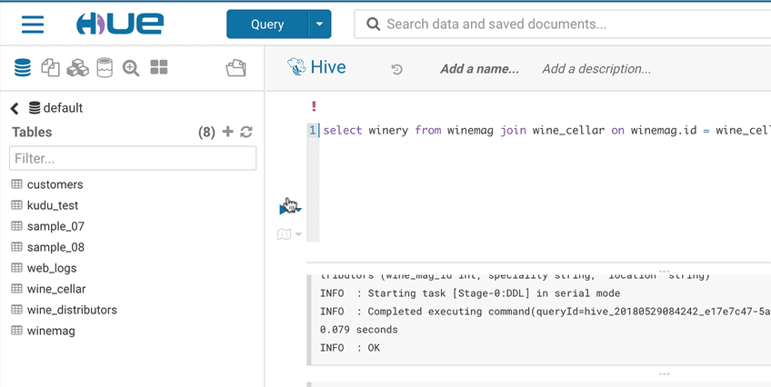](https://cdn.gethue.com/uploads/2018/05/SQL_Context_Navigation.gif)

### 文档

与 Google 文档类似，在 Hue 应用程序中打开的任何文档（例如 SQL 查询、工作流、仪表板……）都可以与其他用户或组共享。

#### 共享

共享发生在主页上或通过所选应用程序的右上角菜单进行。

存在两种类型的共享权限：

-   只读
-   可以修改

共享文档将显示一个小蓝色图标。

[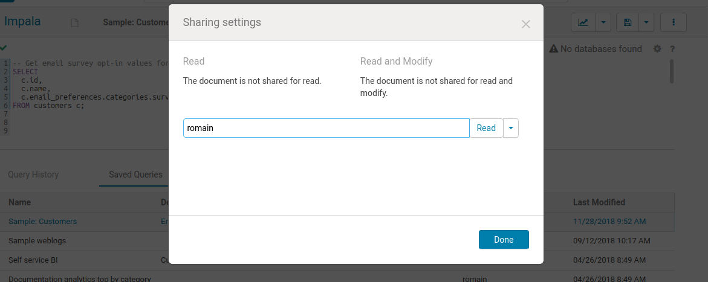](https://cdn.gethue.com/uploads/2019/04/editor_sharing.png)

除了文档共享之外，还有另一种通过链接共享查询的选项，这种方式更快捷方便 - **公共链接和 Gist 共享**

##### 公共链接

公共链接与 Google 文档中的链接相同，有助于快速共享参数化的已保存报告、客户分析链接。它们只需要接收者拥有 Hue 登录名。然后，人们可以通过执行查询来查看结果、创建分支并进行调整，从而重用这些查询。

-   无需选择组或单个用户列表
-   读写权限
-   链接的文档不会显示在您的主页中
-   可以全局关闭
-   可以与传统用户/组共享相结合

以下是全局启用时顶部带有公共链接选项的共享弹出窗口：

[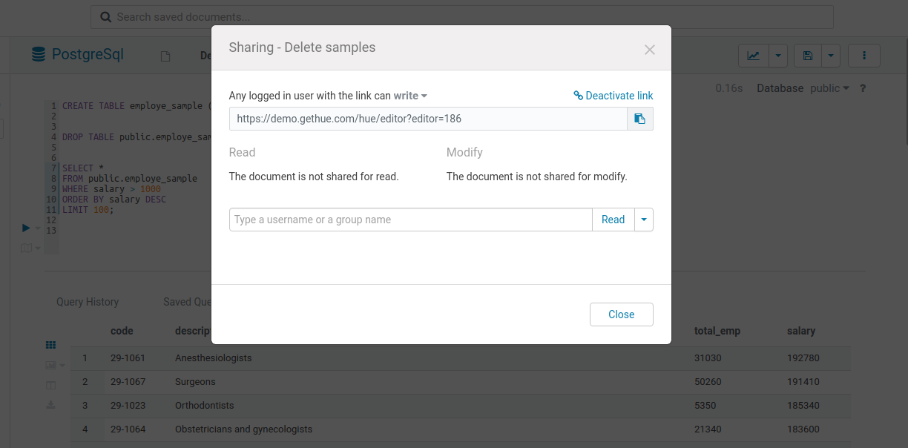](https://cdn.gethue.com/uploads/2020/03/editor_sharing_popup.png)

##### Gist 共享 - SQL 片段

通过查询结果回答问题？向 slack 频道展示一些奇怪的数据？Gist 是一种快速共享 SQL 片段的好方法，可以直接链接到 SQL 编辑器。

-   适用于 SQL 片段：一个或多个语句
-   链接自动指向编辑器和 SQL 内容
-   查询以更友好的[演示模式](https://docs.gethue.com/user/querying/#presentation)显示
-   Slack unfurling 将显示迷你预览（可以全局关闭）
-   Gist 存储在您主目录中的 Gist 目录中

示例如下：

选择一部分语句以快速与 Slack 频道共享：

[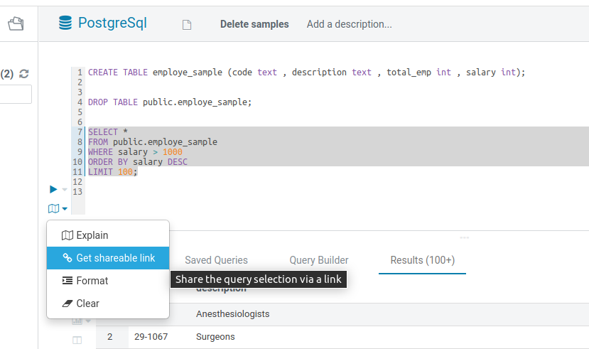](https://cdn.gethue.com/uploads/2020/03/editor_sharing_gist_menu.png)

SQL 片段的链接会自动生成：

[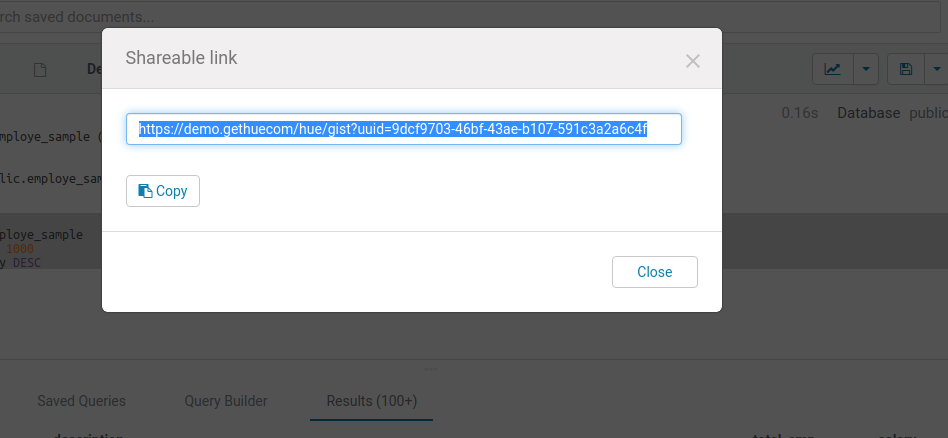](https://cdn.gethue.com/uploads/2020/03/editor_sharing_gist_popup.png)

只需将链接粘贴到 Slack 频道中，用户就会看到迷你预览：

[](https://cdn.gethue.com/uploads/2020/03/editor_gist_slack.png)

单击链接将打开 SQL 选择：

[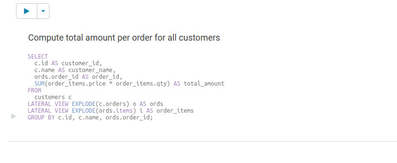](https://cdn.gethue.com/uploads/2020/03/editor_gist_open_presentation_mode.png)

#### 导入/导出

通过主页，可以导出已保存的文档以进行备份或传输到另一个 Hue。

### Slack

目前处于 **测试版**。

这种与 Hue 的集成通过协助用户进行 SQL 查询，并通过 Slack 与其他用户进行更好的协作/讨论来帮助用户。

要设置 Hue 应用程序，**Slack 工作区管理员**需要按照管理员部分中描述的这些[步骤](https://docs.gethue.com/administrator/configuration/server/#improved-slack-app-installation)进行操作。

成功将应用程序与 Hue 连接后，在 Slack 频道中输入 `hello hue` 或 `@Hue help` 以获取该应用程序可以为您提供帮助的事项列表。

[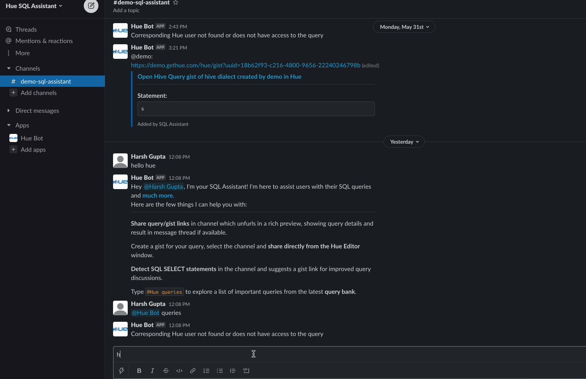](https://cdn.gethue.com/uploads/2021/06/hello_hue.gif)

#### 共享查询/Gist 链接

用户可以在应用程序也存在的 Slack 频道中共享查询链接或 gist，然后这些链接会展开，为其他用户提供有关查询的详细信息的丰富预览，以便进行协作/讨论。如果结果可用，应用程序还会在消息线程中提供查询的结果文件。

打开 Hue 编辑器，运行一些查询并复制其链接：

[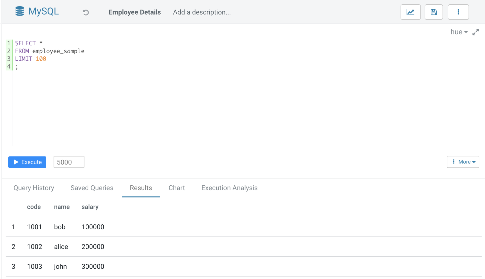](https://cdn.gethue.com/uploads/2021/04/run_query_in_hue.png)

将其粘贴到 Slack 频道中，以便其他人获得丰富的链接预览：

[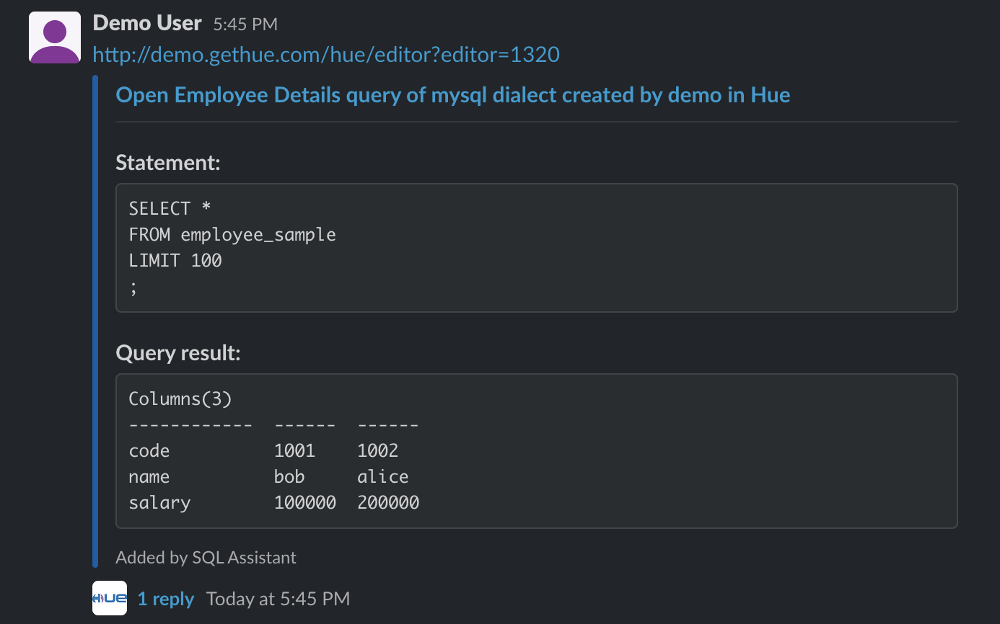](https://cdn.gethue.com/uploads/2021/04/query_link_preview.png)

Slack 目前不支持 markdown 表格，当 Hue 支持通过[查询任务](https://docs.gethue.com/administrator/administration/reference/#task-server)进行结果缓存时，内联预览可能会得到改进。

在评估了许多可能的修复方法（例如上传结果图像、截断看起来不佳的列、旋转结果表、[上传结果文件](https://github.com/slackapi/python-slack-sdk/issues/991)等）并考虑到它们的权衡之后，我们选择保留几行示例数据，但通过旋转结果表来保留所有列，并为了弥补行数损失，Hue 应用程序会在消息线程中提供结果文件。

[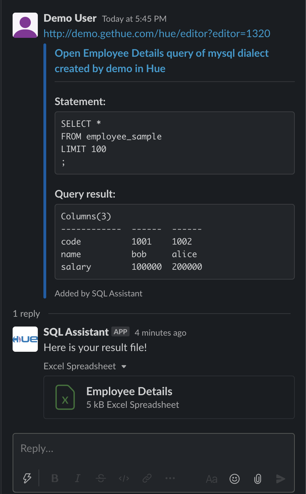](https://cdn.gethue.com/uploads/2021/04/message_thread_with_result_file.png)

用户还可以共享 SQL gist 链接：

[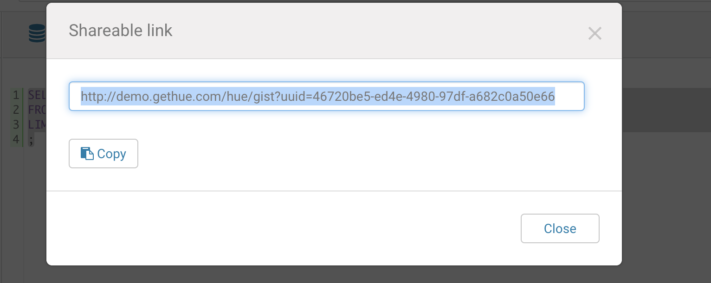](https://cdn.gethue.com/uploads/2021/04/gist_link.png)

[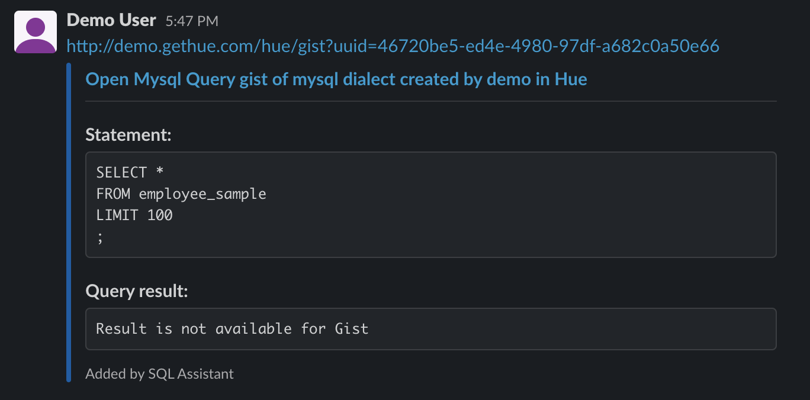](https://cdn.gethue.com/uploads/2021/04/gist_link_preview.png)

为了进一步减少 Slack 和 Hue 之间用于讨论的上下文切换，用户现在可以直接从 Hue 编辑器在 Slack 频道中共享他们想要的查询。应用程序会将 gist 链接发送到所选频道，并利用现有的 gist 链接展开功能来提供丰富的预览。

只需创建一个 gist，选择一个频道并直接从编辑器共享：

[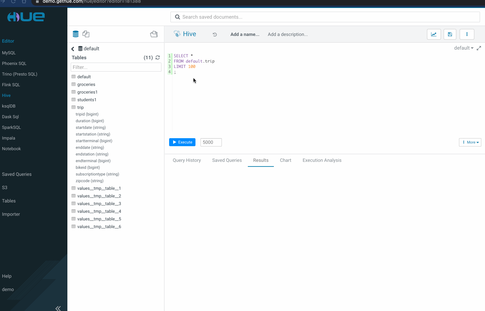](https://cdn.gethue.com/uploads/2021/06/share_from_editor.gif)

#### 协助

##### 检测 SQL SELECT 语句

为了建议用户共享查询链接而不是复制/粘贴 SQL 语句进行讨论/查询疑问，Hue 应用程序会检测消息中的 SELECT 语句，并给出快速建议以共享链接，同时发送检测到的 SQL 的 gist 链接，然后该链接会展开以提供丰富的预览。

在将来的版本中，Hue 应用程序可以通过更好的检测来改进，并更有效地协助检测到的 SQL。例如，使用解析器检查和提取表，并建议查询优化，如 LIMITS 或表/连接信息。

[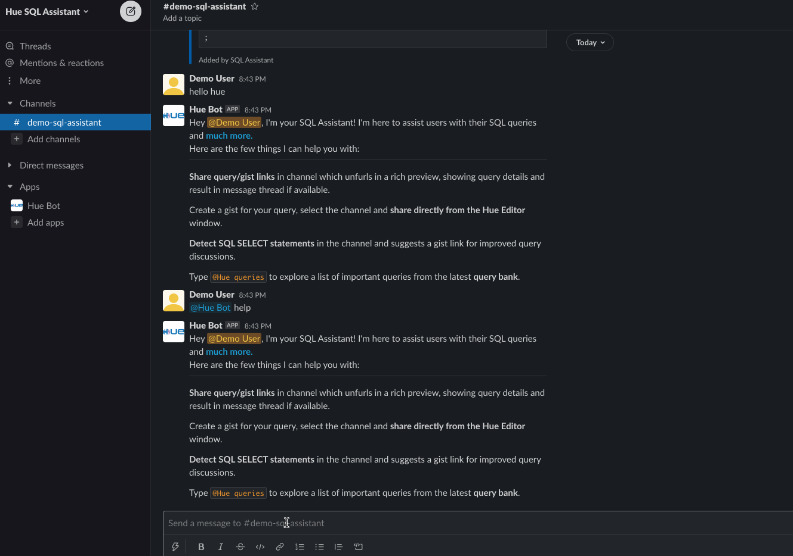](https://cdn.gethue.com/uploads/2021/06/detect_sql_select.gif)

##### 查询库

在频道中输入 `@Hue queries` 以浏览最新查询库中重要且最常用的查询列表。此查询库有助于与其他用户共享复杂查询以供访问。

[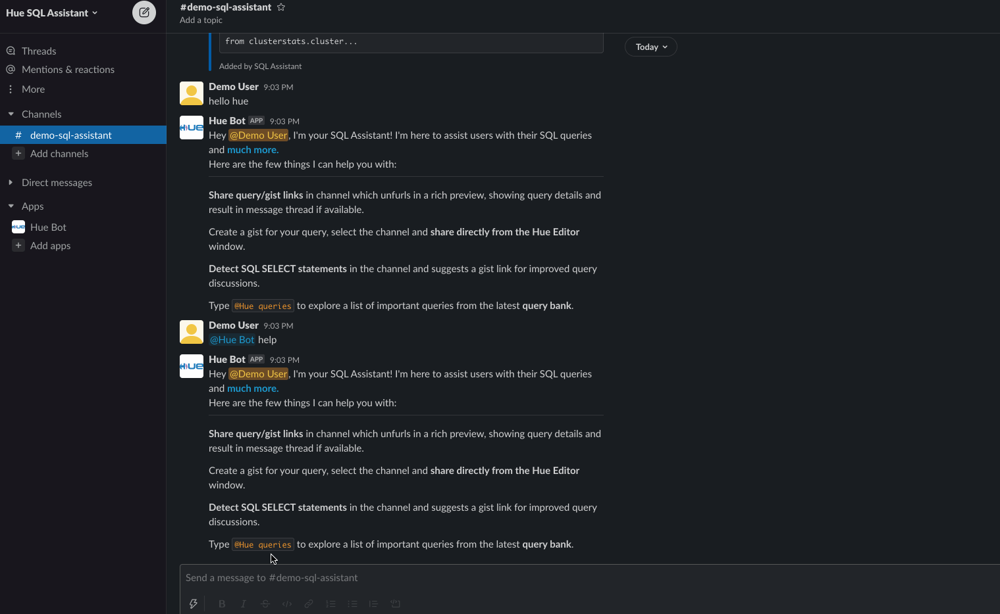](https://cdn.gethue.com/uploads/2021/06/hue_query_bank.gif)

#### 安全性

考虑到安全方面，Slack 用户需要是 Hue 用户才能有权访问应用程序的上述功能。此映射目前通过检查 Slack 用户的**电子邮件前缀作为 Hue 用户名**以及他们的**电子邮件主机与应用程序插入的 Hue 实例域相同**来完成。

例如，某个名为 **Alice** 且拥有用户名为 **alice** 的 Hue 帐户的用户，只能通过某个 Slack 帐户获得读取权限，前提是该 Slack 用户的电子邮件前缀与 Hue 用户名相同，并且电子邮件主机与 Hue 域相同，即 **[alice@gethue.com](mailto:alice@gethue.com) Slack 用户**只能访问 **demo.gethue.com** 上的 **Hue 用户 alice**。

### 设置

#### 登陆页面

任何应用程序或编辑器都可以在其名称旁边加星标，使其成为登录时的默认编辑器和登陆页面。

#### 更改语言

语言是从浏览器或操作系统自动检测的。支持英语、西班牙语、法语、德语、韩语、日语和中文。

用户可以在"我的个人资料"页面手动设置语言。请转到"我的个人资料">"步骤2 个人资料和组">"语言首选项"，然后选择所需的语言。

## 查询

Hue 的目标是使数据库和数据仓库的查询变得简单高效。

有几个应用程序可用，每个应用程序专门用于特定类型的查询。可以首先通过[浏览器](https://docs.gethue.com/user/browsing/)探索数据源。

- 编辑器在 SQL 查询方面表现出色。它配备了智能自动完成、风险警报和自助故障排除功能。
- 编辑器也以笔记本模式提供，用于快速执行轻量级编程代码段。
- 仪表板专注于可视化索引数据，但也可以查询 SQL 数据库。

连接器的配置目前由[管理员](https://docs.gethue.com/administrator/configuration/connectors/)完成。

### 编辑器

[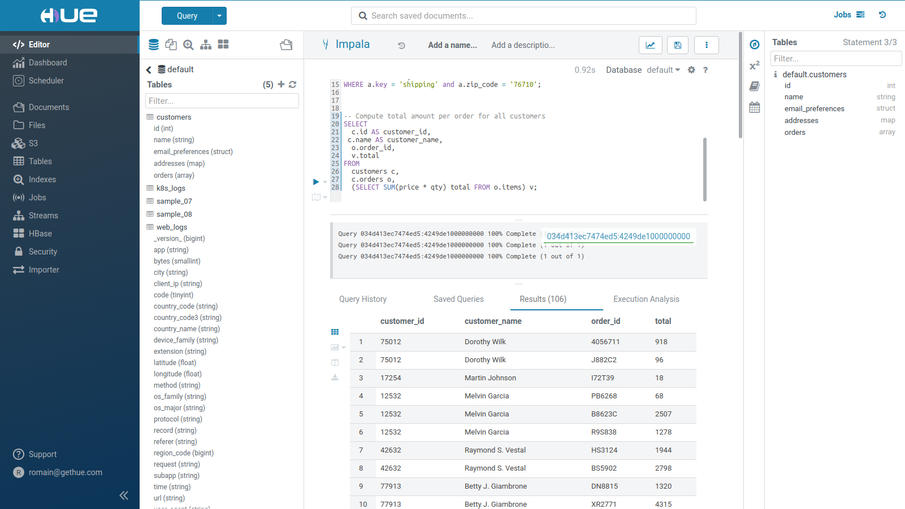](https://cdn.gethue.com/uploads/2019/08/hue_4.5.png)

#### 运行查询

SQL 查询执行是编辑器的主要用例。请参阅最常见的[数据库和数据仓库](https://docs.gethue.com/administrator/configuration/connectors/)列表。

1. 当前选定的语句左侧有**蓝色**边框。要执行查询的一部分，请突出显示一个或多个查询语句。
2. 单击**执行**。将出现"查询结果"窗口。
    - 进度条左侧有一个日志插入符号。
    - 通过单击列标签展开**列**将滚动到该列。可以筛选名称和类型。
    - 选择**图表**图标以绘制结果。
    - 要展开某行，请单击行号。
    - 要锁定某行，请单击行号列中的锁定图标。
    - 通过单击结果选项卡上的放大镜图标或按 `Ctrl/Cmd + F`进行搜索。
    - 请参阅下文了解如何[优化结果](#Refining Results)。
3.  如果查询中有**多个语句**（用分号分隔），请在多语句查询窗格中单击"下一步"以执行其余语句。

当您有多个语句时，只需将光标放在要执行的语句中即可，活动语句会以蓝色边栏标记指示。

**注意**：使用 `CTRL/Cmd + ENTER` 执行查询。

**注意**：在日志面板顶部，有一个链接可以在[查询浏览器](https://docs.gethue.com/user/browsing/#sql-queries)中打开查询配置文件。

#### 结果

##### 优化

锁定某些行：这将帮助您将数据与其他行进行比较。当您将鼠标悬停在行 ID 上时，会出现一个新的锁定图标。如果单击它，该行会自动固定在表格顶部。

[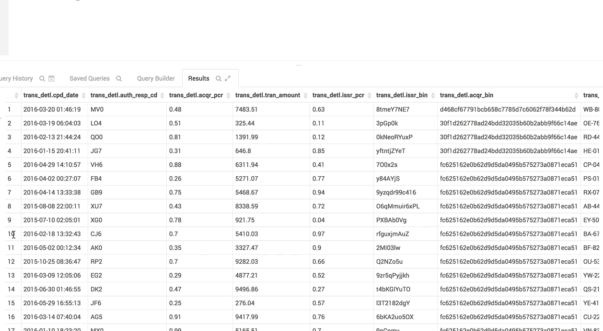](https://cdn.gethue.com/uploads/2016/08/lock_rows.gif)

列列表跟随结果网格，可以按数据类型筛选并可以调整大小。

[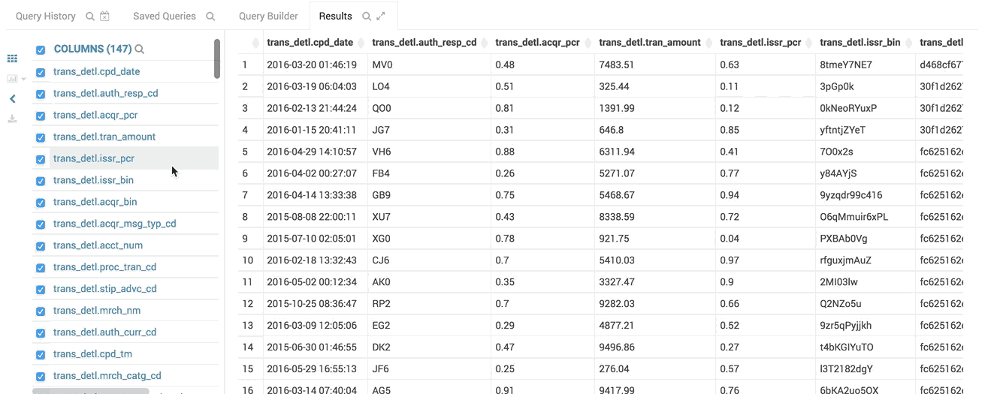](https://cdn.gethue.com/uploads/2016/08/column_list.gif)

内容很长的字段的表头将跟随您的滚动位置并始终可见。

[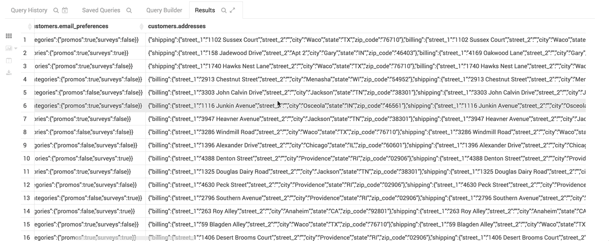](https://cdn.gethue.com/uploads/2016/08/headers.gif)

您现在可以在表格中搜索特定的单元格值，结果会高亮显示。

您可以通过单击结果选项卡上的放大镜图标或按 `Ctrl/Cmd + F` 来激活新的搜索功能。

[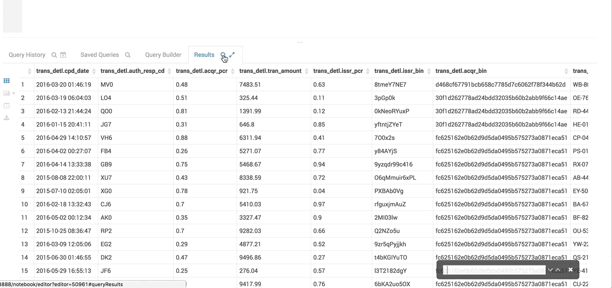](https://cdn.gethue.com/uploads/2016/08/search.gif)

虚拟渲染器仅显示您当前需要的单元格。

您在此处看到的表格有数百列。

[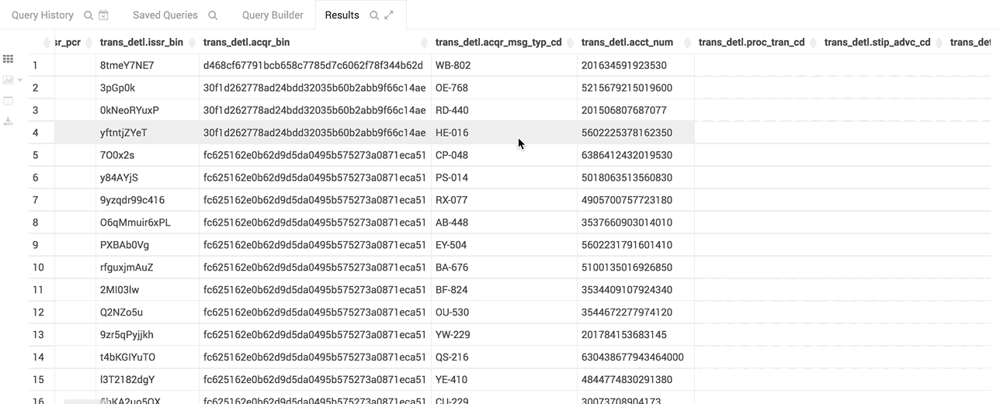](https://cdn.gethue.com/uploads/2016/08/virtual_renderer.gif)

如果下载到 Excel 或 CSV 的时间过长，您现在会收到一条友好的消息。

[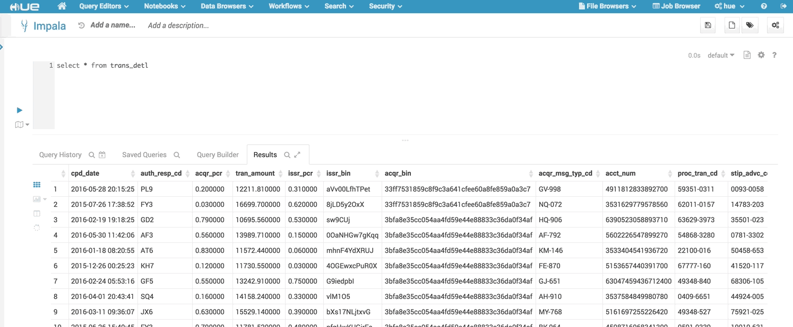](https://cdn.gethue.com/uploads/2016/08/downloadwait.gif)

##### 下载

有几种方法可以导出查询结果。

最常见的：

- 下载到您的计算机，格式为 CSV 或 XLS
- 将当前获取的行复制到剪贴板

其中两种提供了更大的可伸缩性：

- 导出到集群文件系统上的空文件夹。
- 导出到表。您可以选择一个已有的表或一个新表。

[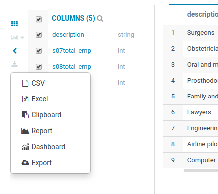](https://cdn.gethue.com/uploads/2019/04/editor_export_results.png)

#### 自动完成

为了改善您的 SQL 编辑体验，Hue 配备了全球最好的 SQL 自动完成功能之一。新的自动完成器了解 Hive和 Impala SQL 方言的所有细节，并将根据语句的结构和光标的位置建议关键字、函数、列、表、数据库等。

结果是全面改进了补全功能。我们现在不仅可以补全 SELECT 语句，还可以帮助您处理其他 DDL 和 DML 语句，例如 INSERT、CREATE、ALTER、DROP 等。

[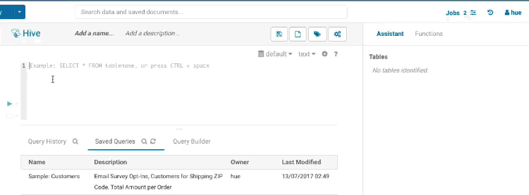](https://cdn.gethue.com/uploads/2017/07/hue_4_assistant_2.gif)

**智能列建议**

如果 FROM 子句中出现多个表，包括派生表和连接表，它将合并所有表中的列，并在需要时添加适当的前缀。它还了解您的别名、横向视图和复杂类型，并将包括这些内容。现在，它会自动为任何保留字或外来列名添加反引号，以防止出错。

**智能关键字补全**

自动完成器会根据光标在语句中的位置建议关键字。在可能的情况下，它甚至会一次建议多个单词，例如 IF NOT EXISTS，没人喜欢输入太多，对吧？在顺序重要但关键字可选的部分，例如在 FROM tbl 之后，它会按预期顺序列出关键字建议，第一个预期的关键字在顶部。因此，在 FROM tbl 之后，WHERE 关键字会列在 GROUP BY 等关键字之前。

**函数**

改进后的自动完成器现在可以建议函数，对于每个函数建议，自动完成下拉列表中会添加一个额外的面板，显示函数的文档和签名。自动完成器了解参数的预期类型，并且只会建议与光标位置参数列表中参数匹配的列或函数。

**子查询，无论是否相关**

编辑子查询时，它只会在子查询的范围内提供建议。对于相关的子查询，外部表也会被考虑在内。

**上下文弹出窗口**

右键单击查询的任何片段（例如表名）以获取其所有元数据信息。这是一个方便的快捷方式，可以获取更多描述或检查表或列中包含的值类型。

在编写查询时能够查看列示例以了解可以期望的值类型非常方便。Hue 现在能够对示例数据执行某些操作，您现在可以查看不同的值以及最小值和最大值。预计在未来的版本中会看到更多操作。

[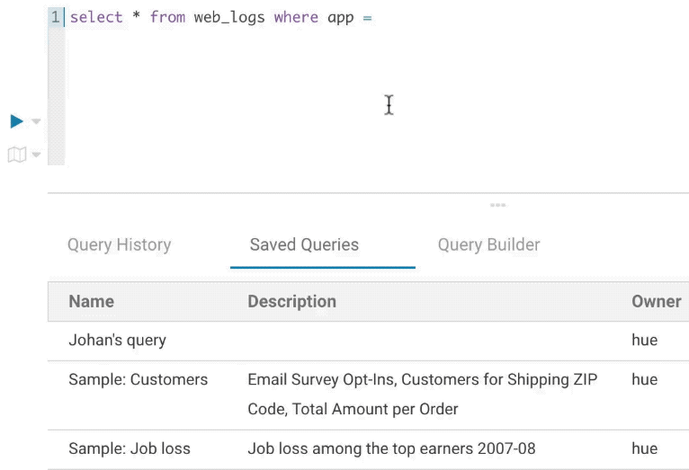](https://cdn.gethue.com/uploads/2018/10/sample_context_operations.gif)

**语法检查器**

一条红色的小下划线将显示不正确的语法，以便在提交之前修复查询。右键单击会提供建议。

[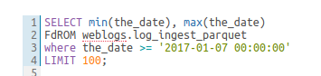](https://cdn.gethue.com/uploads/2018/01/syntax_checkerhigh.png)

[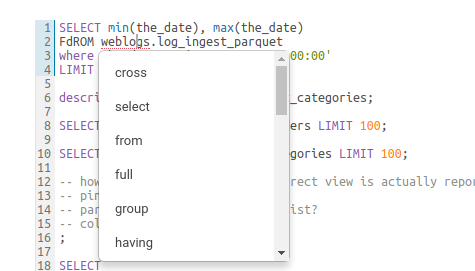](https://cdn.gethue.com/uploads/2018/01/checker_help.png)

**高级设置**

实时自动完成功能经过微调，以提供更好的体验。高级设置可以通过 `CTRL +` , （Mac 上为 `CMD + ,`）或单击"?"图标访问。

自动完成器与后端通信以获取表和数据库等数据，并将其缓存以保持快速。单击左侧助手中的刷新图标将清除缓存。如果新表是在 Hue 外部创建且尚未显示（Hue 会定期清除其缓存以自动获取在 Hue 外部进行的元数据更改），这可能很有用。

#### 共享

任何查询都可以通过权限共享，详见[概念](https://docs.gethue.com/user/concept/)。

#### 助手

随着事务的引入，数据仓库生态系统变得更加完整。实际上，这意味着您的表现在可以支持`主键`、`INSERT`、`DELETE`和`UPDATE`以及`分区键`。

以下教程演示了 Hue 的 SQL 编辑器如何通过其[助手](https://docs.gethue.com/user/concept/)和[自动完成](https://docs.gethue.com/user/querying/#autocomplete)组件帮助您快速可视化和使用这些指令。

[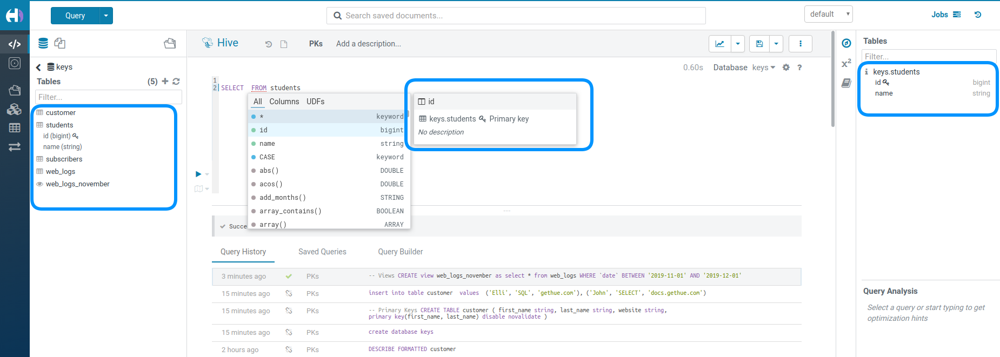](https://cdn.gethue.com/uploads/2019/11/sql_column_pk.png)

##### 主键

主键像分区键一样显示，带有锁定图标：

[](https://cdn.gethue.com/uploads/2019/11/sql_columns_assist_pks.png)

以下是使用它们的 SQL 示例：

```sql
CREATE TABLE customer (
    first_name string,
    last_name string,
    website string,
    PRIMARY KEY (first_name, last_name) DISABLE NOVALIDATE
);
```

也支持 [Apache Kudu](https://kudu.apache.org/)：

```sql
CREATE TABLE students (
  id BIGINT,
  name STRING,
  PRIMARY KEY(id)
)
PARTITION BY HASH PARTITIONS 16
STORED AS KUDU
TBLPROPERTIES ('kudu.num_tablet_replicas' = '1')
;
```

##### 外键

当一个列值指向另一个表中的另一个列时。例如，业务部门的负责人必须存在于 person 表中：

[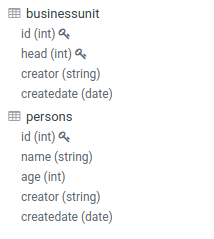](https://cdn.gethue.com/uploads/2020/03/assist_foreign_keys_icons.png)

```sql
CREATE TABLE person (
  id INT NOT NULL,
  name STRING NOT NULL,
  age INT,
  creator STRING DEFAULT CURRENT_USER(),
  created_date DATE DEFAULT CURRENT_DATE(),

  PRIMARY KEY (id) DISABLE NOVALIDATE
);

CREATE TABLE business_unit (
  id INT NOT NULL,
  head INT NOT NULL,
  creator STRING DEFAULT CURRENT_USER(),
  created_date DATE DEFAULT CURRENT_DATE(),

  PRIMARY KEY (id) DISABLE NOVALIDATE,
  CONSTRAINT fk FOREIGN KEY (head) REFERENCES person(id) DISABLE NOVALIDATE
);
```

##### 分区键

数据分区是优化查询的关键概念。这些特殊列也用键图标显示：

[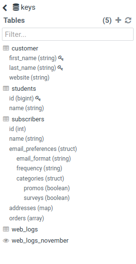](https://cdn.gethue.com/uploads/2019/11/sql_columns_assist_keys.png)

以下是使用它们的 SQL 示例：

```sql
CREATE TABLE web_logs (
    _version_ BIGINT,
    app STRING,
    bytes SMALLINT,
    city STRING,
    client_ip STRING,
    code TINYINT,
    country_code STRING,
    country_code3 STRING,
    country_name STRING,
    device_family STRING,
    extension STRING,
    latitude FLOAT,
    longitude FLOAT,
    `METHOD` STRING,
    os_family STRING,
    os_major STRING,
    protocol STRING,
    record STRING,
    referer STRING,
    region_code BIGINT, request STRING,
    subapp STRING,
    TIME STRING,
    url STRING,
    user_agent STRING,
    user_agent_family STRING,
    user_agent_major STRING,
    id STRING
)
PARTITIONED BY ( `date` STRING);

INSERT INTO web_logs
PARTITION (`date`='2019-11-14') VALUES
(1480895575515725824,'metastore',1041,'Singapore','128.199.234.236',127,'SG','SGP','Singapore','Other',NULL,1.2930999994277954,103.85579681396484,'GET','Other',NULL,'HTTP/1.1',NULL,'-',0,'GET /metastore/table/default/sample_07 HTTP/1.1','table','2014-05-04T06:35:49Z','/metastore/table/default/sample_07','Mozilla/5.0 (compatible; phpservermon/3.0.1; +http://www.phpservermonitor.org)','Other',NULL,'8836e6ce-9a21-449f-a372-9e57641389b3')
```

##### 嵌套类型

复杂或嵌套类型便于将关联数据存储在一起。助手可让您展开列树：

[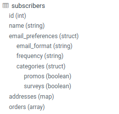](https://cdn.gethue.com/uploads/2019/11/sql_columns_assist_nested_types.png)

以下是使用它们的 SQL 示例：

```sql
CREATE TABLE subscribers (
  id INT,
  name STRING,
  email_preferences STRUCT<email_format:STRING,frequency:STRING,categories:STRUCT<promos:BOOLEAN,surveys:BOOLEAN>>,
  addresses MAP<STRING,STRUCT<street_1:STRING,street_2:STRING,city:STRING,state:STRING,zip_code:STRING>>,
  orders ARRAY<STRUCT<order_id:STRING,order_date:STRING,items:ARRAY<STRUCT<product_id:INT,sku:STRING,name:STRING,price:DOUBLE,qty:INT>>>>
)
STORED AS PARQUET
```

##### 视图

有时可能难以识别表实际上是一个视图。视图用这个小眼睛图标显示：

[](https://cdn.gethue.com/uploads/2019/11/sql_assist_view_icon.png)

以下是使用它们的 SQL 示例：

```sql
CREATE VIEW web_logs_november AS
SELECT * FROM web_logs
WHERE `date` BETWEEN '2019-11-01' AND '2019-12-01'
```

##### 事务操作

事务表现已支持这些 SQL 指令来更新数据。

###### 插入

以下是如何向表中添加一些数据。以前，只能通过加载一些文件来完成此操作。

```sql
INSERT INTO TABLE customer
VALUES
  ('Elli', 'SQL', 'gethue.com'),
  ('John', 'SELECT', 'docs.gethue.com')
;
```

###### 删除

删除数据行：

```sql
DELETE FROM customer
WHERE first_name = 'John';
```

###### 更新

如何更新某些行中某些列的值：

```sql
UPDATE customer
SET website = 'helm.gethue.com'
WHERE first_name = 'Elli';
```

###### 语言参考

您可以在右侧助手面板中找到语言参考。右侧面板本身具有新外观，左侧带有图标，可以通过单击活动图标将其最小化。

顶部的筛选器输入在此初始版本中仅筛选主题标题。以下是如何查找有关 select 语句中联接的文档的示例。

[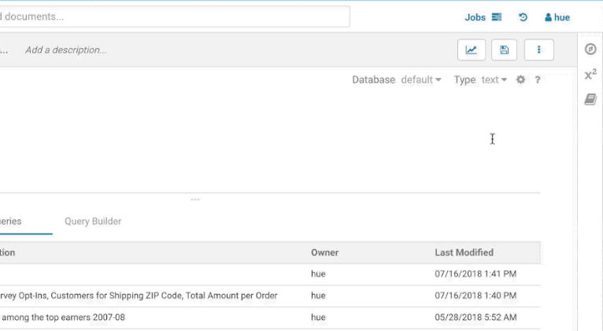](https://cdn.gethue.com/uploads/2018/10/impala_lang_ref_joins.gif)

在编辑语句时，有一种更快的方法可以找到当前语句类型的语言参考，只需右键单击第一个单词，参考就会出现在下面的弹出窗口中：

[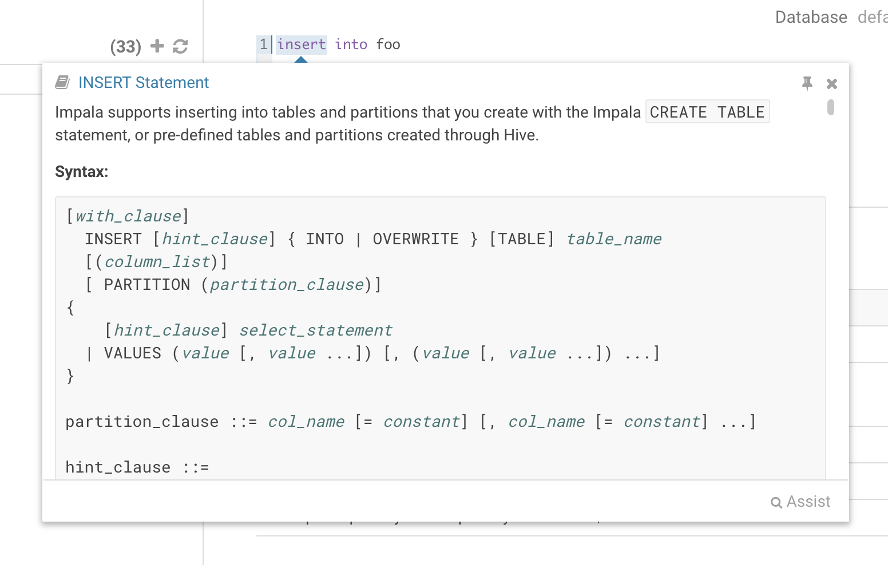](https://cdn.gethue.com/uploads/2018/10/impala_lang_ref_context.png)

#### 变量

变量用于轻松配置查询中的参数。它们非常适合保存可以共享或重复执行的报告：

**单值**

```sql
select * from web_logs where country_code = "${country_code}"
```

[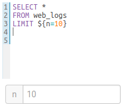](https://cdn.gethue.com/uploads/2017/10/var_defaults.png)

**变量可以具有默认值**

```sql
select * from web_logs where country_code = "${country_code=US}"
```

**多值**

```sql
select * from web_logs where country_code = "${country_code=CA, FR, US}"
```

**此外，可以更改多值变量的显示文本**

```sql
select * from web_logs where country_code = "${country_code=CA(Canada), FR(France), US(United States)}"
```

[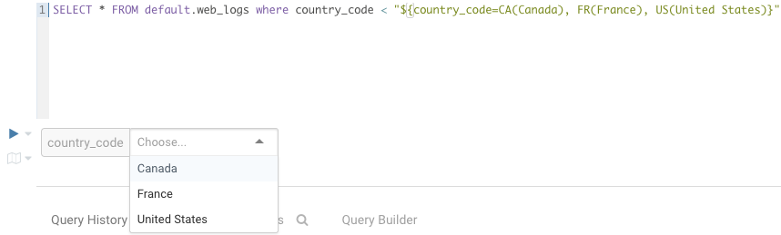](https://cdn.gethue.com/uploads/2018/04/variables_multi.png)

**对于非文本值，省略引号。**

```sql
select * from boolean_table where boolean_column = ${boolean_column}
```

#### 图表绘制

这些可视化便于绘制按时间顺序排列的数据，或者当行的子集具有相同属性时：它们将被堆叠在一起。

- 饼图
- 带透视的条形图/折线图
- 时间轴
- 散点图
- 地图（标记和渐变）

[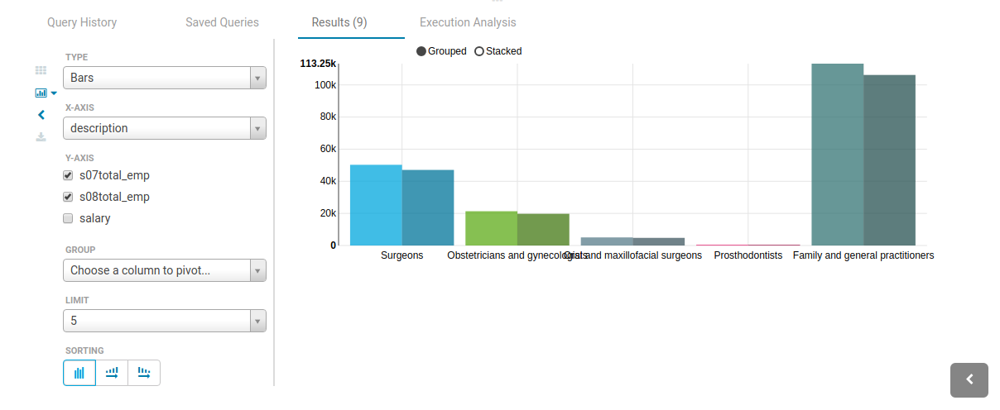](https://cdn.gethue.com/uploads/2019/04/editor_charting.png)

#### 查询故障排除

##### 查询前执行

**热门值**

自动完成器将根据 Navigator Optimizer 中的元数据建议热门的表、列、筛选器、联接、group by、order by 等。自动完成结果下拉列表中已添加一个新的"热门"选项卡，当有热门建议可用时将显示该选项卡。

这对于在未知数据集上执行联接或获取包含数百列的表中最有趣的列特别有用。

[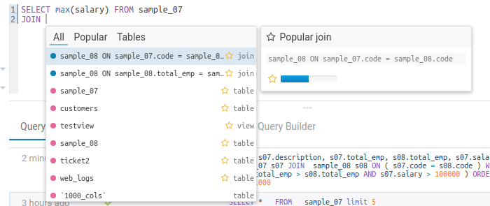](https://cdn.gethue.com/uploads/2017/07/hue_4_query_joins.png) [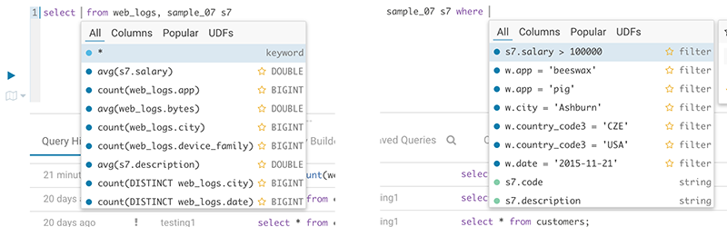](https://cdn.gethue.com/uploads/2017/07/hue_4_popular_filter_agg.png)

**风险警报**

在编辑期间，Hue 会在后台通过 Navigator Optimizer 运行您的查询，以识别可能影响查询性能的潜在风险。如果识别出风险，查询编辑器上方会显示一个感叹号，右侧助手面板的下部会显示如何改进它的建议。

[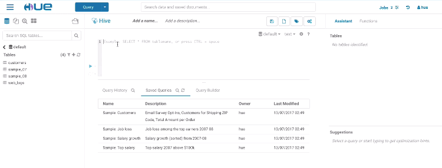](https://cdn.gethue.com/uploads/2017/07/hue_4_risk_6.gif)

##### 执行期间

[查询浏览器](https://docs.gethue.com/user/browsing/#sql-queries)详细说明了查询的计划和瓶颈。检测到后，"运行状况"风险会与如何修复它们的建议一起列出。

[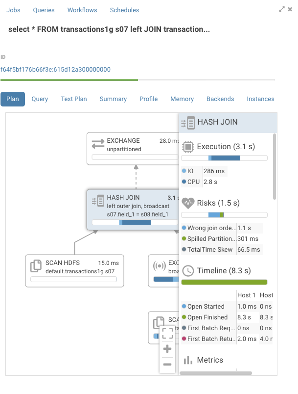](../images/1747830405762-56.png)

##### 教程

在目录中找到数据并使用查询助手后，最终用户可能想知道为什么他们的查询需要很长时间才能执行。这个新功能建立在 Impala 分析器之上，可以教育用户并提供更多信息，以便他们可以更高效地自行工作。以下是一个展示流程的场景：

**执行时间线**

为了让您体验新功能，我们将执行一些查询。

```sql
SELECT *
FROM
  transactions1g s07 left JOIN transactions1g s08
ON ( s07.field_1 = s08.field_1) limit 100
```

transactions1g 是一个 1GB 的表，没有谓词的自联接将强制整个表的网络传输。

[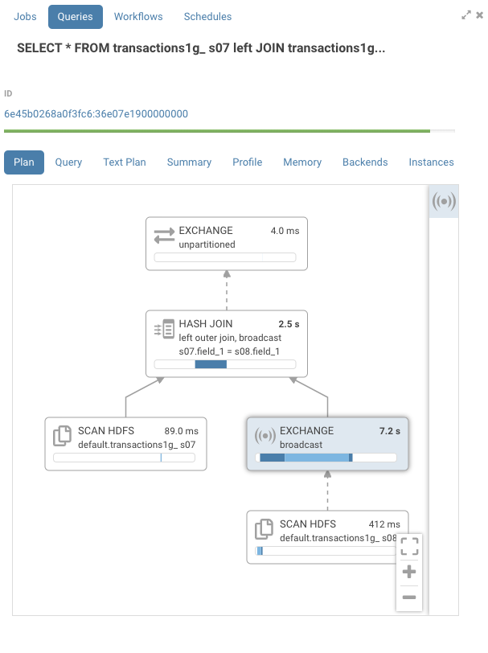](https://cdn.gethue.com/uploads/2019/03/Screen-Shot-2019-03-06-at-4.08.01-PM.png)

查看配置文件，您可以在每个节点的右上角看到一个数字，代表其 IO 和 CPU 时间。还有一个时间线，给出了该节点在执行期间处理时间的估计表示。深蓝色是 CPU 时间，而浅蓝色是网络或磁盘 IO 时间。在此示例中，我们可以看到哈希联接运行了 2.5 秒。在两个主机之间进行网络传输的交换节点是开销最大的节点，为 7.2 秒。

**详细信息窗格**

在右侧，现在有一个默认关闭的窗格。要打开或关闭，请按窗格的标题。在那里，您会找到按执行时间排序的所有节点的列表，这使得导航较大的执行图更容易。此列表是可单击的，并将导航到相应的节点。

[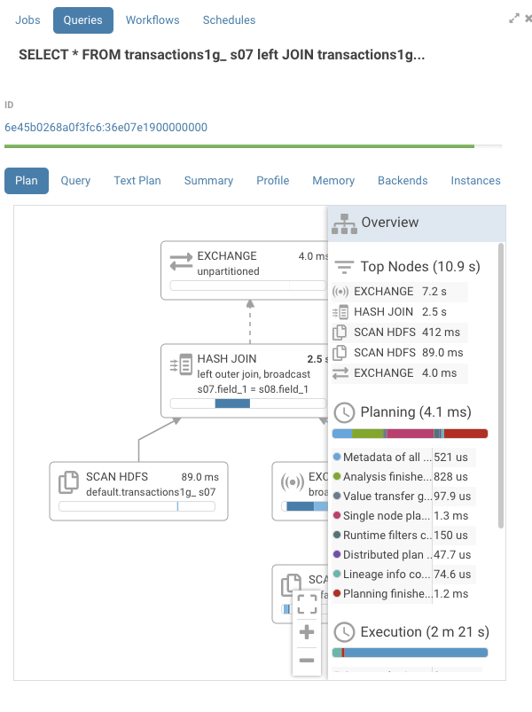](https://cdn.gethue.com/uploads/2019/03/Screen-Shot-2019-03-06-at-4.12.38-PM.png)

**事件**

按交换节点，我们会找到更详细的执行时间线。

[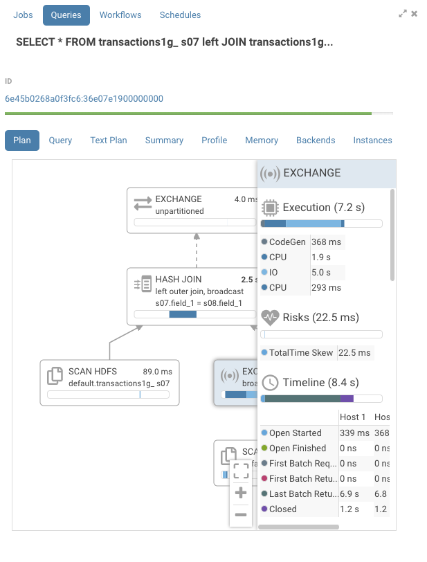](https://cdn.gethue.com/uploads/2019/03/Screen-Shot-2019-03-06-at-4.13.40-PM.png)

我们看到 IO 是交换中最重要的部分。

**按主机统计**

详细信息窗格还包含按每个节点的每个主机聚合的详细统计信息，例如内存消耗和网络传输速度。

[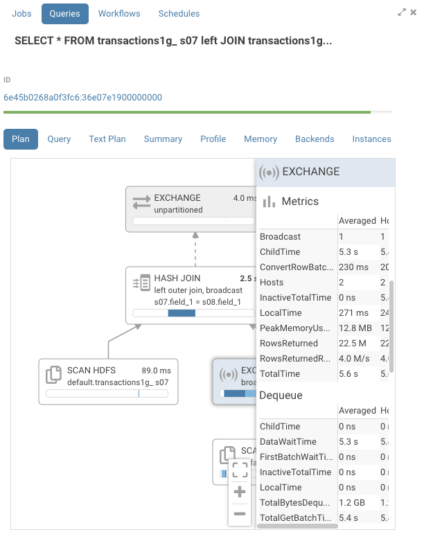](https://cdn.gethue.com/uploads/2019/03/Screen-Shot-2019-03-06-at-4.16.11-PM.png)

**风险**

在详细信息窗格中，对于每个节点，您都会找到一个名为"风险"的部分。此部分将包含有关如何提高此运算符性能的提示。目前，默认情况下未启用此功能。要启用它，请转到您的 Hue ini 文件并启用此标志：

```ini
[notebook]
enable_query_analysis=true
```

**CodeGen**

让我们看一些查询以及可以识别的一些风险。

```sql
SELECT s07.description, s07.salary, s08.salary,
  s08.salary - s07.salary
FROM
  sample_07 s07 left outer JOIN sample_08 s08
ON ( s07.code = s08.code)
where s07.salary > 100000
```

sample_07 和 sample_08 是 Hue 附带的小示例表。

[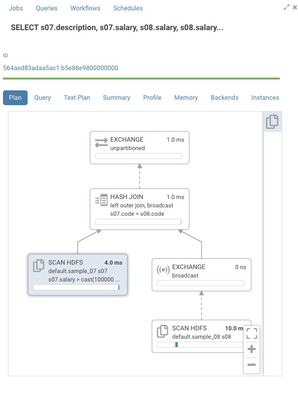](https://cdn.gethue.com/uploads/2019/03/Screen-Shot-2019-03-07-at-9.35.23-AM.png)

查看该图，时间线大部分为空。如果我们打开其中一个节点，我们会看到所有时间都由"CodeGen"占用。

[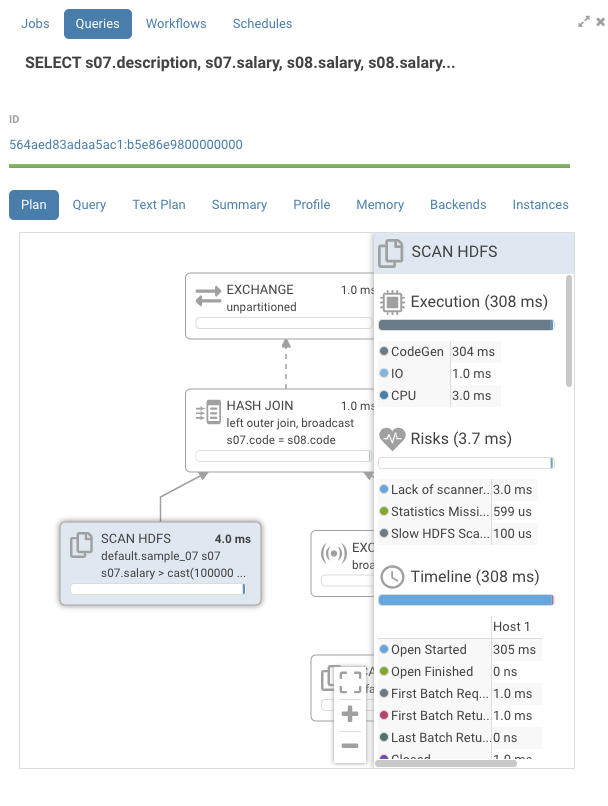](https://cdn.gethue.com/uploads/2019/03/Screen-Shot-2019-03-07-at-9.40.50-AM.png)

Impala 将 SQL 请求编译为本机代码以执行图中的每个节点。在具有大表的查询中，这会带来很大的性能提升。在较小的表上，我们可以看到 CodeGen 是执行时间的主要贡献者。通常，Impala 会禁用具有小表的 CodeGen，但 Impala 不知道它是一个小表，正如风险部分中的语句"缺少统计信息"所指出的那样。这里有两种解决方案：

添加缺少的统计信息。一种方法是执行以下命令：

```sql
compute stats sample_07;
compute stats sample_08;
```

这通常是正确的做法，但在较大的表上可能会非常昂贵。

通过以下方式禁用查询的 codegen：

```sql
set DISABLE_CODEGEN=true
```

[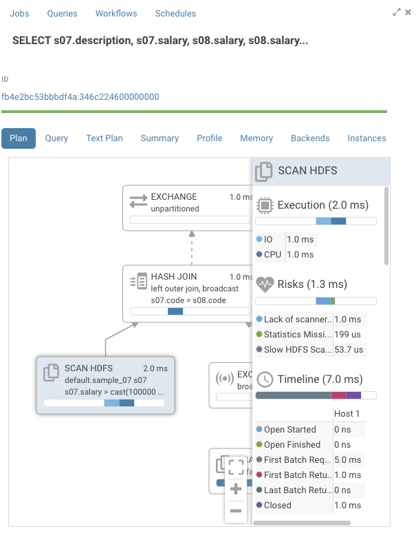](https://cdn.gethue.com/uploads/2019/03/Screen-Shot-2019-03-07-at-9.52.37-AM.png)

重新运行查询后，我们看到 CodeGen 现在消失了。

**联接顺序**

如果我们打开联接节点，会有一个关于错误联接顺序的警告。

[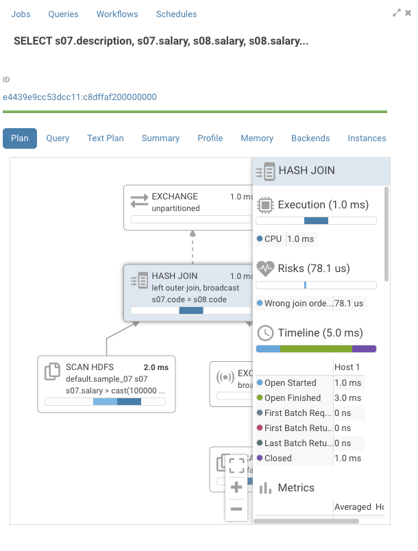](https://cdn.gethue.com/uploads/2019/03/Screen-Shot-2019-03-07-at-4.50.54-PM.png)

#### 标记地图

彼此靠近的点会组合在一起，并在放大时展开。通过选中该框，还可以创建类似 Yelp 的搜索筛选体验。

[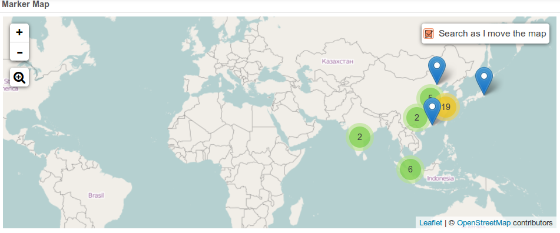](../images/1747830405762-68.png)

#### 编辑记录

管理员可以直接在网格或 HTML 小部件中编辑索引记录。

#### 链接

Impala 倾向于将较大的表放在图表的右侧，但在这种情况下则相反。通常，Impala 会自动优化此过程，但我们看到正在联接的表缺少统计信息。有几种方法可以解决此问题：

- 如前所述添加缺少的统计信息。
- 重写查询以更改联接顺序：

```sql
SELECT s07.description, s07.salary, s08.salary,
  s08.salary - s07.salary
FROM
  sample_08 s08 left outer JOIN sample_07 s07
ON ( s07.code = s08.code)
where s07.salary > 100000
```

[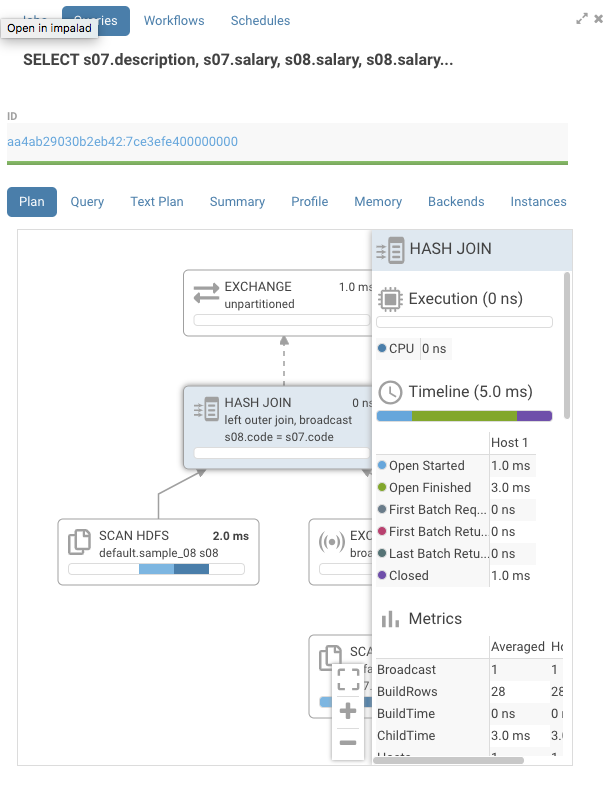](https://cdn.gethue.com/uploads/2019/03/Screen-Shot-2019-03-07-at-9.57.14-AM.png)

警告消失了，联接的执行时间也缩短了。

**Spilling**

如果内存充足，Impala 将在内存中执行其所有运算符。如果执行无法完全容纳在内存中，Impala 将使用可用磁盘临时存储其数据。要查看此操作，我们将使用与之前相同的查询，但我们将设置内存限制以触发溢出：

```sql
set MEM_LIMIT=1g;
select *
FROM
  transactions1g s07 left JOIN transactions1g s08
ON ( s07.field_1 = s08.field_1);
```

[](https://cdn.gethue.com/uploads/2019/03/Screen-Shot-2019-03-07-at-11.40.24-AM.png)

查看联接节点，我们可以看到风险部分中有一个关于溢出分区的条目。通常，联接只有 CPU 时间，但在这种情况下，由于溢出，它还有 IO 时间。

**Kudu 筛选**

Kudu 是 Impala 支持的存储后端之一。虽然 Impala 单独可以查询各种文件数据格式，但 Impala on Kudu 允许对数据进行快速更新和插入，并且在涉及小文件时也是更好的选择。在 Kudu 上使用 Impala 时，Impala 会将某些操作下推到 Kudu，以减少两者之间的数据传输。

但是，Kudu 并不支持 Impala 支持的所有运算符。例如，在撰写本文时，Impala 支持"like"运算符，但 Kudu 不支持。在这些情况下，所有无法在 Kudu 中本机筛选的数据都将传输到 Impala 进行筛选。让我们看一下两者之间的行为差异。

```sql
SELECT * FROM transactions1g_kudu s07 left JOIN transactions1g_kudu s08 on s07.field_1 = s08.field_1
where s07.field_5 LIKE '2000-01%';
```

[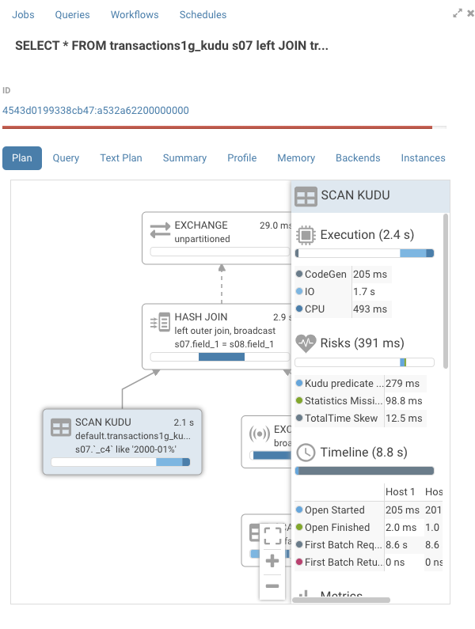](https://cdn.gethue.com/uploads/2019/03/Screen-Shot-2019-03-07-at-5.00.59-PM.png)

当我们查看图表时，我们看到在 Kudu 节点上，我们同时拥有 IO（表示在 Kudu 中花费的时间）和 CPU（表示在 Impala 中花费的时间），总计 2.1 秒。在风险部分，我们还可以找到一个警告，指出 Kudu 无法评估谓词。

```sql
SELECT * FROM transactions1g_kudu s07 left JOIN transactions1g_kudu s08 on s07.field_1 = s08.field_1
where s07.field_5 <= '2000-01-31' and s07.field_5 >= '2000-01-01';
```

[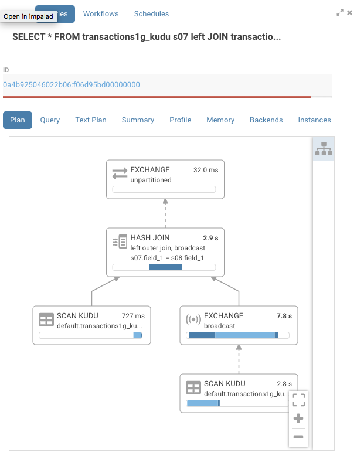](https://cdn.gethue.com/uploads/2019/03/Screen-Shot-2019-03-07-at-4.02.33-PM.png)

当我们查看图表时，我们看到 Kudu 节点现在主要具有 IO，总时间为 727 毫秒。

**其他**

您可能还会遇到节点执行时间短但总持续时间长的查询。使用相同的查询，我们看到所有节点的执行时间都低于 10 毫秒，但查询执行时间为 7.9 秒。

[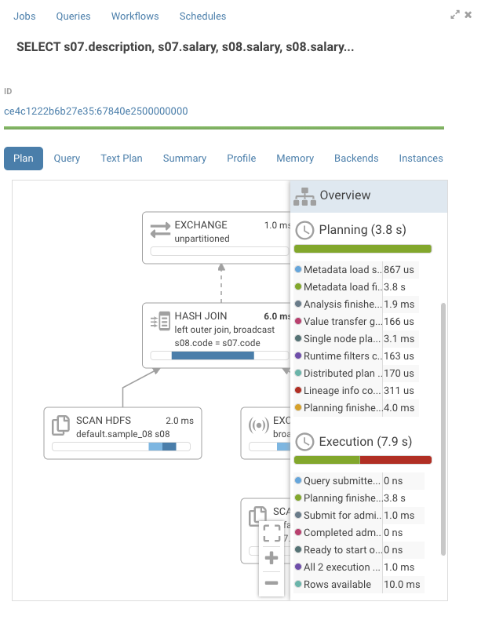](https://cdn.gethue.com/uploads/2019/03/Screen-Shot-2019-03-07-at-10.56.07-AM.png)

查看全局时间线，我们看到计划阶段花费了 3.8 秒，大部分时间用于元数据加载。当 Impala 没有关于表的元数据时（这可能在用户执行以下操作后发生）：

```sql
invalidate metadata;
```

Impala 必须从元存储中重新获取元数据。此外，我们看到第二个最昂贵的项目是获取第一行，耗时 4.1 秒。这是客户端（在本例中为 Hue）获取结果所花费的时间。虽然这两个事件都不是用户可以更改的，但很高兴看到时间花在了哪里。

##### 查询后执行

启用后，一个新的实验性面板可以提供事后风险分析和关于如何调整查询以提高速度的建议。

#### 模式

##### 演示文稿

通过单击"仪表板"图标，将以分号分隔的查询列表转换为交互式演示文稿。它非常适合用于进行带有场景和实时结果的演示，以证明某个观点或一键执行包含一系列顺序查询的报告。

[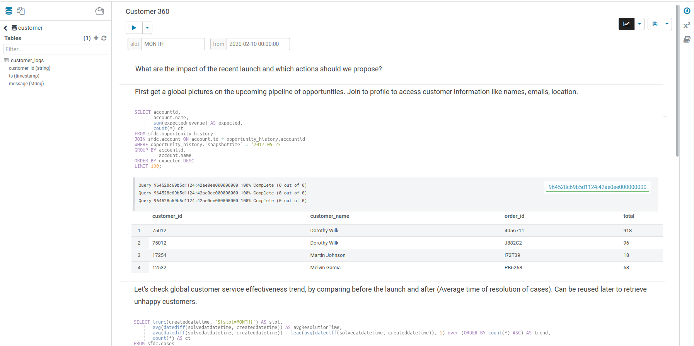](https://cdn.gethue.com/uploads/2020/02/editor_presentation_mode.png)

##### 深色

最初，此模式仅限于实际编辑器区域，我们正在考虑将其扩展到覆盖所有 Hue。

[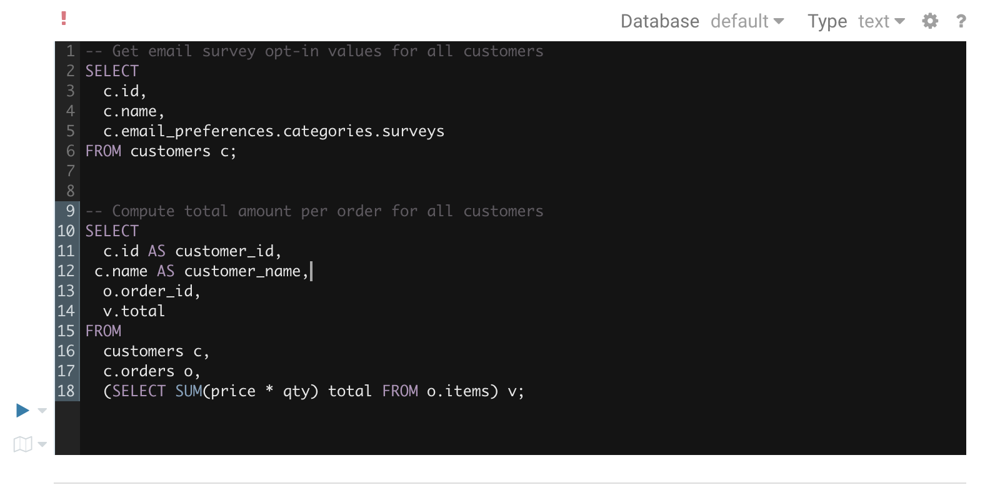](https://cdn.gethue.com/uploads/2018/10/editor_dark_mode.png)

要切换深色模式，您可以在编辑器获得焦点时按 `Ctrl-Alt-T` 或 Mac 上的 `Command-Option-T`。或者，您可以通过按 `Ctrl-` 或 Mac 上的 `Command-` 显示的设置菜单来控制此模式。

### 仪表板

仪表板提供了一种快速轻松地查询索引数据的交互方式。不需要编程，分析通过拖放和单击完成。

[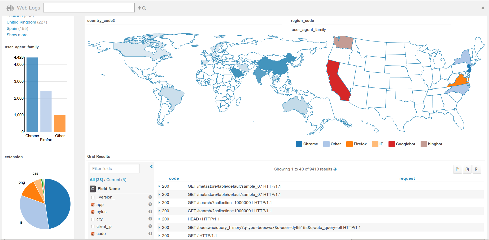](https://cdn.gethue.com/uploads/2015/08/search-full-mode.png)

小部件相互连接。这对于探索新数据集或无需键入即可进行监控非常有用。

[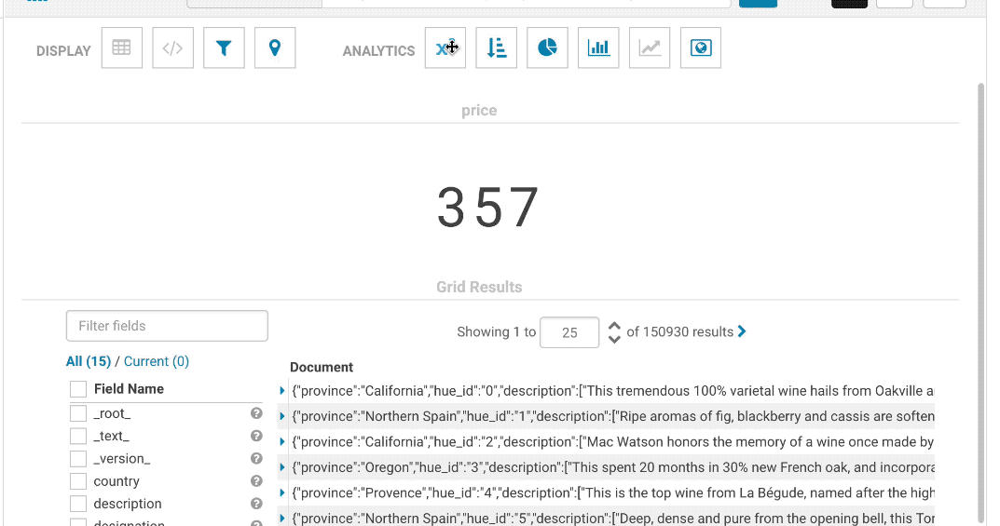](https://cdn.gethue.com/uploads/2018/08/dashboard_layout_dnd.gif)

支持最好的引擎是 Apache Solr，然后对 SQL 数据库的支持越来越好。要帮助添加更多 SQL 支持，请随时查看[仪表板连接器](https://docs.gethue.com/developer/development/#connectors)部分。

这些教程展示了这些功能：

- 顶部搜索栏提供对索引所有值的[完全自动完成](http://gethue.com/intuitively-discovering-and-exploring-a-wine-dataset-with-the-dynamic-dashboards/)
- 查看[实时数据](http://gethue.com/build-a-real-time-analytic-dashboard-with-solr-search-and-spark-streaming/)
- [BikeShare 数据可视化帖子](http://gethue.com/bay-area-bikeshare-data-analysis-with-search-and-spark-notebook/)的综合演示

#### 分析分面

深入分析数据集的维度，并对其应用聚合函数：

[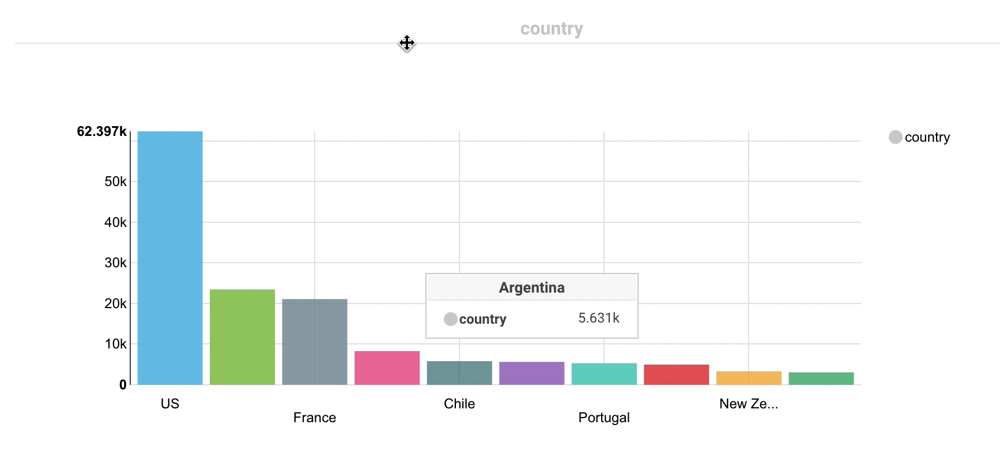](https://cdn.gethue.com/uploads/2018/08/dashboard_layout_dimensions.gif)

一些分面可以嵌套：

[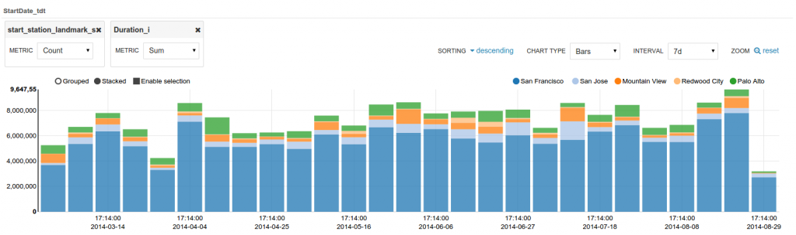](https://cdn.gethue.com/uploads/2015/08/search-nested-facet-1024x304.png) [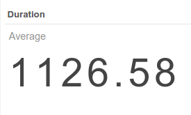](https://cdn.gethue.com/uploads/2015/08/search-hit-widget.png)

#### 自动完成

顶部栏支持分面和自由词文本搜索，并具有自动完成功能。

[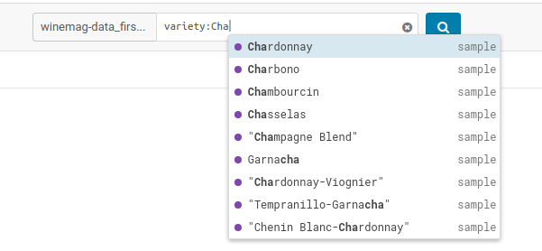](https://cdn.gethue.com/uploads/2018/01/dashboard_autocomplete.png)

#### 标记地图

彼此靠近的点会组合在一起，并在放大时展开。通过选中该框，还可以创建类似 Yelp 的搜索筛选体验。

[](https://cdn.gethue.com/uploads/2015/08/search-marker-map.png)

#### 编辑记录

管理员可以直接在网格或 HTML 小部件中编辑索引记录。

#### 链接

也可以插入指向原始文档的链接。向记录中添加一个名为"link-meta"的字段，其中包含一些描述可在 HBase 浏览器、元数据存储应用或文件浏览器中打开的表或文件的 URL 或地址的 json：

任何链接

```json
{'type': 'link', 'link': 'gethue.com'}
```

HBase 浏览器

```json
{'type': 'hbase', 'table': 'document_demo', 'row_key': '20150527'}
{'type': 'hbase', 'table': 'document_demo', 'row_key': '20150527', 'fam': 'f1'}
{'type': 'hbase', 'table': 'document_demo', 'row_key': '20150527', 'fam': 'f1', 'col': 'c1'}
```

文件浏览器

```json
{'type': 'hdfs', 'path': '/data/hue/file.txt'}
```

表目录

```json
{'type': 'hive', 'database': 'default', 'table': 'sample_07'}
```

[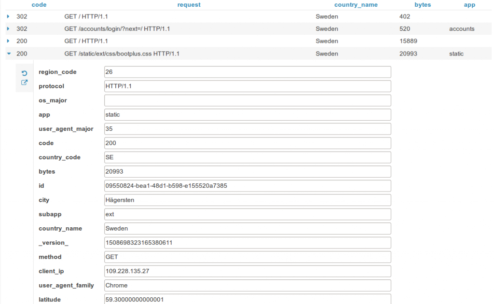](https://cdn.gethue.com/uploads/2015/08/search-link-1024x630.png)

#### 已保存的查询

当前选定的分面和筛选器、查询字符串可以在仪表板中以名称保存。这些对于定义"群组"或预选记录并快速重新加载它们非常有用。

[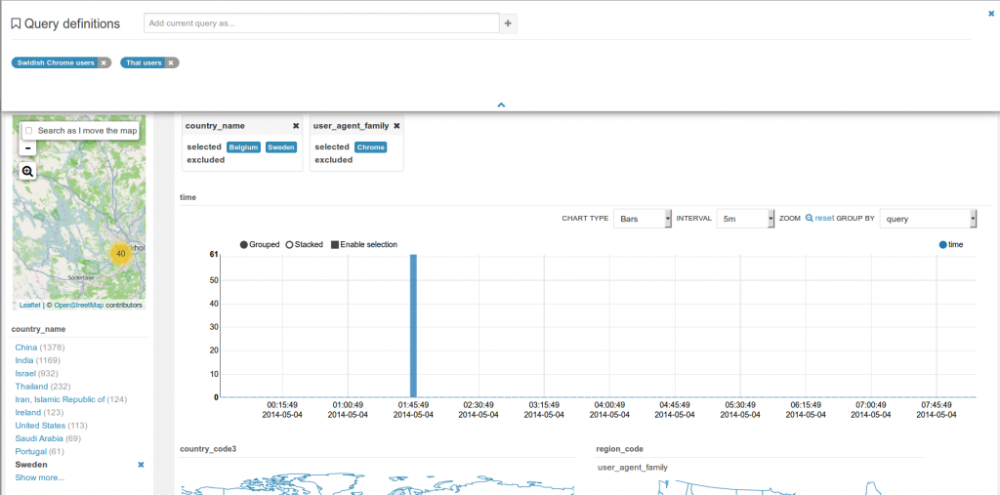](https://cdn.gethue.com/uploads/2015/08/search-query-def-1024x507.png)

#### "固定"或"滚动"窗口

实时索引现在可以通过滚动窗口筛选器和每 N 秒自动刷新仪表板的功能大放异彩。请参阅使用 Spark 流进行实时 Twitter 索引的帖子中的实际操作。

[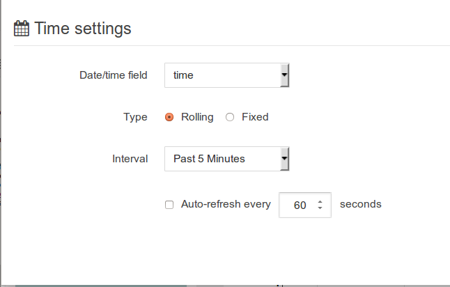](https://cdn.gethue.com/uploads/2015/08/search-fixed-time.png)

#### "更多类似内容"

此功能可让您选择要用于查找相似记录的字段。这是查找与属性列表相关的相似问题、客户、人员……的好方法。

[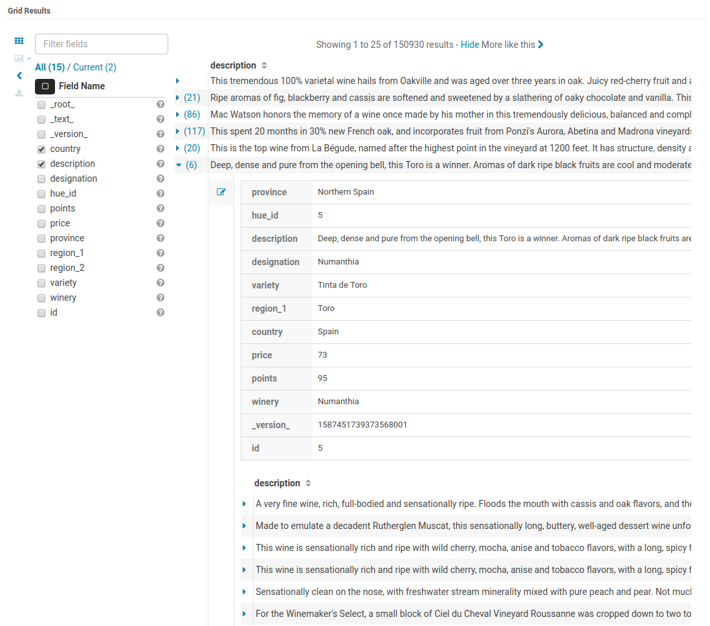](https://cdn.gethue.com/uploads/2018/01/solr_more_like_this.png)

### 笔记本

笔记本的目标是快速试验小型编程代码片段（尤其是 Spark）并进行交互式演示。其目标是相对于其他笔记本或编程系统保持轻量级。

主要优点是能够将不同方言（例如 PySpark、Hive SQL……）的代码片段添加到单个页面中：

[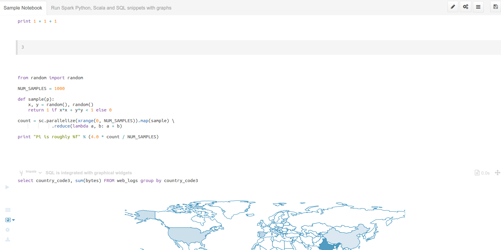](https://cdn.gethue.com/uploads/2015/10/notebook-october.png)

编辑器的任何已配置语言都将作为方言提供。每个代码片段都有一个代码编辑器，具有自动完成、语法高亮显示以及指向 HDFS 路径和 Hive 表的快捷链接等其他功能。

[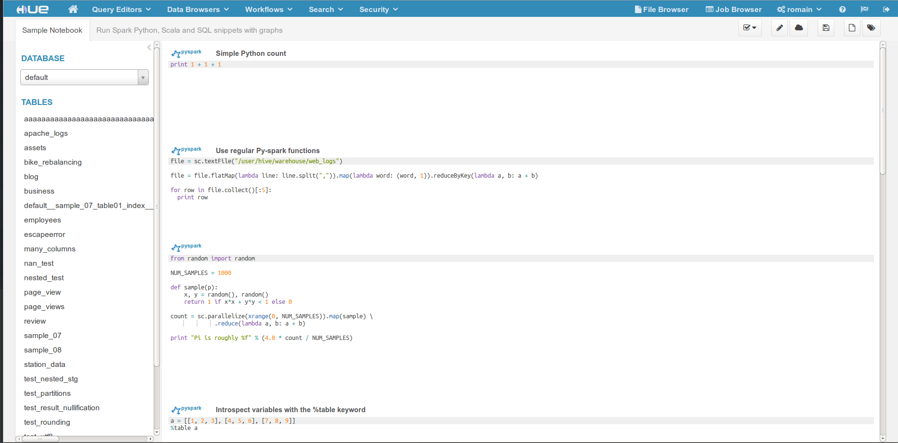](https://cdn.gethue.com/uploads/2015/08/notebook.png)

SparkR shell 内联绘图示例

[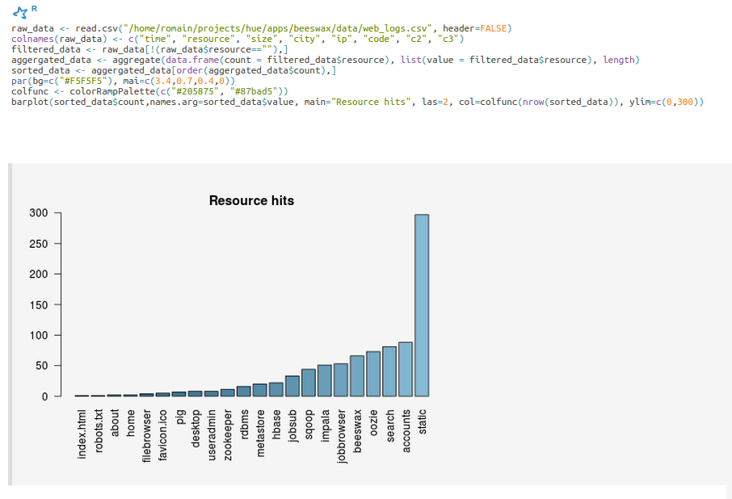](https://cdn.gethue.com/uploads/2015/08/spark-r-snippet.png)

作业和 shell 的所有 spark-submit、spark-shell、pyspark、sparkR 属性都可以添加到笔记本的会话中。例如，这将使您可以添加文件、模块以及调整内存和执行程序数量。

[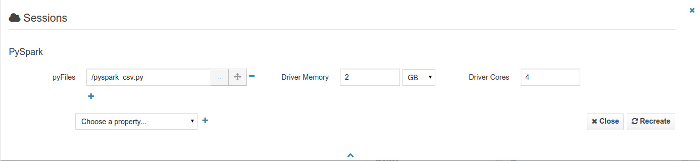](https://cdn.gethue.com/uploads/2015/08/notebook-sessions.png)

#### Spark

Hue 依赖 [Livy](https://livy.incubator.apache.org/) 来实现交互式 Scala、Python、SparkSQL 和 R 代码片段。

Livy 是一个开源 REST 接口，用于从任何地方与 Apache Spark 进行交互。它最初是在 Hue 项目中开发的，但获得了很大的关注，并已移至其自己的项目 livy.io。

确保笔记本和解释器已[配置](https://docs.gethue.com/administrator/configuration/connectors/#apache-spark)。

##### Livy

启动 Livy REST 服务器的详细信息在[入门](http://livy.incubator.apache.org/get-started/)页面上有详细说明。

**执行一些 Spark**

由于 REST 服务器正在运行，我们可以与其通信。我们在同一台机器上，因此将使用"localhost"作为 Livy 的地址。

让我们列出我们打开的会话

```bash
curl localhost:8998/sessions

{"from":0,"total":0,"sessions":[]}
```

**注意** 您可以使用

```bash
| python -m json.tool
```

在命令末尾美化输出，例如：

```bash
curl localhost:8998/sessions/0 | python -m json.tool
```

没有会话。我们创建一个交互式 PySpark 会话

```bash
curl -X POST --data '{"kind": "pyspark"}' -H "Content-Type: application/json" localhost:8998/sessions

{"id":0,"state":"starting","kind":"pyspark","log":[]}
```

会话 ID 是从 0 开始递增的数字。稍后我们可以通过其 ID 引用会话。

我们会检查会话的状态，直到其状态变为 `idle`：这意味着它已准备好执行 PySpark 代码段：

```bash
curl localhost:8998/sessions/0 | python -m json.tool

% Total    % Received % Xferd  Average Speed   Time    Time     Time  Current

                                Dload  Upload   Total   Spent    Left  Speed

100  1185    0  1185    0     0  72712      0 --:--:-- --:--:-- --:--:-- 79000

{
    "id": 5,
    "kind": "pyspark",
    "log": [
      "15/09/03 17:44:14 INFO util.Utils: Successfully started service 'SparkUI' on port 4040.",
      "15/09/03 17:44:14 INFO ui.SparkUI: Started SparkUI at http://172.21.2.198:4040",
      "15/09/03 17:44:14 INFO spark.SparkContext: Added JAR file:/home/romain/projects/hue/apps/spark/java-lib/livy-assembly.jar at http://172.21.2.198:33590/jars/livy-assembly.jar with timestamp 1441327454666",
      "15/09/03 17:44:14 WARN metrics.MetricsSystem: Using default name DAGScheduler for source because spark.app.id is not set.",
      "15/09/03 17:44:14 INFO executor.Executor: Starting executor ID driver on host localhost",
      "15/09/03 17:44:14 INFO util.Utils: Successfully started service 'org.apache.spark.network.netty.NettyBlockTransferService' on port 54584.",
      "15/09/03 17:44:14 INFO netty.NettyBlockTransferService: Server created on 54584",
      "15/09/03 17:44:14 INFO storage.BlockManagerMaster: Trying to register BlockManager",
      "15/09/03 17:44:14 INFO storage.BlockManagerMasterEndpoint: Registering block manager localhost:54584 with 530.3 MB RAM, BlockManagerId(driver, localhost, 54584)",
      "15/09/03 17:44:15 INFO storage.BlockManagerMaster: Registered BlockManager"
    ],
    "state": "idle"
}
```

[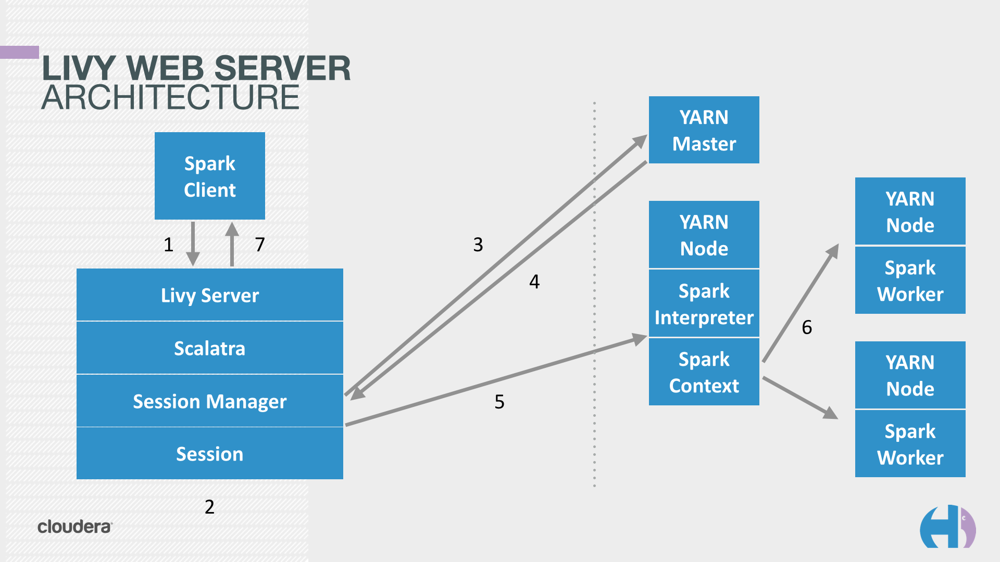](https://cdn.gethue.com/uploads/2015/09/20150818_scalabythebay.024.png)

**会话属性**

Spark Shell 支持的所有属性（如执行器数量、内存等）都可以在会话创建时更改。它们的格式与键入 `spark-shell -h` 时相同。

```bash
curl -X POST --data '{"kind": "pyspark", "numExecutors": "3", "executorMemory": "2G"}' -H "Content-Type: application/json" localhost:8998/sessions
{"id":0,"state":"starting","kind":"pyspark","numExecutors":"3","executorMemory":"2G","log":[]}
```

**执行语句**

在 YARN 模式下，Livy 在集群中创建一个远程 Spark Shell，可以通过 REST 轻松访问。

当会话状态为 `idle` 时，表示已准备好接受语句！让我们计算 1 + 1：

```bash
curl localhost:8998/sessions/0/statements -X POST -H 'Content-Type: application/json' -d '{"code":"1 + 1"}'

{"id":0,"state":"running","output":null}
```

当语句 0 的状态可用时，我们检查其结果：

```bash
curl localhost:8998/sessions/0/statements/0

{"id":0,"state":"available","output":{"status":"ok","execution_count":0,"data":{"text/plain":"2"}}}
```

**注意**：如果语句花费的时间少于几毫秒，Livy 会直接在 POST 命令的响应中返回响应。

语句是递增的，并且都共享相同的上下文，因此我们可以有一系列语句：

```bash
curl localhost:8998/sessions/0/statements -X POST -H 'Content-Type: application/json' -d '{"code":"a = 10"}'

{"id":1,"state":"available","output":{"status":"ok","execution_count":1,"data":{"text/plain":""}}}
```

跨多个语句：

```bash
curl localhost:8998/sessions/5/statements -X POST -H 'Content-Type: application/json' -d '{"code":"a + 1"}'

{"id":2,"state":"available","output":{"status":"ok","execution_count":2,"data":{"text/plain":"11"}}}
```

让我们关闭会话以释放集群。请注意，Livy 会在一小时（可配置）后自动停用空闲会话。

```bash
curl localhost:8998/sessions/0 -X DELETE

{"msg":"deleted"}
```

##### 教程：共享 RDD

本节介绍如何共享 Spark RDD 和上下文。Livy 为用户提供远程 Spark 会话。他们通常每人一个（或每个笔记本一个）：

```bash
## 客户端 1
curl localhost:8998/sessions/0/statements -X POST -H 'Content-Type: application/json' -d '{"code":"1 + 1"}'
## 客户端 2
curl localhost:8998/sessions/1/statements -X POST -H 'Content-Type: application/json' -d '{"code":"..."}'
## 客户端 3
curl localhost:8998/sessions/2/statements -X POST -H 'Content-Type: application/json' -d '{"code":"..."}'
livy_shared_contexts2
```

[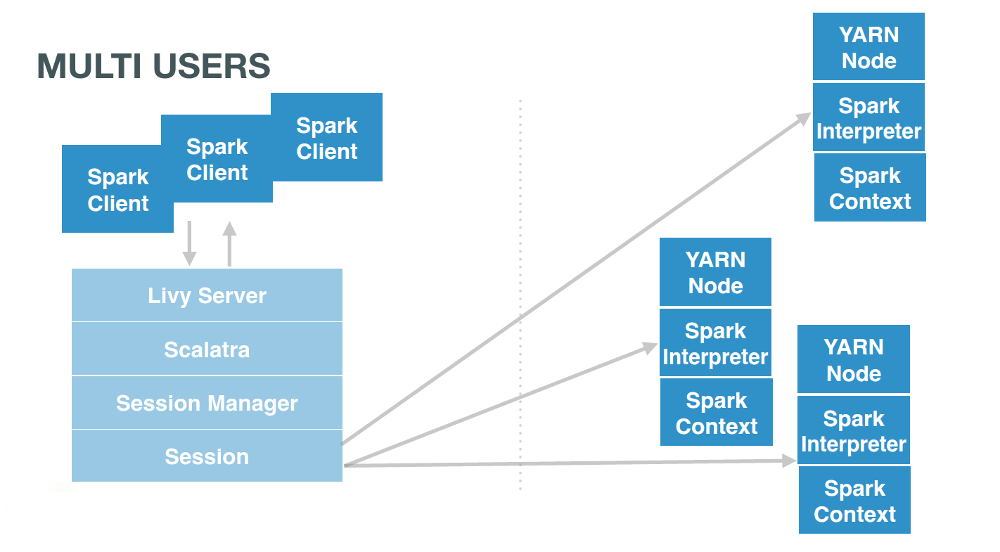](https://cdn.gethue.com/uploads/2015/10/livy_shared_contexts2.png)

###### … 因此共享 RDD

如果用户指向同一个会话，他们将与同一个 Spark 上下文进行交互。此上下文本身将管理多个 RDD。用户只需使用相同的会话 ID（例如 0）并在那里发出命令：

```bash
## 客户端 1
curl localhost:8998/sessions/0/statements -X POST -H 'Content-Type: application/json' -d '{"code":"1 + 1"}'

## 客户端 2
curl localhost:8998/sessions/0/statements -X POST -H 'Content-Type: application/json' -d '{"code":"..."}'

## 客户端 3
curl localhost:8998/sessions/0/statements -X POST -H 'Content-Type: application/json' -d '{"code":"..."}'
```

[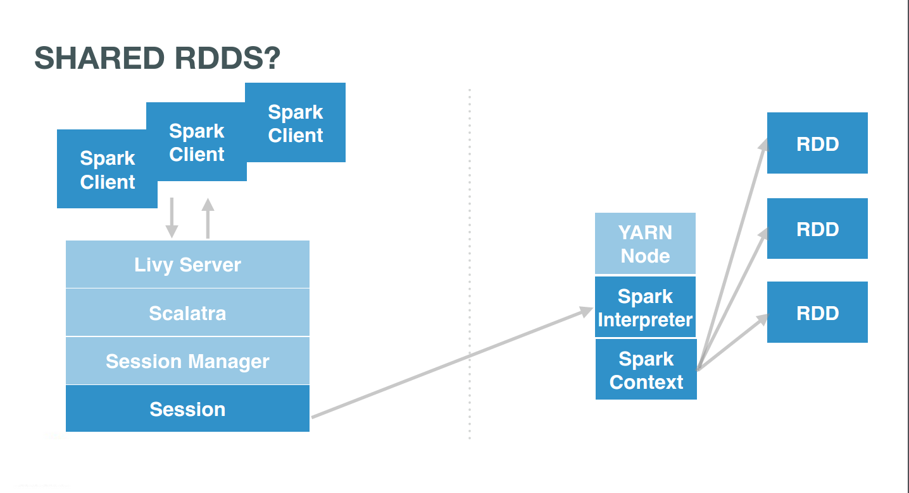](https://cdn.gethue.com/uploads/2015/10/livy_multi_rdds2.png)

###### …从任何地方访问它们

现在我们可以让它更复杂，同时保持简单。假设我们想模拟一个共享的内存键/值存储。一个用户可以在远程 Livy PySpark 会话上启动一个命名的 RDD，任何人都可以访问它。

[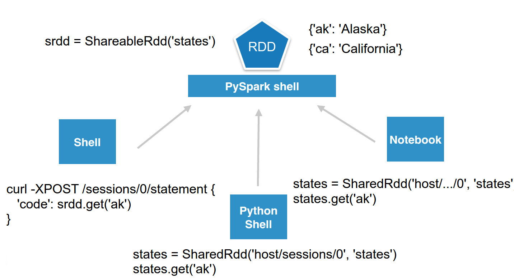](https://cdn.gethue.com/uploads/2015/10/livy_shared_rdds_anywhere2.png)

为了使其更美观，我们可以将其包装在几行 Python 代码中，并将其命名为 `ShareableRdd`。然后用户可以直接连接到会话并设置或检索值。

```python
class ShareableRdd():

def __init__(self):
  self.data = sc.parallelize([])

def get(self, key):
  return self.data.filter(lambda row: row[0] == key).take(1)

def set(self, key, value):
  new_key = sc.parallelize([[key, value]])
  self.data = self.data.union(new_key)
```

`set()` 将值添加到共享 RDD，而 `get()` 检索它。

```python
srdd = ShareableRdd()

srdd.set('ak', 'Alaska')
srdd.set('ca', 'California')

srdd.get('ak')
```

如果直接使用 REST Api，任何人都可以使用这些命令访问它：

```bash
curl localhost:8998/sessions/0/statements -X POST -H 'Content-Type: application/json' -d '{"code":"srdd.get(\"ak\")"}'
{"id":3,"state":"running","output":null}

curl localhost:8998/sessions/0/statements/3
{"id":3,"state":"available","output":{"status":"ok","execution_count":3,"data":{"text/plain":"[['ak', 'Alaska']]"}}}
```

我们甚至可以通过添加 `%json` 魔术关键字直接以 json 格式获取更美观的数据：

```bash
curl localhost:8998/sessions/0/statements -X POST -H 'Content-Type: application/json' -d  '{"code":"data = srdd.get(\"ak\")\n%json data"}'
{"id":4,"state":"running","output":null}

curl localhost:8998/sessions/0/statements/4
{"id":4,"state":"available","output":{"status":"ok","execution_count":2,"data":{"application/json":[["ak","Alaska"]]}}}
```

###### 甚至来自任何语言

由于 Livy 提供了一个简单的 REST Api，我们可以快速地在其周围实现一个小包装器，以在任何语言中提供共享 RDD 功能。让我们用常规 Python 来做：

```bash
pip install requests
python
```

然后在 Python shell 中声明包装器：

```python
import requests
import json

class SharedRdd():
  """
  Perform REST calls to a remote PySpark shell containing a Shared named RDD.
  """
  def __init__(self, session_url, name):
    self.session_url = session_url
    self.name = name

  def get(self, key):
    return self._curl('%(rdd)s.get("%(key)s")' % {'rdd': self.name, 'key': key})

  def set(self, key, value):
    return self._curl('%(rdd)s.set("%(key)s", "%(value)s")' % {'rdd': self.name, 'key': key, 'value': value})

  def _curl(self, code):
    statements_url = self.session_url + '/statements'
    data = {'code': code}
    r = requests.post(statements_url, data=json.dumps(data), headers={'Content-Type': 'application/json'})
    resp = r.json()
    statement_id = str(resp['id'])
    while resp['state'] == 'running':
      r = requests.get(statements_url + '/' + statement_id)
      resp = r.json()
    return r.json()['data']
```

实例化它并使其指向包含 ShareableRdd 的活动会话：

```python
states = SharedRdd('http://localhost:8998/sessions/0', 'states')
```

并以透明方式与 RDD 交互：

```python
states.get('ak')
states.set('hi', 'Hawaii')
```

#### 其他

**Apache Pig** 键入 [Apache Pig](https://pig.apache.org/) 拉丁指令以加载/合并数据以执行 ETL 或分析。

**Apache Sqoop** 通过 [Apache Sqoop](https://sqoop.apache.org/) 命令从传统关系数据库运行 [SQL 导入](https://docs.gethue.com/user/browsing/#relational-databases)。

## 浏览

浏览器为数据目录提供支持。它们使您可以轻松搜索、浏览、导入数据集或作业。

浏览器可以通过外部[目录/元数据服务](https://docs.gethue.com/administrator/configuration/connectors/#storage/)进行"丰富"。

### 目录

#### 表

表浏览器使您能够管理 Hive 和 Impala 共享的元存储的数据库、表和分区。您可以执行以下操作：

- 搜索和显示元数据，如标签和附加描述
- 数据库
    - 选择数据库
    - 创建数据库
    - 删除数据库
- 表
    - 创建表
    - 浏览表
    - 删除表
    - 浏览表数据和元数据（列、分区……）
    - 将数据导入表中
    - [筛选、排序和浏览分区](http://gethue.com/filter-sort-browse-hive-partitions-with-hues-metastore/)

#### 数据目录

在键入任何查询以获取见解之前，用户需要查找和浏览正确的数据集。它可以从界面的顶部栏访问，并提供对 SQL 表、列、标签和已保存查询的自由文本搜索。这对于在数千个表中快速查找表或查找已分析特定数据集的现有查询特别有用。

现有的标签、描述和索引对象会自动显示，您添加的任何其他标签都会显示在元数据服务器中，并且支持熟悉的元数据服务器搜索语法。

[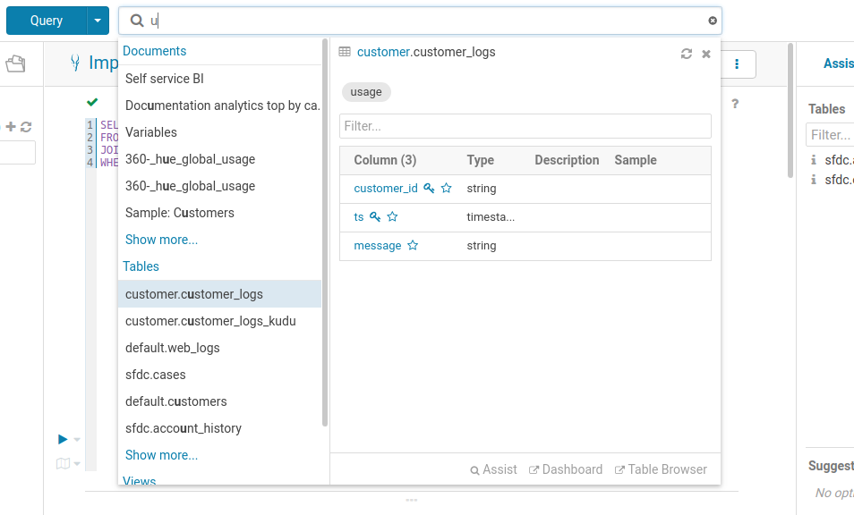](https://cdn.gethue.com/uploads/2018/04/blog_top_search_.png)

搜索集群中所有可用的查询或数据

[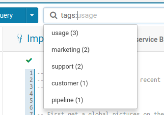](https://cdn.gethue.com/uploads/2018/04/blog_tag_listing.png)

列出可能的标签以进行筛选。这也适用于"类型"。

##### 元数据统一

表及其列的列表显示在界面的多个部分。此数据获取成本相当高，并且来自不同的来源。在此新版本中，信息现在被缓存并由所有 Hue 组件重用。由于来源多种多样，例如 Apache Hive、Apache Atlas，这些信息存储在一个对象中，因此更容易、更快地显示，而无需关心底层的技术细节。

除了编辑任何 SQL 对象（如表、视图、列……）的标签（自版本一以来就已提供此功能）之外，现在还可以编辑表描述。这允许最终用户对元数据进行自助服务文档化，这在以前是不可能的，因为直接编辑 Hive 注释需要一些管理员 Sentry 特权，而这些特权在安全集群中不会授予普通用户。

[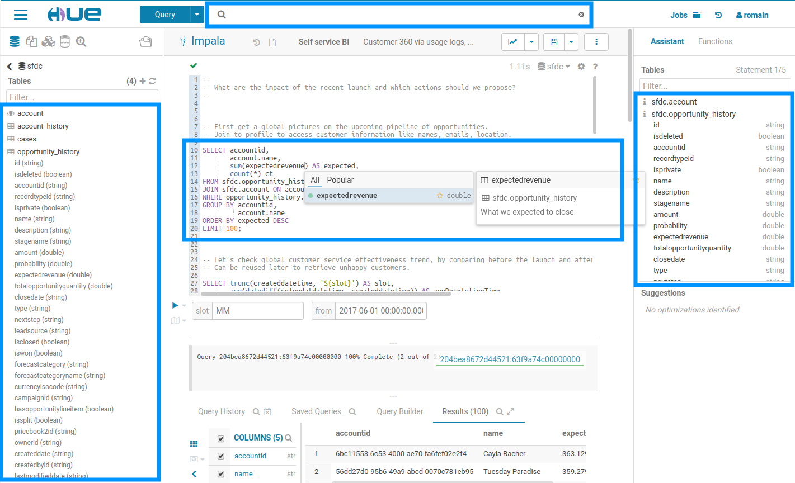](https://cdn.gethue.com/uploads/2018/04/blog_metadata.png)

##### 搜索

默认情况下，仅返回表和视图。要搜索列、分区、数据库，请使用"type:"筛选器。

搜索示例：

Atlas

- sample → 将返回任何带有前缀"sample"的表或 Hue 文档
- type:database → 列出此集群上的所有数据库
- type:table → 列出此集群上的所有表
- type:field name → 列出带有字段（列）："name"的表
- 'tag:classification\_testdb5' 或 'classification:classification\_testdb5'→ 列出带有分类"classification\_testdb5"的实体
- owner:admin → 列出"admin"用户拥有的所有表

Navigator

- table:customer → 查找 customer 表
- table:tax\* tags:finance → 列出所有以 tax 开头并标记为"finance"的表
- owner:admin type:field usage → 列出由 admin 用户创建并与 usage 字符串匹配的所有字段
- parentPath:"/default/web\_logs" type:FIELD originalName:b\* → 列出数据库"default"中表"web\_logs"中所有以 `b` 开头的列。

[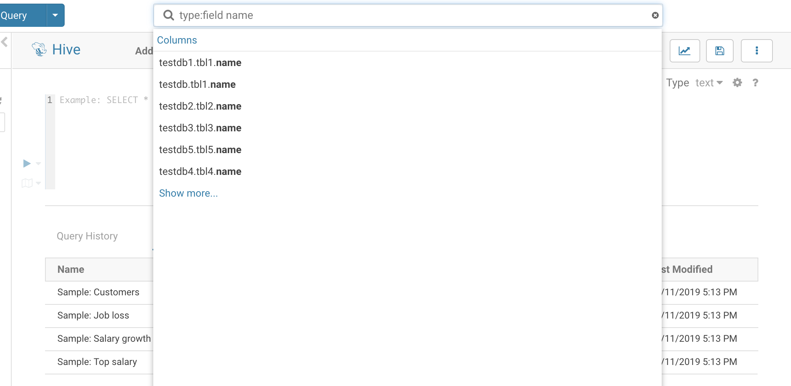](https://cdn.gethue.com/uploads/2019/06/SearchWithType_field_name.png)

更多信息请参阅[搜索](http://gethue.com/realtime-catalog-search-with-hue-and-apache-atlas/)。

##### 标记

此外，您现在还可以使用名称标记对象，以更好地对其进行分类并将其分组到不同的项目中。这些标签是可搜索的，通过更轻松、更直观的发现来加快探索过程。

[](https://cdn.gethue.com/uploads/2016/04/tags.png)

#### 导入数据

导入器的目标是允许对尚未在集群中的数据进行即席查询，并简化自助服务分析。

如果要导入自己的数据而不是安装示例表，请从左侧菜单或左侧助手中单击小"+"打开导入器。

要了解更多信息，请观看有关[数据导入向导](http://gethue.com/import-data-to-be-queried-via-the-self-service-drag-drop-create-table-wizard/)的视频。

**注意** 文件可以拖放、从 HDFS 或 S3（如果已配置）中选择，并且它们的格式会自动检测。该向导还在执行高级功能（如表分区、Kudu 表和嵌套类型）时提供帮助。

##### CSV 文件

任何小型 CSV 文件都可以在几次单击内导入到新索引中。

##### 关系数据库

使用 Apache Sqoop 将数据从关系数据库导入 HDFS 文件或 Hive 表。它可以通过交互式 UI 在几次单击内将大量数据引入集群。导入在 YARN 上运行，并由 Oozie 调度。

更多信息请参阅有关[从传统数据库提取数据](http://gethue.com/importing-data-from-traditional-databases-into-hdfshive-in-just-a-few-clicks/)的帖子。

##### Apache Solr

过去，将数据索引到 Solr 然后使用[动态仪表板](https://docs.gethue.com/user/querying/#dashboards)进行浏览一直相当困难。该任务涉及编写 Solr 模式和 Morphlines 文件，然后向 YARN 提交作业以执行索引。通常，对于非平凡的导入，正确完成此任务可能需要几天的工作。现在，借助 Hue 的新功能，您可以在几分钟内启动 YARN 索引作业。

首先，您需要一个正在运行的 Solr 集群，并且 Hue 已配置该集群。

接下来，您需要安装这些必需的库。为此，请将它们放在 HDFS 上的某个目录中，并在 Hue ini 中的 indexer 下将 config\_indexer\_libs\_path 的路径设置为匹配，默认情况下，config\_indexer\_libs\_path 值设置为 /tmp/smart\_indexer\_lib。此外，在 Hue ini 中的 indexer 下，您需要将 enable\_new\_indexer 设置为 true。

```ini
[indexer]

## Flag to turn on the morphline based Solr indexer.
enable_new_indexer=false

## Oozie workspace template for indexing.
### config_indexer_libs_path=/tmp/smart_indexer_lib
```

我们将为新集合选择一个名称，并从 HDFS 中选择我们的评论数据文件。然后我们将单击下一步。

[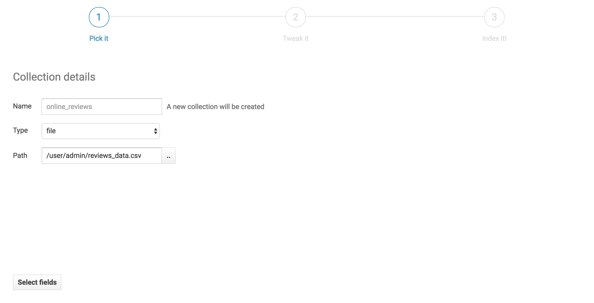](https://cdn.gethue.com/uploads/2016/08/indexer-wizard.png)

字段选择和 ETL

在此选项卡上，我们可以看到索引器从文件中提取的所有字段。请注意，Hue 还对字段类型进行了有根据的猜测。通常，Hue 在推断数据类型方面做得很好。但是，我们应该快速检查以确认字段类型看起来正确。

[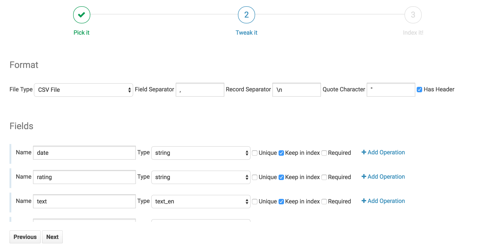](https://cdn.gethue.com/uploads/2016/08/indexer-wizard-fields.png)

对于我们的数据，我们将执行 4 个操作来创建一个非常易于搜索的 Solr 集合。

转换日期

此操作是隐式的。通过将字段类型设置为 date，我们通知 Hue 我们要将此日期转换为 Solr 日期。Hue 可以自动转换大多数标准日期格式。如果我们有唯一的日期格式，则必须通过显式使用转换日期操作为 Hue 定义它。

[](https://cdn.gethue.com/uploads/2016/08/indexer-op-date.png)

将星级评分转换为整数评分

在评分字段下，我们将字段类型从 string 更改为 long，然后单击添加操作。然后，我们将选择翻译操作并设置以下翻译映射。

[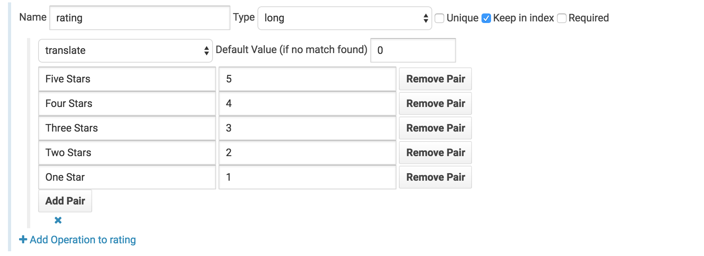](https://cdn.gethue.com/uploads/2016/08/indexer-translate-date.png)

从完整地址字段中提取城市

我们将向完整地址字段添加一个 grok 操作，填写以下正则表达式 .\* (?<city>\\w+),.\* 并将预期字段数设置为

[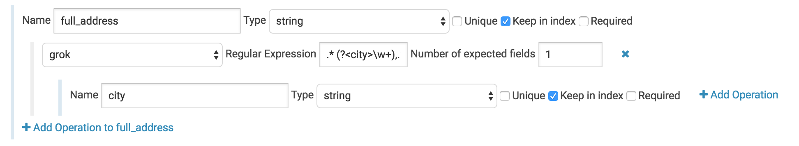](https://cdn.gethue.com/uploads/2016/08/indexer-op-grok.png)

1. 在新的子字段中，我们将名称设置为 city。这个新字段现在将包含与正则表达式中城市捕获组匹配的值。

使用拆分操作将纬度/经度字段拆分为两个单独的浮点字段。这里我们有一个烦恼。我们的数据文件包含正在审查的地点的纬度和经度——太棒了！然而，由于某种原因，它们被集中到一个字段中，两个数字之间用逗号隔开。我们将使用拆分操作分别获取它们。将拆分值设置为"，"，并将输出字段数设置为 2。然后将子字段的类型更改为 double，并为它们指定逻辑名称。在这种情况下，保留父字段没有多大意义，因此我们取消选中"保留在索引中"框。

[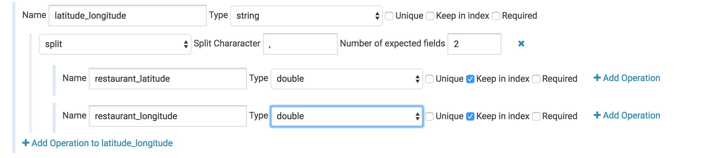](https://cdn.gethue.com/uploads/2016/08/indexer-op-split.png)

在这里，我们将添加一个 geo ip 操作，并选择 iso\_code 作为我们的输出。这将为我们提供国家/地区代码。

[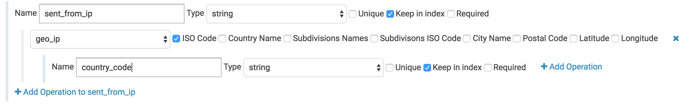](https://cdn.gethue.com/uploads/2016/08/indexer-op-geoip.png)

在索引之前，让我们通过快速扫描预览来确保一切看起来都很好。这有助于避免任何愚蠢的拼写错误或类似情况。

现在我们已经定义了 ETL，Hue 可以完成其余的工作。单击索引并等待 Hue 为我们的数据编制索引。在此屏幕的底部，我们可以看到该过程的进度条。黄色表示我们的数据当前正在编制索引，绿色表示已完成。请随时关闭此窗口。索引将在您的集群上继续进行。

一旦我们的数据被索引到 Solr 集合中，我们就可以访问 Hue 的所有搜索功能，并可以为我们的数据制作一个漂亮的分析仪表板，如下所示。

[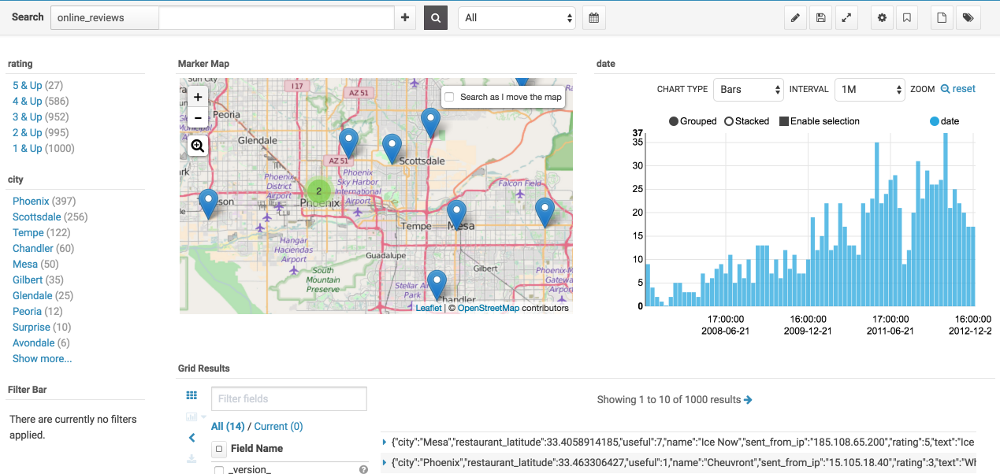](https://cdn.gethue.com/uploads/2016/08/indexer-dash.png)

**依赖项**

索引器库路径是所有必需的索引库所在的位置。如果您愿意，可以自己组装此目录。库目录有三个主要组件：

1. [MapReduceIndexerTool](https://www.cloudera.com/documentation/enterprise/5-5-x/topics/search_mapreduceindexertool.html) 所需的 JAR 文件

所有必需的 jar 文件都应随 CDH 一起提供。目前所需的 JAR 列表是：

```
argparse4j-0.4.3.jar
readme.txt
httpmime-4.2.5.jar
search-mr-1.0.0-cdh5.8.0-job.jar
kite-morphlines-core-1.0.0-cdh5.8.0.jar
solr-core-4.10.3-cdh5.8.0.jar
kite-morphlines-solr-core-1.0.0-cdh5.8.0.jar
solr-solrj-4.10.3-cdh5.8.0.jar
noggit-0.5.jar
```

如果发生更改并且您收到缺少类的错误，您可以通过在 CDH 附带的所有 jar 中搜索缺少的类来找到任何可能缺少的 jar。

2. Maxmind GeoLite2 数据库

此文件是 GeoIP 查找命令所必需的，可以在 [MaxMind 网站](https://dev.maxmind.com/geoip/geoip2/geolite2/)上找到。

3. Grok 词典

任何 grok 命令都可以在 grok\_dictionaries 子目录中的文本文件中定义。

#### 流

可以通过 [`ksql` 连接器](https://docs.gethue.com/administrator/configuration/connectors/#ksql)列出 Kafka 主题、流、表。