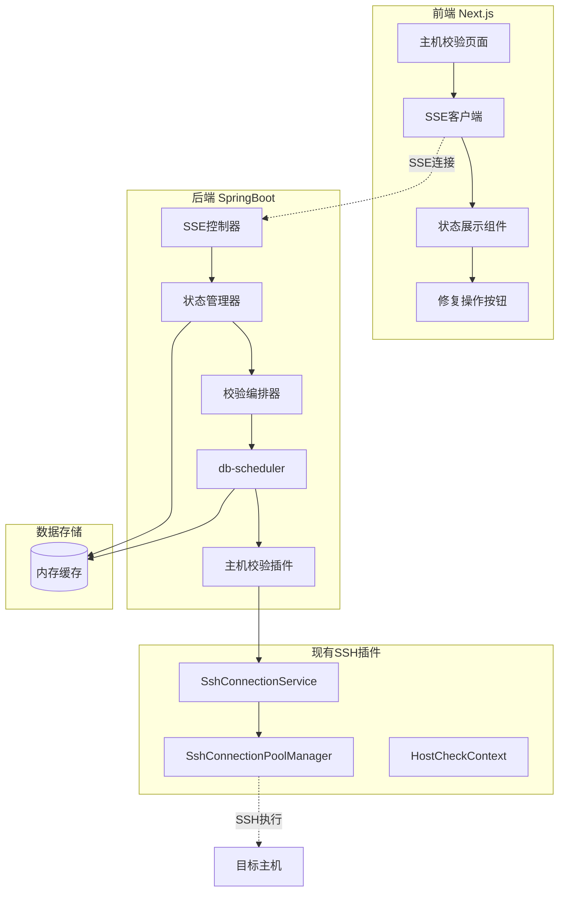

# 🎯 主机校验与修复功能技术设计方案

## 项目概述

**功能目标：** 集群配置第二个页面的主机校验与自动修复功能  
**核心特性：** 插件化架构、实时状态推送、自动修复、支持多OS类型  
**作者：** 任相鹏  
**邮箱：** 635887935@qq.com  
**日期：** 2025-01-28  

---

## 1. 核心架构设计

### 1.1 技术选型

- **实时通信：** SSE (Server-Sent Events) - 单向推送，自动重连
- **任务调度：** db-scheduler - 零外部依赖，集群友好  
- **插件架构：** PF4J - 动态加载/卸载，内存友好
- **多OS支持：** 策略模式 + 模板方法模式
- **SSH连接：** Apache SSHJ + Commons Pool2 连接池

### 1.2 系统架构图



### 1.3 分层插件架构设计

**三层插件架构：**

1. **基础层 - SSH插件**
   - `SshConnectionService`: 统一的SSH连接管理和命令执行接口
   - `SshConnectionPoolManager`: 基于Apache SSHJ + Commons Pool2的高性能连接池
   - 职责：SSH连接、命令执行、连接池管理

2. **数据层 - 系统信息收集插件**
   - `SystemInfoCollectorPlugin`: 系统信息收集插件接口
   - 职责：调用SSH插件执行命令、解析结果、返回结构化数据
   - 内部使用策略模式处理多OS差异

3. **业务层 - 校验和修复插件**
   - `HostValidationPlugin`: 主机校验插件接口
   - `HostRepairPlugin`: 主机修复插件接口
   - 职责：业务逻辑判断、调用数据层获取信息、执行检查和修复

**调用链路：**
```
主程序 → 校验/修复插件 → 系统信息收集插件 → SSH插件 → 目标主机
```

### 1.3 核心流程

**校验流程：** 启动校验 → SSH免密检查 → SSH连接检查 → 信息收集 → 环境检查 → 结果汇总  
**修复流程：** 检查失败 → 自动修复 → 重新检查 → 状态更新  
**实时推送：** 每个步骤完成后通过SSE推送状态和日志到前端  
**数据存储：** 仅使用内存缓存，无需持久化（一次性校验）

## 2. 检查项配置设计

### 2.1 完整检查项清单

基于你的配置文件，补充完整的检查项：

```yaml
datasophon:
  checker:
    # SSH免密检查 (第一优先级)
    ssh-passwordless:
      timeout: 30s
      retry-count: 3
      test-command: "echo 'ssh passwordless test'"
      
    # SSH连接检查 (第二优先级)
    ssh:
      timeout: 30s
      retry-count: 3
      
    # CPU检查配置  
    cpu:
      min-cores: 4
      recommended-cores: 8
      
    # 内存检查配置
    memory:
      min-memory: 8192        # MB
      recommended-memory: 16384
      min-swap: 4096
      
    # 磁盘空间检查配置
    disk:
      check-directories:
        - path: /opt
          min-available-gb: 100
        - path: /var/log  
          min-available-gb: 50
        - path: /tmp
          min-available-gb: 30
      min-available-percent: 20
      
    # Java环境检查
    java:
      min-version: 1.8
      default-path: /usr/local/jdk1.8.0_333
      check-default-path: true
      
    # 文件句柄数检查
    file-handle:
      min-limit: 65535
      
    # 时间同步检查
    time-sync:
      max-time-diff: 10       # 秒
      ntp-servers:
        - pool.ntp.org
        - time.nist.gov
        
    # 用户组检查
    user-group:
      auto-create: true
      default-group-mappings:
        hdfs: hadoop
        yarn: hadoop
        hbase: hadoop
        hive: hadoop
        spark: hadoop
        kafka: hadoop
        mapred: hadoop
        
    # 防火墙检查
    firewall:
      auto-configure: true
      required-ports:
        - 22    # SSH
        - 8020  # HDFS NameNode
        - 9000  # HDFS NameNode (backup)
        - 8088  # YARN ResourceManager
        - 19888 # MapReduce History Server
        
    # SELinux检查  
    selinux:
      auto-disable: true
      expected-status: disabled
      
    # 系统服务检查
    services:
      required-services:
        - sshd
        - chronyd
      disabled-services:
        - firewalld  # 如果使用iptables
        
    # Hosts文件检查
    hosts:
      auto-configure: true
      validate-hostname: true
```

### 2.2 多OS支持策略

不同操作系统的命令和配置差异：

```java
// OS命令策略映射
public enum OsCommandMapping {
    // 包管理器
    CENTOS_PACKAGE_INSTALL("yum install -y"),
    UBUNTU_PACKAGE_INSTALL("apt-get install -y"),
    KYLIN_PACKAGE_INSTALL("yum install -y"),
    
    // 服务管理
    CENTOS_SERVICE_ENABLE("systemctl enable"),
    UBUNTU_SERVICE_ENABLE("systemctl enable"),
    
    // 防火墙管理
    CENTOS_FIREWALL_OPEN("firewall-cmd --permanent --add-port="),
    UBUNTU_FIREWALL_OPEN("ufw allow"),
    
    // 时间同步
    CENTOS_NTP_CONFIG("/etc/chrony.conf"),
    UBUNTU_NTP_CONFIG("/etc/chrony/chrony.conf");
}
```

---

## 3. 核心模块设计

### 3.1 数据模型设计

```java
// 主机校验请求
public record HostValidationRequestDTO(
    Long clusterId,
    List<String> hostIps,
    String sshUser,
    String sshPassword,        // 可选，优先使用免密
    Integer sshPort,
    String privateKeyPath      // SSH私钥路径（免密登录）
) {}

// 主机校验状态（仅内存存储）
public record HostValidationStatusVO(
    String hostIp,
    String hostname,
    ValidationStatus overallStatus,
    List<CheckItemStatusVO> checkItems,
    List<String> logs,                    // 实时日志
    LocalDateTime lastUpdateTime,
    boolean canRepair                     // 是否可修复
) {}

// 检查项状态
public record CheckItemStatusVO(
    String checkType,
    String displayName,
    ValidationStatus status,
    String message,
    Map<String, Object> details,
    LocalDateTime updateTime,
    boolean repairAvailable,              // 是否支持修复
    String repairAction                   // 修复操作描述
) {}

// 校验状态枚举
public enum ValidationStatus {
    PENDING("待检查"),
    CHECKING("检查中"),
    SUCCESS("检查成功"),
    FAILED("检查失败"),
    REPAIRING("修复中"),
    REPAIRED("修复完成"),
    REPAIR_FAILED("修复失败");
}

// 检查项类型枚举（按执行优先级排序）
public enum CheckType {
    SSH_PASSWORDLESS("ssh-passwordless", "SSH免密检查", 1, true),
    SSH_CONNECTIVITY("ssh-connectivity", "SSH连接检查", 2, true),
    OS_INFO_COLLECTION("os-info-collection", "操作系统信息收集", 3, false),
    HARDWARE_INFO_COLLECTION("hardware-info-collection", "硬件信息收集", 4, false),
    CPU_CHECK("cpu-check", "CPU检查", 5, false),
    MEMORY_CHECK("memory-check", "内存检查", 6, false),
    DISK_SPACE_CHECK("disk-space-check", "磁盘空间检查", 7, false),
    JAVA_ENVIRONMENT_CHECK("java-environment-check", "Java环境检查", 8, true),
    FILE_HANDLE_LIMIT_CHECK("file-handle-limit-check", "文件句柄限制检查", 9, true),
    TIME_SYNC_CHECK("time-sync-check", "时间同步检查", 10, true),
    USER_GROUP_CHECK("user-group-check", "用户组检查", 11, true),
    FIREWALL_CHECK("firewall-check", "防火墙检查", 12, true),
    SELINUX_CHECK("selinux-check", "SELinux检查", 13, true),
    HOSTS_FILE_CHECK("hosts-file-check", "Hosts文件检查", 14, true);
    
    private final String code;
    private final String displayName;
    private final int priority;
    private final boolean canRepair;
}
```

### 3.2 多OS检查与修复架构

#### 3.2.1 策略模式 - OS命令差异处理

```java
// OS命令策略接口
public interface OsCommandStrategy {
    // SSH免密检查命令
    String getSshPasswordlessTestCommand();
    boolean validateSshPasswordlessConnection(String output);
    String getSetupSshPasswordlessCommand(String publicKeyPath);
    
    // 系统信息收集命令
    String getCpuInfoCommand();
    String getMemoryInfoCommand();
    String getDiskInfoCommand();
    String getJavaVersionCommand();
    
    // 修复命令
    String getInstallJavaCommand(String jdkPath);
    String getCreateUserCommand(String user, String group);
    String getDisableFirewallCommand();
    String getConfigureNtpCommand(List<String> ntpServers);
    
    // 解析方法
    CpuInfo parseCpuInfo(String output);
    MemoryInfo parseMemoryInfo(String output);
}

// CentOS/RHEL策略实现
@Component
public class RedHatCommandStrategy implements OsCommandStrategy {
    @Override
    public String getSshPasswordlessTestCommand() {
        return "echo 'ssh passwordless test successful'";
    }
    
    @Override
    public boolean validateSshPasswordlessConnection(String output) {
        return output.contains("ssh passwordless test successful");
    }
    
    @Override
    public String getSetupSshPasswordlessCommand(String publicKeyPath) {
        return String.format("""
            mkdir -p ~/.ssh && \
            chmod 700 ~/.ssh && \
            cat %s >> ~/.ssh/authorized_keys && \
            chmod 600 ~/.ssh/authorized_keys && \
            echo 'SSH免密配置完成'
            """, publicKeyPath);
    }
    
    @Override
    public String getCpuInfoCommand() {
        return "nproc; cat /proc/cpuinfo | grep 'model name' | head -1 | cut -d ':' -f2";
    }
    
    @Override
    public String getInstallJavaCommand(String jdkPath) {
        return String.format("yum install -y java-1.8.0-openjdk && " +
                           "echo 'export JAVA_HOME=%s' >> /etc/profile", jdkPath);
    }
    
    @Override
    public String getDisableFirewallCommand() {
        return "systemctl stop firewalld && systemctl disable firewalld";
    }
}

// Ubuntu/Debian策略实现  
@Component
public class DebianCommandStrategy implements OsCommandStrategy {
    @Override
    public String getSshPasswordlessTestCommand() {
        return "echo 'ssh passwordless test successful'";
    }
    
    @Override
    public String getSetupSshPasswordlessCommand(String publicKeyPath) {
        return String.format("""
            mkdir -p ~/.ssh && \
            chmod 700 ~/.ssh && \
            cat %s >> ~/.ssh/authorized_keys && \
            chmod 600 ~/.ssh/authorized_keys && \
            echo 'SSH免密配置完成'
            """, publicKeyPath);
    }
    
    @Override
    public String getInstallJavaCommand(String jdkPath) {
        return String.format("apt-get update && apt-get install -y openjdk-8-jdk && " +
                           "echo 'export JAVA_HOME=%s' >> /etc/profile", jdkPath);
    }
    
    @Override
    public String getDisableFirewallCommand() {
        return "ufw disable";
    }
}
```

#### 3.2.2 模板方法模式 - 统一检查流程

```java
// 抽象检查器模板
public abstract class AbstractSystemChecker {
    
    protected final OsCommandStrategy commandStrategy;
    protected final SshCommandExecutor sshExecutor;
    
    // 模板方法 - 定义检查和修复流程
    public final CheckResult executeCheck(HostCheckContext context) {
        try {
            // 1. 执行检查
            String command = getCheckCommand();
            String output = sshExecutor.executeCommand(context, command);
            Object result = parseOutput(output);
            
            // 2. 验证结果
            ValidationResult validation = validateResult(result);
            
            // 3. 如果失败且支持修复，尝试自动修复
            if (!validation.isValid() && canRepair()) {
                return attemptRepair(context, validation);
            }
            
            return createResult(validation, result);
            
        } catch (Exception e) {
            return createFailedResult("检查异常: " + e.getMessage());
        }
    }
    
    // 修复方法
    private CheckResult attemptRepair(HostCheckContext context, ValidationResult validation) {
        try {
            // 推送修复开始日志
            pushLog(context, "开始自动修复: " + validation.getMessage());
            
            // 执行修复命令
            String repairCommand = getRepairCommand();
            String output = sshExecutor.executeCommand(context, repairCommand);
            
            // 推送修复日志
            pushLog(context, "修复命令执行完成: " + output);
            
            // 重新检查
            Thread.sleep(2000); // 等待修复生效
            return executeCheck(context);
            
        } catch (Exception e) {
            pushLog(context, "修复失败: " + e.getMessage());
            return createFailedResult("修复失败: " + e.getMessage());
        }
    }
    
    // 抽象方法
    protected abstract String getCheckCommand();
    protected abstract Object parseOutput(String output);
    protected abstract ValidationResult validateResult(Object result);
    protected abstract boolean canRepair();
    protected abstract String getRepairCommand();
}

// SSH免密检查器实现
@Component
public class SshPasswordlessChecker extends AbstractSystemChecker {
    
    @Override
    protected String getCheckCommand() {
        return commandStrategy.getSshPasswordlessTestCommand();
    }
    
    @Override
    protected ValidationResult validateResult(Object result) {
        String output = (String) result;
        boolean isValid = commandStrategy.validateSshPasswordlessConnection(output);
        
        if (isValid) {
            return ValidationResult.success("SSH免密连接验证成功");
        } else {
            return ValidationResult.failed("SSH免密连接失败，需要配置公钥");
        }
    }
    
    @Override
    protected boolean canRepair() {
        return true; // SSH免密支持自动修复
    }
    
    @Override
    protected String getRepairCommand() {
        // 从配置中获取公钥路径
        String publicKeyPath = getPublicKeyPath();
        return commandStrategy.getSetupSshPasswordlessCommand(publicKeyPath);
    }
    
    private String getPublicKeyPath() {
        // 从配置文件或系统环境获取公钥路径
        return System.getProperty("user.home") + "/.ssh/id_rsa.pub";
    }
}

// Java环境检查器实现
@Component
public class JavaEnvironmentChecker extends AbstractSystemChecker {
    
    @Override
    protected String getCheckCommand() {
        return commandStrategy.getJavaVersionCommand();
    }
    
    @Override
    protected ValidationResult validateResult(Object result) {
        JavaInfo javaInfo = (JavaInfo) result;
        if (javaInfo.getVersion() == null) {
            return ValidationResult.failed("Java未安装");
        }
        if (!isVersionValid(javaInfo.getVersion())) {
            return ValidationResult.failed("Java版本不符合要求");
        }
        return ValidationResult.success("Java环境检查通过");
    }
    
    @Override
    protected boolean canRepair() {
        return true; // Java环境支持自动修复
    }
    
    @Override
    protected String getRepairCommand() {
        return commandStrategy.getInstallJavaCommand("/usr/lib/jvm/java-8-openjdk");
    }
}
```

### 3.3 SSE实时通信与日志推送

```java
@RestController
@ApiVersion(path = "host-validation")
public class HostValidationSSEController {
    
    // 建立SSE连接
    @GetMapping(value = "/stream", produces = MediaType.TEXT_EVENT_STREAM_VALUE)
    public SseEmitter streamValidationStatus(@RequestParam Long clusterId) {
        SseEmitter emitter = new SseEmitter(300_000L);
        
        // 注册SSE连接
        stateManager.registerSSEEmitter(clusterId, emitter);
        
        // 发送连接成功消息
        emitter.send(SseEmitter.event()
            .name("connection")
            .data("主机校验连接建立成功"));
        
        return emitter;
    }
    
    // 启动校验
    @PostMapping("/start")
    public Result<String> startValidation(@RequestBody HostValidationRequestDTO request) {
        orchestrator.startHostValidation(request);
        return Result.success("主机校验已启动");
    }
    
    // 启动修复
    @PostMapping("/repair")
    public Result<String> startRepair(@RequestParam Long clusterId, 
                                    @RequestParam String hostIp,
                                    @RequestParam String checkType) {
        orchestrator.startRepair(clusterId, hostIp, checkType);
        return Result.success("修复任务已启动");
}

// 状态管理器 - 负责SSE推送和日志管理（仅内存存储）
@Service
public class HostValidationStateManager {
    
    // 集群SSE连接管理
    private final Map<Long, List<SseEmitter>> clusterEmitters = new ConcurrentHashMap<>();
    
    // 主机校验状态缓存（仅内存，无持久化）
    private final Map<String, HostValidationStatusVO> statusCache = new ConcurrentHashMap<>();
    
    // 推送状态更新
    public void pushStatusUpdate(Long clusterId, HostValidationStatusVO status) {
        // 更新内存缓存
        String cacheKey = clusterId + ":" + status.hostIp();
        statusCache.put(cacheKey, status);
        
        // 推送给前端
        List<SseEmitter> emitters = clusterEmitters.get(clusterId);
        if (emitters != null) {
            emitters.removeIf(emitter -> {
                try {
                    emitter.send(SseEmitter.event()
                        .name("status-update")
                        .data(status));
                    return false;
                } catch (Exception e) {
                    return true; // 移除失效的连接
                }
            });
        }
    }
    
    // 推送实时日志
    public void pushLog(Long clusterId, String hostIp, String logMessage) {
        List<SseEmitter> emitters = clusterEmitters.get(clusterId);
        if (emitters != null) {
            String logData = String.format("[%s] %s: %s", 
                LocalDateTime.now().format(DateTimeFormatter.ofPattern("HH:mm:ss")),
                hostIp, logMessage);
                
            emitters.removeIf(emitter -> {
                try {
                    emitter.send(SseEmitter.event()
                        .name("log")
                        .data(logData));
                    return false;
                } catch (Exception e) {
                    return true;
                }
            });
        }
    }
    
    // 获取集群校验状态（从内存缓存）
    public List<HostValidationStatusVO> getClusterValidationStatus(Long clusterId) {
        String clusterPrefix = clusterId + ":";
        return statusCache.entrySet().stream()
                .filter(entry -> entry.getKey().startsWith(clusterPrefix))
                .map(Map.Entry::getValue)
                .toList();
    }
    
    // 清理集群校验数据（校验完成后调用）
    public void clearClusterValidationData(Long clusterId) {
        String clusterPrefix = clusterId + ":";
        statusCache.entrySet().removeIf(entry -> entry.getKey().startsWith(clusterPrefix));
        clusterEmitters.remove(clusterId);
    }
### 3.4 插件架构设计

#### 3.4.1 插件分类策略

采用 **中等粒度插件** - 按功能域划分，而非单一检查项：

```java
// 环境检查插件 - 包含多个相关检查项
@Extension
@Component  
public class EnvironmentCheckPlugin implements HostCheckerPlugin {
    
    @Autowired
    private SystemCheckerFactory checkerFactory;
    
    // 支持的检查类型（按优先级排序）
    private static final List<CheckType> SUPPORTED_CHECKS = List.of(
        CheckType.SSH_PASSWORDLESS,        // 第一优先级：SSH免密检查
        CheckType.SSH_CONNECTIVITY,        // 第二优先级：SSH连接检查
        CheckType.OS_INFO_COLLECTION,      // 信息收集
        CheckType.HARDWARE_INFO_COLLECTION,
        CheckType.CPU_CHECK,               // 环境检查
        CheckType.MEMORY_CHECK,
        CheckType.DISK_SPACE_CHECK,
        CheckType.JAVA_ENVIRONMENT_CHECK,
        CheckType.FILE_HANDLE_LIMIT_CHECK,
        CheckType.TIME_SYNC_CHECK,
        CheckType.USER_GROUP_CHECK,
        CheckType.FIREWALL_CHECK,          // 系统配置检查
        CheckType.SELINUX_CHECK,
        CheckType.HOSTS_FILE_CHECK
    );
    
    @Override
    public CompletableFuture<CheckResult> executeCheck(HostCheckContext context) {
        return CompletableFuture.supplyAsync(() -> {
            Map<String, CheckResult> results = new ConcurrentHashMap<>();
            
            // 获取OS类型
            OsType osType = detectOsType(context);
            
            // 按优先级顺序执行检查（SSH免密和连接检查必须先成功）
            for (CheckType checkType : SUPPORTED_CHECKS) {
                try {
                    // SSH免密和连接检查必须串行执行，其他可以并行
                    if (checkType == CheckType.SSH_PASSWORDLESS || checkType == CheckType.SSH_CONNECTIVITY) {
                        executeSerialCheck(checkType, osType, context, results);
                        
                        // 如果SSH检查失败，停止后续检查
                        CheckResult sshResult = results.get(checkType.getCode());
                        if (sshResult != null && !sshResult.isSuccess()) {
                            stateManager.pushLog(context.getClusterId(), context.getHostIp(), 
                                "SSH检查失败，停止后续检查");
                            break;
                        }
                    } else {
                        // 其他检查可以并行执行
                        executeParallelCheck(checkType, osType, context, results);
                    }
                } catch (Exception e) {
                    stateManager.pushLog(context.getClusterId(), context.getHostIp(), 
                        String.format("检查项 %s 执行异常: %s", checkType.getDisplayName(), e.getMessage()));
                }
            }
            
            // 汇总结果
            return aggregateResults(results);
        });
    }
    
    private void executeSerialCheck(CheckType checkType, OsType osType, 
                                   HostCheckContext context, Map<String, CheckResult> results) {
        try {
            stateManager.pushLog(context.getClusterId(), context.getHostIp(), 
                "开始执行: " + checkType.getDisplayName());
                
            AbstractSystemChecker checker = checkerFactory.createChecker(checkType, osType);
            CheckResult result = checker.executeCheck(context);
            results.put(checkType.getCode(), result);
            
            // 推送状态更新
            stateManager.pushStatusUpdate(context.getClusterId(), 
                createStatusUpdate(context.getHostIp(), checkType, result));
                
            stateManager.pushLog(context.getClusterId(), context.getHostIp(), 
                String.format("%s: %s", checkType.getDisplayName(), 
                             result.isSuccess() ? "成功" : "失败 - " + result.getMessage()));
                
        } catch (Exception e) {
            CheckResult failedResult = CheckResult.failed(checkType.getCode(), "检查异常: " + e.getMessage());
            results.put(checkType.getCode(), failedResult);
            
            stateManager.pushLog(context.getClusterId(), context.getHostIp(), 
                String.format("%s 执行异常: %s", checkType.getDisplayName(), e.getMessage()));
        }
    }
}
```

#### 3.4.2 性能优化策略

```java
// 命令合并优化 - 减少SSH连接次数
@Component
public class OptimizedCommandStrategy {
    
    public String getCombinedSystemInfoCommand() {
        return """
            echo "=== CPU_INFO ===" && nproc && cat /proc/cpuinfo | grep 'model name' | head -1 && \
            echo "=== MEMORY_INFO ===" && cat /proc/meminfo | head -5 && \
            echo "=== DISK_INFO ===" && df -h && \
            echo "=== JAVA_INFO ===" && java -version 2>&1 && \
            echo "=== HOSTNAME ===" && hostname
            """;
    }
    
    public SystemInfo parseAllSystemInfo(String combinedOutput) {
        // 解析合并输出，一次获取所有信息
        String[] sections = combinedOutput.split("=== \\w+_INFO ===");
        return new SystemInfo(
            parseCpuInfo(sections[1]),
            parseMemoryInfo(sections[2]), 
            parseDiskInfo(sections[3]),
            parseJavaInfo(sections[4])
        );
    }
}

// SSH连接池优化
@Component
public class SshConnectionPool {
    
    private final GenericObjectPool<SSHClient> connectionPool;
    
    public <T> T executeWithConnection(HostCheckContext context, 
                                     Function<SSHClient, T> operation) throws Exception {
        SSHClient client = null;
        try {
            client = borrowConnection(context);
            return operation.apply(client);
        } finally {
            if (client != null) {
                returnConnection(client);
            }
        }
    }
}
```

---

## 4. 前端实现设计

### 4.1 Next.js Hook设计

```tsx
// hooks/useHostValidationSSE.ts
export const useHostValidationSSE = ({ clusterId }) => {
  const [validationStatus, setValidationStatus] = useState<HostValidationStatus[]>([])
  const [logs, setLogs] = useState<string[]>([])
  const [isConnected, setIsConnected] = useState(false)
  
  useEffect(() => {
    if (!clusterId) return
    
    const sseUrl = `/ddh/api/v1/host-validation/stream?clusterId=${clusterId}&token=${token}`
    const eventSource = new EventSource(sseUrl)
    
    // 连接建立
    eventSource.addEventListener('connection', (event) => {
      setIsConnected(true)
      toast.success('主机校验连接建立成功')
    })
    
    // 状态更新
    eventSource.addEventListener('status-update', (event) => {
      const statusUpdate = JSON.parse(event.data) as HostValidationStatus
      setValidationStatus(prev => updateHostStatus(prev, statusUpdate))
    })
    
    // 实时日志
    eventSource.addEventListener('log', (event) => {
      setLogs(prev => [...prev, event.data])
    })
    
    return () => eventSource.close()
  }, [clusterId])
  
  // 启动校验
  const startValidation = useCallback(async (hosts: string[], sshConfig) => {
    const response = await fetch('/ddh/api/v1/host-validation/start', {
      method: 'POST',
      headers: { 'Content-Type': 'application/json' },
      body: JSON.stringify({ clusterId, hostIps: hosts, ...sshConfig })
    })
    if (!response.ok) throw new Error('启动校验失败')
  }, [clusterId])
  
  // 启动修复
  const startRepair = useCallback(async (hostIp: string, checkType: string) => {
    const response = await fetch('/ddh/api/v1/host-validation/repair', {
      method: 'POST',
      headers: { 'Content-Type': 'application/json' },
      body: JSON.stringify({ clusterId, hostIp, checkType })
    })
    if (!response.ok) throw new Error('启动修复失败')
  }, [clusterId])
  
  return { validationStatus, logs, isConnected, startValidation, startRepair }
}
```

### 4.2 主机校验页面组件

```tsx
// components/HostValidationPanel.tsx
export const HostValidationPanel = ({ clusterId, hosts, sshConfig }) => {
  const { validationStatus, logs, isConnected, startValidation, startRepair } = 
    useHostValidationSSE({ clusterId })
  
  const [isValidating, setIsValidating] = useState(false)
  
  const handleStartValidation = async () => {
    setIsValidating(true)
    try {
      await startValidation(hosts, sshConfig)
    } finally {
      setIsValidating(false)
    }
  }
  
  const handleRepair = async (hostIp: string, checkType: string) => {
    await startRepair(hostIp, checkType)
  }
  
  return (
    <div className="space-y-6">
      {/* 操作按钮 */}
      <div className="flex justify-between">
        <h3 className="text-lg font-semibold">主机校验</h3>
        <Button 
          onClick={handleStartValidation}
          disabled={!isConnected || isValidating}
        >
          {isValidating ? '校验中...' : '开始校验'}
        </Button>
      </div>
      
      {/* 主机列表 */}
      <div className="grid gap-4">
        {hosts.map(hostIp => {
          const hostStatus = validationStatus.find(s => s.hostIp === hostIp)
          
          return (
            <Card key={hostIp}>
              <CardHeader>
                <div className="flex items-center justify-between">
                  <div className="flex items-center gap-2">
                    {getStatusIcon(hostStatus?.overallStatus)}
                    <span className="font-medium">{hostIp}</span>
                  </div>
                  <Badge className={getStatusColor(hostStatus?.overallStatus)}>
                    {getStatusText(hostStatus?.overallStatus)}
                  </Badge>
                </div>
              </CardHeader>
              
              <CardContent>
                {/* 检查项列表 */}
                {hostStatus?.checkItems?.map(item => (
                  <div key={item.checkType} className="flex items-center justify-between p-2 bg-gray-50 rounded">
                    <div className="flex items-center gap-2">
                      {getStatusIcon(item.status)}
                      <span>{item.displayName}</span>
                    </div>
                    <div className="flex items-center gap-2">
                      <Badge size="sm" className={getStatusColor(item.status)}>
                        {getStatusText(item.status)}
                      </Badge>
                      {item.status === 'FAILED' && item.repairAvailable && (
                        <Button 
                          size="sm" 
                          variant="outline"
                          onClick={() => handleRepair(hostIp, item.checkType)}
                        >
                          修复
                        </Button>
                      )}
                    </div>
                  </div>
                ))}
              </CardContent>
            </Card>
          )
        })}
      </div>
      
      {/* 实时日志 */}
      <Card>
        <CardHeader>
          <CardTitle>实时日志</CardTitle>
        </CardHeader>
        <CardContent>
          <div className="bg-black text-green-400 p-4 rounded font-mono text-sm h-64 overflow-y-auto">
            {logs.map((log, index) => (
              <div key={index}>{log}</div>
            ))}
          </div>
        </CardContent>
      </Card>
    </div>
  )
```

---

## 5. 实施计划

### 5.1 开发阶段 (8天)

#### 阶段一：基础架构 (2天)
- **Day 1:** 数据模型设计、多OS策略接口、SSH连接池
- **Day 2:** SSE控制器、状态管理器、日志推送机制

#### 阶段二：检查插件 (3天)  
- **Day 3:** SSH连接检查插件、OS信息收集插件
- **Day 4:** 环境检查插件（CPU、内存、磁盘、Java）
- **Day 5:** 系统配置检查插件（防火墙、SELinux、服务）

#### 阶段三：修复功能 (2天)
- **Day 6:** 修复命令策略、自动修复流程
- **Day 7:** 修复任务调度、修复日志推送

#### 阶段四：前端集成 (1天)
- **Day 8:** Next.js Hook、主机校验页面、实时日志显示

### 5.2 技术要求

**后端技术栈：**
- SpringBoot 3.5.4 + JDK21
- db-scheduler 任务调度
- SSE 实时通信  
- PF4J 插件框架
- Apache SSHJ + Commons Pool2

**前端技术栈：**
- Next.js + TypeScript
- EventSource API (SSE客户端)
- TailwindCSS + shadcn/ui

**关键特性：**
- 🔌 插件化架构 - 动态加载/卸载
- 🚀 多OS支持 - 策略模式 + 模板方法  
- 📡 实时推送 - SSE状态和日志推送
- 🔧 自动修复 - 检查失败后自动修复
- 💾 性能优化 - 命令合并、连接池复用

### 5.3 配置文件补充

基于你的 `checker-config.yml`，补充以下配置：

```yaml
datasophon:
  checker:
    # SSH免密检查配置（第一优先级）
    ssh-passwordless:
      timeout: 30s
      retry-count: 3
      public-key-path: ${user.home}/.ssh/id_rsa.pub
      test-command: "echo 'ssh passwordless test successful'"
    
    # SSH连接检查配置（第二优先级）
    ssh:
      timeout: 30s
      retry-count: 3
    
    # 时间同步检查
    time-sync:
      max-time-diff: 10
      ntp-servers: [pool.ntp.org, time.nist.gov]
    
    # 防火墙检查
    firewall:
      auto-configure: true
      required-ports: [22, 8020, 9000, 8088, 19888]
    
    # SELinux检查
    selinux:
      auto-disable: true
      expected-status: disabled
    
    # 系统服务检查
    services:
      required-services: [sshd, chronyd]
      disabled-services: [firewalld]
    
    # Hosts文件检查
    hosts:
      auto-configure: true
      validate-hostname: true
      
    # 校验完成后数据清理
    cleanup:
      auto-clear-after-completion: true
      clear-delay-minutes: 30
```

## 📋 设计要点总结

**核心特性：**
- 🔌 **SSH免密优先** - 第一个检查项，支持自动配置
- 📡 **实时推送** - SSE状态和日志推送，用户体验流畅  
- 🚀 **多OS支持** - 策略模式优雅处理系统差异
- 🔧 **自动修复** - 检查失败后自动修复并重新检查
- 💾 **内存存储** - 一次性校验，无需持久化数据库
- 🎯 **性能优化** - 命令合并、连接池复用、并行执行

**执行流程：**
1. **SSH免密检查** → 成功则继续，失败可自动修复
2. **SSH连接检查** → 验证基础连接可用性
3. **信息收集** → 并行收集系统和硬件信息
4. **环境检查** → 并行检查各项环境配置
5. **结果汇总** → 校验完成，数据自动清理
}
```

### 3.5 db-scheduler任务定义

#### 3.5.1 调度任务配置

```java
/**
 * 主机校验调度任务配置
 * 
 * @author 任相鹏
 * @email 635887935@qq.com
 * @date 2025-01-28
 */
@Configuration
@Slf4j
public class HostValidationSchedulerConfig {
    
    @Autowired
    private HostValidationService validationService;
    
    @Autowired
    private HostValidationOrchestrator orchestrator;
    
    /**
     * SSH连接检查任务
     * 优先级最高，其他检查依赖此任务
     */
    @Bean
    public Task<HostValidationTaskData> sshConnectivityCheckTask() {
        return Tasks.oneTime("ssh-connectivity-check", HostValidationTaskData.class)
                .execute((instance, ctx) -> {
                    HostValidationTaskData taskData = instance.getData();
                    log.info("开始执行SSH连接检查: 主机={}, 集群={}", 
                            taskData.hostIp(), taskData.clusterId());
                    
                    try {
                        // 执行SSH连接检查
                        CheckResult result = validationService.executeSshConnectivityCheck(taskData);
                        
                        if (result.isSuccess()) {
                            // SSH检查成功后，调度后续检查任务
                            orchestrator.onSshCheckSuccess(taskData);
                            log.info("SSH连接检查成功: 主机={}", taskData.hostIp());
                        } else {
                            log.warn("SSH连接检查失败: 主机={}, 原因={}", 
                                    taskData.hostIp(), result.getMessage());
                        }
                        
                    } catch (Exception e) {
                        log.error("SSH连接检查异常: 主机={}, 错误={}", 
                                taskData.hostIp(), e.getMessage(), e);
                        
                        // 让db-scheduler处理重试
                        throw new RuntimeException("SSH连接检查失败", e);
                    }
                });
    }
    
    /**
     * 操作系统信息收集任务
     */
    @Bean
    public Task<HostValidationTaskData> osInfoCollectionTask() {
        return Tasks.oneTime("os-info-collection", HostValidationTaskData.class)
                .execute((instance, ctx) -> {
                    HostValidationTaskData taskData = instance.getData();
                    log.info("开始执行操作系统信息收集: 主机={}", taskData.hostIp());
                    
                    try {
                        validationService.executeOsInfoCollection(taskData);
                        log.info("操作系统信息收集完成: 主机={}", taskData.hostIp());
                    } catch (Exception e) {
                        log.error("操作系统信息收集失败: 主机={}, 错误={}", 
                                taskData.hostIp(), e.getMessage(), e);
                        throw new RuntimeException("操作系统信息收集失败", e);
                    }
                });
    }
    
    /**
     * 硬件信息收集任务
     */
    @Bean
    public Task<HostValidationTaskData> hardwareInfoCollectionTask() {
        return Tasks.oneTime("hardware-info-collection", HostValidationTaskData.class)
                .execute((instance, ctx) -> {
                    HostValidationTaskData taskData = instance.getData();
                    log.info("开始执行硬件信息收集: 主机={}", taskData.hostIp());
                    
                    try {
                        validationService.executeHardwareInfoCollection(taskData);
                        log.info("硬件信息收集完成: 主机={}", taskData.hostIp());
                    } catch (Exception e) {
                        log.error("硬件信息收集失败: 主机={}, 错误={}", 
                                taskData.hostIp(), e.getMessage(), e);
                        throw new RuntimeException("硬件信息收集失败", e);
                    }
                });
    }
    
    /**
     * Java环境检查任务
     */
    @Bean
    public Task<HostValidationTaskData> javaEnvironmentCheckTask() {
        return Tasks.oneTime("java-environment", HostValidationTaskData.class)
                .execute((instance, ctx) -> {
                    HostValidationTaskData taskData = instance.getData();
                    log.info("开始执行Java环境检查: 主机={}", taskData.hostIp());
                    
                    try {
                        validationService.executeJavaEnvironmentCheck(taskData);
                        log.info("Java环境检查完成: 主机={}", taskData.hostIp());
                    } catch (Exception e) {
                        log.error("Java环境检查失败: 主机={}, 错误={}", 
                                taskData.hostIp(), e.getMessage(), e);
                        throw new RuntimeException("Java环境检查失败", e);
                    }
                });
    }
    
    /**
     * 磁盘空间检查任务
     */
    @Bean
    public Task<HostValidationTaskData> diskSpaceCheckTask() {
        return Tasks.oneTime("disk-space", HostValidationTaskData.class)
                .execute((instance, ctx) -> {
                    HostValidationTaskData taskData = instance.getData();
                    log.info("开始执行磁盘空间检查: 主机={}", taskData.hostIp());
                    
                    try {
                        validationService.executeDiskSpaceCheck(taskData);
                        log.info("磁盘空间检查完成: 主机={}", taskData.hostIp());
                    } catch (Exception e) {
                        log.error("磁盘空间检查失败: 主机={}, 错误={}", 
                                taskData.hostIp(), e.getMessage(), e);
                        throw new RuntimeException("磁盘空间检查失败", e);
                    }
                });
    }
    
    // 更多检查任务...
    // memory-check, cpu-check, file-handle-limit, time-sync, user-group 等
}
```

### 3.6 插件系统设计

#### 3.6.1 插件管理器

```java
/**
 * 主机检查插件管理器
 * 负责插件的动态加载、管理和卸载
 * 
 * @author 任相鹏
 * @email 635887935@qq.com
 * @date 2025-01-28
 */
@Service
@Slf4j
public class HostCheckerPluginManager {
    
    private final Map<String, HostCheckerPlugin> pluginCache = new ConcurrentHashMap<>();
    private final PluginManager pf4jPluginManager;
    
    @Value("${datasophon.plugins.host-validation.auto-unload:true}")
    private boolean autoUnloadAfterInstall;
    
    @Value("${datasophon.plugins.host-validation.unload-delay-minutes:30}")
    private int unloadDelayMinutes;
    
    public HostCheckerPluginManager() {
        // 初始化PF4J插件管理器
        this.pf4jPluginManager = new JarPluginManager();
    }
    
    /**
     * 加载主机校验插件
     */
    @PostConstruct
    public void loadValidationPlugins() {
        log.info("开始加载主机校验插件");
        
        try {
            // 加载插件
            pf4jPluginManager.loadPlugins();
            pf4jPluginManager.startPlugins();
            
            // 获取所有主机检查插件
            List<HostCheckerPlugin> plugins = pf4jPluginManager.getExtensions(HostCheckerPlugin.class);
            
            for (HostCheckerPlugin plugin : plugins) {
                // 初始化插件
                plugin.initialize();
                
                // 缓存插件
                String pluginId = plugin.getPluginId();
                pluginCache.put(pluginId, plugin);
                
                log.info("加载主机检查插件: {} - {}", pluginId, plugin.getMetadata().getDisplayName());
            }
            
            log.info("主机校验插件加载完成，共加载 {} 个插件", plugins.size());
            
        } catch (Exception e) {
            log.error("加载主机校验插件失败", e);
            throw new RuntimeException("插件加载失败", e);
        }
    }
    
    /**
     * 获取指定类型的插件
     */
    public HostCheckerPlugin getPlugin(CheckerPluginType pluginType, OsType osType) {
        String pluginId = pluginType.getCode();
        HostCheckerPlugin plugin = pluginCache.get(pluginId);
        
        if (plugin == null) {
            throw new RuntimeException("未找到插件: " + pluginId);
        }
        
        // 检查插件是否支持目标操作系统
        if (!plugin.getSupportedOperatingSystems().contains(osType)) {
            throw new RuntimeException(String.format(
                "插件 %s 不支持操作系统 %s", pluginId, osType.getDisplayName()));
        }
        
        return plugin;
    }
    
    /**
     * 获取所有可用插件
     */
    public List<HostCheckerPlugin> getAllPlugins() {
        return new ArrayList<>(pluginCache.values());
    }
    
    /**
     * 卸载主机校验插件（集群安装完成后调用）
     */
    public void unloadValidationPlugins() {
        if (!autoUnloadAfterInstall) {
            log.info("插件自动卸载已禁用，跳过卸载");
            return;
        }
        
        log.info("开始卸载主机校验插件，延迟 {} 分钟", unloadDelayMinutes);
        
        // 延迟卸载，确保所有任务都已完成
        CompletableFuture.delayedExecutor(unloadDelayMinutes, TimeUnit.MINUTES)
                .execute(this::performPluginUnload);
    }
    
    /**
     * 执行插件卸载
     */
    private void performPluginUnload() {
        try {
            log.info("执行主机校验插件卸载");
            
            // 清理插件资源
            for (HostCheckerPlugin plugin : pluginCache.values()) {
                try {
                    plugin.cleanup();
                    log.debug("清理插件资源: {}", plugin.getPluginId());
                } catch (Exception e) {
                    log.warn("清理插件资源失败: {}", plugin.getPluginId(), e);
                }
            }
            
            // 停止并卸载插件
            pf4jPluginManager.stopPlugins();
            pf4jPluginManager.unloadPlugins();
            
            // 清空缓存
            pluginCache.clear();
            
            log.info("主机校验插件卸载完成，内存已释放");
            
        } catch (Exception e) {
            log.error("卸载主机校验插件失败", e);
        }
    }
    
    /**
     * 检查插件健康状态
     */
    public Map<String, Boolean> checkPluginHealth() {
        Map<String, Boolean> healthStatus = new HashMap<>();
        
        for (Map.Entry<String, HostCheckerPlugin> entry : pluginCache.entrySet()) {
            try {
                boolean isHealthy = entry.getValue().isHealthy();
                healthStatus.put(entry.getKey(), isHealthy);
            } catch (Exception e) {
                log.warn("检查插件健康状态失败: {}", entry.getKey(), e);
                healthStatus.put(entry.getKey(), false);
            }
        }
        
        return healthStatus;
    }
}
```

#### 3.6.2 核心检查插件实现示例

```java
/**
 * SSH连接检查插件
 * 
 * @author 任相鹏
 * @email 635887935@qq.com
 * @date 2025-01-28
 */
@Extension
@Component
public class SshConnectivityCheckPlugin implements HostCheckerPlugin {
    
    private SSHConnectionPool sshConnectionPool;
    
    @Override
    public Set<OsType> getSupportedOperatingSystems() {
        // 支持所有Linux系统
        return Set.of(
            OsType.CENTOS, OsType.RHEL, OsType.UBUNTU, 
            OsType.DEBIAN, OsType.KYLIN_V10, OsType.KYLIN_V4
        );
    }
    
    @Override
    public int getPriority() {
        return 1; // 最高优先级
    }
    
    @Override
    public CompletableFuture<CheckResult> executeCheck(HostCheckContext context) {
        return CompletableFuture.supplyAsync(() -> {
            long startTime = System.currentTimeMillis();
            
            try {
                // 获取SSH连接
                SSHClient sshClient = sshConnectionPool.borrowConnection(
                    context.getHostIp(),
                    context.getSshUser(),
                    context.getSshPassword(),
                    context.getSshPort()
                );
                
                // 测试连接
                boolean isConnected = sshClient.isConnected() && sshClient.isAuthenticated();
                
                if (isConnected) {
                    // 执行简单命令验证
                    Session session = sshClient.startSession();
                    Command cmd = session.exec("echo 'SSH connection test'");
                    cmd.join(10, TimeUnit.SECONDS);
                    
                    boolean commandSuccess = cmd.getExitStatus() == 0;
                    session.close();
                    
                    // 归还连接
                    sshConnectionPool.returnConnection(context.getHostIp(), sshClient);
                    
                    if (commandSuccess) {
                        return CheckResult.builder()
                                .success(true)
                                .checkType("ssh-connectivity")
                                .message("SSH连接测试成功")
                                .details(Map.of(
                                    "host", context.getHostIp(),
                                    "port", context.getSshPort(),
                                    "user", context.getSshUser(),
                                    "responseTime", System.currentTimeMillis() - startTime
                                ))
                                .checkTime(LocalDateTime.now())
                                .build();
                    }
                }
                
                return CheckResult.builder()
                        .success(false)
                        .checkType("ssh-connectivity")
                        .message("SSH连接失败")
                        .error("无法建立有效的SSH连接")
                        .checkTime(LocalDateTime.now())
                        .build();
                        
            } catch (Exception e) {
                return CheckResult.builder()
                        .success(false)
                        .checkType("ssh-connectivity")
                        .message("SSH连接异常")
                        .error(e.getMessage())
                        .checkTime(LocalDateTime.now())
                        .build();
            }
        });
    }
    
    @Override
    public boolean canExecute(HostCheckContext context) {
        // SSH检查是前置检查，总是可以执行
        return true;
    }
    
    @Override
    public PluginMetadata getMetadata() {
        return PluginMetadata.builder()
                .pluginId("ssh-connectivity-check")
                .displayName("SSH连接检查")
                .description("测试目标主机的SSH连接可用性")
                .version("1.0.0")
                .author("DataSophon Team")
                .build();
    }
    
    @Override
    public void initialize() {
        // 初始化SSH连接池
        this.sshConnectionPool = new SSHConnectionPool();
        log.info("SSH连接检查插件初始化完成");
    }
    
    @Override
    public void cleanup() {
        // 清理SSH连接池
        if (sshConnectionPool != null) {
            sshConnectionPool.close();
        }
        log.info("SSH连接检查插件清理完成");
    }
}

/**
 * 硬件信息收集插件
 */
@Extension
@Component
public class HardwareInfoCollectionPlugin implements HostCheckerPlugin {
    
    private SSHCommandExecutor sshExecutor;
    
    @Override
    public CompletableFuture<CheckResult> executeCheck(HostCheckContext context) {
        return CompletableFuture.supplyAsync(() -> {
            try {
                // 收集CPU信息
                CpuInfo cpuInfo = collectCpuInfo(context);
                
                // 收集内存信息
                MemoryInfo memoryInfo = collectMemoryInfo(context);
                
                // 收集磁盘信息
                List<DiskInfo> diskInfos = collectDiskInfo(context);
                
                // 收集操作系统信息
                OsInfo osInfo = collectOsInfo(context);
                
                Map<String, Object> hardwareDetails = Map.of(
                    "cpu", cpuInfo,
                    "memory", memoryInfo,
                    "disks", diskInfos,
                    "os", osInfo
                );
                
                return CheckResult.builder()
                        .success(true)
                        .checkType("hardware-info-collection")
                        .message("硬件信息收集成功")
                        .details(hardwareDetails)
                        .checkTime(LocalDateTime.now())
                        .build();
                        
            } catch (Exception e) {
                return CheckResult.builder()
                        .success(false)
                        .checkType("hardware-info-collection")
                        .message("硬件信息收集失败")
                        .error(e.getMessage())
                        .checkTime(LocalDateTime.now())
                        .build();
            }
        });
    }
    
    private CpuInfo collectCpuInfo(HostCheckContext context) {
        // 根据操作系统类型执行不同的命令
        String command = switch (context.getOsType()) {
            case CENTOS, RHEL, KYLIN_V10, KYLIN_V4 -> 
                "cat /proc/cpuinfo | grep 'processor' | wc -l; " +
                "cat /proc/cpuinfo | grep 'model name' | head -1 | cut -d ':' -f2";
            case UBUNTU, DEBIAN -> 
                "nproc; lscpu | grep 'Model name' | cut -d ':' -f2";
            default -> "nproc; cat /proc/cpuinfo | grep 'model name' | head -1";
        };
        
        String result = sshExecutor.executeCommand(context, command);
        return parseCpuInfo(result);
    }
    
    // 其他收集方法...
}
```

---

## 4. 前端实现设计

### 4.1 Next.js Hook设计

```typescript
// hooks/useHostValidationSSE.ts
import { useState, useEffect, useCallback, useRef } from 'react'
import { toast } from 'sonner'

export interface HostValidationStatus {
  hostIp: string
  hostname?: string
  overallStatus: 'pending' | 'ssh-checking' | 'ssh-success' | 'ssh-failed' | 
                 'info-collecting' | 'info-success' | 'info-failed' |
                 'env-checking' | 'env-success' | 'env-failed' |
                 'completed' | 'failed'
  checkItems: CheckItemStatus[]
  hardwareInfo?: HostHardwareInfo
  lastUpdateTime: string
  errorMessage?: string
}

export interface CheckItemStatus {
  checkType: string
  displayName: string
  status: string
  message: string
  details: Record<string, any>
  updateTime: string
  executionTime?: number
}

export const useHostValidationSSE = ({ 
  clusterId, 
  onStatusUpdate 
}: {
  clusterId: number
  onStatusUpdate?: (status: HostValidationStatus) => void
}) => {
  const [validationStatus, setValidationStatus] = useState<HostValidationStatus[]>([])
  const [isConnected, setIsConnected] = useState(false)
  const [isConnecting, setIsConnecting] = useState(false)
  const [error, setError] = useState<string | null>(null)
  
  const eventSourceRef = useRef<EventSource | null>(null)
  const onStatusUpdateRef = useRef(onStatusUpdate)
  
  // 更新回调引用
  useEffect(() => {
    onStatusUpdateRef.current = onStatusUpdate
  }, [onStatusUpdate])
  
  // 清理连接
  const cleanup = useCallback(() => {
    if (eventSourceRef.current) {
      eventSourceRef.current.close()
      eventSourceRef.current = null
    }
    setIsConnected(false)
    setIsConnecting(false)
  }, [])
  
  // 建立SSE连接
  const connect = useCallback(() => {
    if (!clusterId || eventSourceRef.current) {
      return
    }
    
    setIsConnecting(true)
    setError(null)
    
    try {
      const sseUrl = new URL(`/ddh/api/v1/host-validation/stream`, window.location.origin)
      sseUrl.searchParams.set('clusterId', clusterId.toString())
      
      // 添加认证token
      const token = localStorage.getItem('jwt_token')
      if (token) {
        sseUrl.searchParams.set('token', token)
      }
      
      console.log('建立主机校验SSE连接:', sseUrl.toString())
      
      const eventSource = new EventSource(sseUrl.toString())
      eventSourceRef.current = eventSource
      
      // 连接建立
      eventSource.onopen = () => {
        console.log('主机校验SSE连接建立成功')
        setIsConnected(true)
        setIsConnecting(false)
        setError(null)
      }
      
      // 连接确认
      eventSource.addEventListener('connection', (event: MessageEvent) => {
        console.log('主机校验SSE连接确认:', event.data)
        toast.success('主机校验连接建立成功')
      })
      
      // 初始状态
      eventSource.addEventListener('initial-status', (event: MessageEvent) => {
        const initialStatus = JSON.parse(event.data)
        setValidationStatus(initialStatus)
        console.log('收到初始校验状态:', initialStatus)
      })
      
      // 状态更新
      eventSource.addEventListener('status-update', (event: MessageEvent) => {
        const statusUpdate = JSON.parse(event.data) as HostValidationStatus
        console.log('收到状态更新:', statusUpdate)
        
        setValidationStatus(prev => {
          const updated = prev.map(host => 
            host.hostIp === statusUpdate.hostIp ? statusUpdate : host
          )
          
          // 如果是新主机，添加到列表
          if (!prev.some(host => host.hostIp === statusUpdate.hostIp)) {
            updated.push(statusUpdate)
          }
          
          return updated
        })
        
        // 调用外部回调
        onStatusUpdateRef.current?.(statusUpdate)
      })
      
      // 错误处理
      eventSource.addEventListener('error', (event: MessageEvent) => {
        console.error('SSE错误:', event.data)
        setError(event.data)
        toast.error('主机校验连接错误: ' + event.data)
      })
      
      eventSource.onerror = (event) => {
        console.error('SSE连接错误:', event)
        setError('连接异常')
        setIsConnected(false)
        setIsConnecting(false)
      }
      
    } catch (err) {
      console.error('建立SSE连接失败:', err)
      setError(err instanceof Error ? err.message : '连接失败')
      setIsConnecting(false)
    }
  }, [clusterId])
  
  // 启动校验
  const startValidation = useCallback(async (hosts: string[], sshConfig: {
    user: string
    password: string
    port: number
  }) => {
    try {
      const response = await fetch('/ddh/api/v1/host-validation/start', {
        method: 'POST',
        headers: {
          'Content-Type': 'application/json',
          'Authorization': `Bearer ${localStorage.getItem('jwt_token')}`
        },
        body: JSON.stringify({
          clusterId,
          hostIps: hosts,
          sshUser: sshConfig.user,
          sshPassword: sshConfig.password,
          sshPort: sshConfig.port
        })
      })
      
      if (!response.ok) {
        throw new Error('启动校验失败')
      }
      
      const result = await response.json()
      if (result.code !== 200) {
        throw new Error(result.message || '启动校验失败')
      }
      
      toast.success('主机校验已启动')
      
    } catch (err) {
      console.error('启动校验失败:', err)
      toast.error('启动校验失败: ' + (err instanceof Error ? err.message : '未知错误'))
      throw err
    }
  }, [clusterId])
  
  // 自动连接
  useEffect(() => {
    if (clusterId) {
      connect()
    }
    
    return cleanup
  }, [clusterId, connect, cleanup])
  
  return {
    validationStatus,
    isConnected,
    isConnecting,
    error,
    startValidation,
    reconnect: connect
  }
}
```

### 4.2 主机校验页面组件

```tsx
// components/cluster/HostValidationPanel.tsx
import React, { useState } from 'react'
import { Card, CardContent, CardHeader, CardTitle } from '@/components/ui/card'
import { Button } from '@/components/ui/button'
import { Badge } from '@/components/ui/badge'
import { Progress } from '@/components/ui/progress'
import { Alert, AlertDescription } from '@/components/ui/alert'
import { CheckCircle, XCircle, Clock, AlertCircle } from 'lucide-react'
import { useHostValidationSSE } from '@/hooks/useHostValidationSSE'

interface HostValidationPanelProps {
  clusterId: number
  hosts: string[]
  sshConfig: {
    user: string
    password: string
    port: number
  }
}

export const HostValidationPanel: React.FC<HostValidationPanelProps> = ({
  clusterId,
  hosts,
  sshConfig
}) => {
  const [isValidating, setIsValidating] = useState(false)
  
  const { 
    validationStatus, 
    isConnected, 
    isConnecting, 
    error, 
    startValidation 
  } = useHostValidationSSE({
    clusterId,
    onStatusUpdate: (status) => {
      console.log('主机状态更新:', status.hostIp, status.overallStatus)
    }
  })
  
  const handleStartValidation = async () => {
    setIsValidating(true)
    try {
      await startValidation(hosts, sshConfig)
    } catch (err) {
      console.error('启动校验失败:', err)
    } finally {
      setIsValidating(false)
    }
  }
  
  const getStatusIcon = (status: string) => {
    switch (status) {
      case 'completed':
        return <CheckCircle className="w-5 h-5 text-green-500" />
      case 'failed':
        return <XCircle className="w-5 h-5 text-red-500" />
      case 'pending':
        return <Clock className="w-5 h-5 text-gray-400" />
      default:
        return <AlertCircle className="w-5 h-5 text-blue-500 animate-spin" />
    }
  }
  
  const getStatusColor = (status: string) => {
    switch (status) {
      case 'completed': return 'bg-green-100 text-green-800'
      case 'failed': return 'bg-red-100 text-red-800'
      case 'pending': return 'bg-gray-100 text-gray-800'
      default: return 'bg-blue-100 text-blue-800'
    }
  }
  
  const calculateProgress = (checkItems: any[]) => {
    if (checkItems.length === 0) return 0
    const completed = checkItems.filter(item => 
      item.status.includes('success') || item.status.includes('failed')
    ).length
    return (completed / checkItems.length) * 100
  }
  
  return (
    <div className="space-y-6">
      {/* 连接状态 */}
      <Alert>
        <AlertCircle className="h-4 w-4" />
        <AlertDescription>
          {isConnecting && '正在建立连接...'}
          {isConnected && '实时连接已建立，状态将自动更新'}
          {error && `连接错误: ${error}`}
        </AlertDescription>
      </Alert>
      
      {/* 操作按钮 */}
      <div className="flex justify-between items-center">
        <h3 className="text-lg font-semibold">主机校验</h3>
        <Button 
          onClick={handleStartValidation}
          disabled={!isConnected || isValidating}
          loading={isValidating}
        >
          {isValidating ? '校验中...' : '开始校验'}
        </Button>
      </div>
      
      {/* 主机列表 */}
      <div className="grid gap-4">
        {hosts.map(hostIp => {
          const hostStatus = validationStatus.find(s => s.hostIp === hostIp)
          const progress = hostStatus ? calculateProgress(hostStatus.checkItems) : 0
          
          return (
            <Card key={hostIp} className="w-full">
              <CardHeader className="pb-3">
                <div className="flex items-center justify-between">
                  <CardTitle className="text-base flex items-center gap-2">
                    {getStatusIcon(hostStatus?.overallStatus || 'pending')}
                    {hostIp}
                    {hostStatus?.hostname && (
                      <span className="text-sm text-gray-500">
                        ({hostStatus.hostname})
                      </span>
                    )}
                  </CardTitle>
                  <Badge className={getStatusColor(hostStatus?.overallStatus || 'pending')}>
                    {getStatusDisplayName(hostStatus?.overallStatus || 'pending')}
                  </Badge>
                </div>
                
                {/* 进度条 */}
                <div className="space-y-1">
                  <div className="flex justify-between text-sm text-gray-600">
                    <span>校验进度</span>
                    <span>{Math.round(progress)}%</span>
                  </div>
                  <Progress value={progress} className="h-2" />
                </div>
              </CardHeader>
              
              <CardContent>
                {/* 检查项列表 */}
                {hostStatus?.checkItems && hostStatus.checkItems.length > 0 && (
                  <div className="space-y-2">
                    <h4 className="text-sm font-medium text-gray-700">检查项目</h4>
                    <div className="grid gap-2">
                      {hostStatus.checkItems.map(item => (
                        <div key={item.checkType} className="flex items-center justify-between p-2 bg-gray-50 rounded">
                          <div className="flex items-center gap-2">
                            {getStatusIcon(item.status)}
                            <span className="text-sm">{item.displayName}</span>
                          </div>
                          <div className="flex items-center gap-2">
                            {item.executionTime && (
                              <span className="text-xs text-gray-500">
                                {item.executionTime}ms
                              </span>
                            )}
                            <Badge size="sm" className={getStatusColor(item.status)}>
                              {getStatusDisplayName(item.status)}
                            </Badge>
                          </div>
                        </div>
                      ))}
                    </div>
                  </div>
                )}
                
                {/* 硬件信息 */}
                {hostStatus?.hardwareInfo && (
                  <div className="mt-4 space-y-2">
                    <h4 className="text-sm font-medium text-gray-700">硬件信息</h4>
                    <div className="grid grid-cols-2 gap-4 text-sm">
                      <div>
                        <span className="text-gray-600">CPU:</span>
                        <span className="ml-2">{hostStatus.hardwareInfo.cpu?.cores} 核心</span>
                      </div>
                      <div>
                        <span className="text-gray-600">内存:</span>
                        <span className="ml-2">{formatBytes(hostStatus.hardwareInfo.memory?.total || 0)}</span>
                      </div>
                      <div>
                        <span className="text-gray-600">磁盘:</span>
                        <span className="ml-2">
                          {hostStatus.hardwareInfo.disks?.reduce((total, disk) => total + disk.total, 0)} GB
                        </span>
                      </div>
                      <div>
                        <span className="text-gray-600">系统:</span>
                        <span className="ml-2">{hostStatus.hardwareInfo.osInfo?.name}</span>
                      </div>
                    </div>
                  </div>
                )}
                
                {/* 错误信息 */}
                {hostStatus?.errorMessage && (
                  <Alert className="mt-4">
                    <XCircle className="h-4 w-4" />
                    <AlertDescription>{hostStatus.errorMessage}</AlertDescription>
                  </Alert>
                )}
              </CardContent>
            </Card>
          )
        })}
      </div>
    </div>
  )
}

// 辅助函数
const getStatusDisplayName = (status: string): string => {
  const statusMap: Record<string, string> = {
    'pending': '待校验',
    'ssh-checking': 'SSH检查中',
    'ssh-success': 'SSH成功',
    'ssh-failed': 'SSH失败',
    'info-collecting': '信息收集中',
    'info-success': '信息收集成功',
    'info-failed': '信息收集失败',
    'env-checking': '环境检查中',
    'env-success': '环境检查成功',
    'env-failed': '环境检查失败',
    'completed': '校验完成',
    'failed': '校验失败'
  }
  return statusMap[status] || status
}

const formatBytes = (bytes: number): string => {
  if (bytes === 0) return '0 B'
  const k = 1024
  const sizes = ['B', 'KB', 'MB', 'GB', 'TB']
  const i = Math.floor(Math.log(bytes) / Math.log(k))
  return parseFloat((bytes / Math.pow(k, i)).toFixed(2)) + ' ' + sizes[i]
}
```

---

## 5. 配置文件设计

### 5.1 应用配置

```yaml
# application.yml
datasophon:
  host-validation:
    # 检查项配置
    checkers:
      # SSH连接检查
      ssh-connectivity:
        timeout: 30s
        retry-count: 3
        connection-pool:
          max-total: 20
          max-idle: 10
          min-idle: 2
      
      # 硬件信息收集
      hardware-info:
        timeout: 60s
        collect-detailed: false
        
      # 磁盘空间检查
      disk-space:
        min-available-gb: 100
        check-paths: 
          - path: "/opt"
            min-available-gb: 100
          - path: "/var/log"
            min-available-gb: 50
          - path: "/tmp"
            min-available-gb: 30
        min-available-percent: 20
        
      # 内存检查
      memory:
        min-memory-gb: 8
        recommended-memory-gb: 16
        min-swap-gb: 4
        
      # CPU检查
      cpu:
        min-cores: 4
        recommended-cores: 8
        
      # Java环境检查
      java:
        min-version: "1.8"
        default-path: "/usr/local/jdk1.8.0_333"
        check-default-path: true
        
      # 文件句柄限制检查
      file-handle:
        min-limit: 65535
        
      # 时间同步检查
      time-sync:
        max-time-diff: 10
        
      # 用户组检查
      user-group:
        auto-create: true
        default-group-mappings:
          hdfs: hadoop
          yarn: hadoop
          hbase: hadoop
          hive: hadoop
          spark: hadoop
          kafka: hadoop
          mapred: hadoop
    
    # SSE配置
    sse:
      timeout: 300000  # 5分钟
      heartbeat-interval: 30s
      max-connections-per-user: 5
      
    # 插件配置
    plugins:
      auto-unload-after-install: true
      unload-delay-minutes: 30
      plugin-directory: "${user.dir}/plugins/host-validation"
      
    # 状态管理配置
    state:
      cache-ttl: 24h
      redis-key-prefix: "host-validation:"
      persist-final-results: true
      
    # 调度配置
    scheduler:
      thread-pool-size: 10
      max-retry-attempts: 3
      retry-delay: 30s
```

### 5.2 检查项配置文件

```yaml
# checker-config.yml
# 检查项配置文件
datasophon:
  checker:
    # 元数据路径配置
    meta:
      # 版本目录路径
      versions: DDP-1.2.1
      # 元数据基础目录
      base-dir: ${META_BASE_DIR:${user.dir}/conf/meta}
    
    # CPU检查配置
    cpu:
      # 最小核心数要求
      min-cores: 4
      # 建议核心数
      recommended-cores: 8
    
    # 内存检查配置
    memory:
      # 最小内存要求(MB)
      min-memory: 8192
      # 建议内存(MB)
      recommended-memory: 16384
      # 交换区最小值(MB)
      min-swap: 4096
    
    # Java环境检查配置
    java:
      # 最小版本要求
      min-version: 1.8
      # 默认JDK路径
      default-path: /usr/local/jdk1.8.0_333
      # 是否检查默认路径
      check-default-path: true
    
    # 磁盘空间检查配置
    disk:
      # 目标检查目录
      target-dir: /opt
      # 检查目录列表
      check-directories:
        - path: /opt
          min-available-gb: 100
        - path: /var/log
          min-available-gb: 50
        - path: /tmp
          min-available-gb: 30
      # 全局最小可用空间百分比
      min-available-percent: 20
    
    # 文件句柄数配置
    file-handle:
      min-limit: 65535
    
    # 时间同步配置
    time-sync:
      # 最大允许时间偏差(秒)
      max-time-diff: 10
    
    # 用户和组检查配置
    user-group:
      # 是否自动创建不存在的用户和组
      auto-create: true
      # 默认用户组映射
      default-group-mappings:
        hdfs: hadoop
        yarn: hadoop
        hbase: hadoop
        hive: hadoop
        spark: hadoop
        kafka: hadoop
        mapred: hadoop
        
    # 操作系统特定配置
    os-specific:
      centos:
        package-manager: "yum"
        service-manager: "systemctl"
        firewall-cmd: "firewall-cmd"
      ubuntu:
        package-manager: "apt"
        service-manager: "systemctl"
        firewall-cmd: "ufw"
      kylin:
        package-manager: "yum"
        service-manager: "systemctl"
        firewall-cmd: "firewall-cmd"
```

---

## 6. 实施计划

### 阶段一：核心基础设施 (2天)

**Day 1:**
- ✅ 创建数据模型 (DTO/VO使用record)
- ✅ 实现状态管理器 (内存缓存 + Redis)
- ✅ 创建SSE控制器基础结构

**Day 2:**
- ✅ 完善SSE实时推送逻辑
- ✅ 实现状态转换和广播机制
- ✅ 单元测试和集成测试

### 阶段二：插件系统重构 (3天)

**Day 3:**
- ✅ 重构插件管理器
- ✅ 实现动态加载/卸载机制
- ✅ 清理旧的检查代码

**Day 4:**
- ✅ 实现SSH连接检查插件
- ✅ 实现硬件信息收集插件
- ✅ 实现操作系统信息收集插件

**Day 5:**
- ✅ 实现环境检查插件 (Java、磁盘、内存等)
- ✅ 插件系统集成测试
- ✅ 性能优化

### 阶段三：任务调度系统 (2天)

**Day 6:**
- ✅ 配置db-scheduler任务定义
- ✅ 实现任务编排器
- ✅ 任务依赖关系管理

**Day 7:**
- ✅ 集成调度器与插件系统
- ✅ 错误处理和重试机制
- ✅ 调度系统测试

### 阶段四：前端集成 (2天)

**Day 8:**
- ✅ 实现useHostValidationSSE Hook
- ✅ 创建主机校验页面组件
- ✅ SSE连接和状态展示

**Day 9:**
- ✅ 完善UI交互和用户体验
- ✅ 错误处理和重连机制
- ✅ 前后端集成测试

### 阶段五：配置和优化 (1天)

**Day 10:**
- ✅ 配置文件整理和文档
- ✅ 性能优化和监控集成
- ✅ 部署测试和验收

---

## 7. 技术要求总结

### 7.1 后端技术栈
- ✅ **SpringBoot 3.5.4 + JDK21** - 使用现代Java特性
- ✅ **db-scheduler** - 现代化任务调度框架
- ✅ **SSE** - 轻量级实时通信
- ✅ **PF4J** - 插件框架
- ✅ **MyBatis-Flex + MySQL** - 数据持久化
- ✅ **Apache SSHJ + Commons Pool2** - SSH连接池
- ✅ **Redis** - 状态缓存

### 7.2 前端技术栈
- ✅ **Next.js + TypeScript** - 现代React框架
- ✅ **EventSource API** - SSE客户端
- ✅ **TailwindCSS + shadcn/ui** - 现代UI组件
- ✅ **React Query** - 状态管理

### 7.3 关键特性
- 🔌 **完全插件化** - 支持动态加载/卸载，内存友好
- 🚀 **异步执行** - 基于db-scheduler的高性能任务调度
- 📡 **实时推送** - SSE推送状态更新，用户体验流畅
- 🎯 **跨平台支持** - 支持CentOS/RHEL/Ubuntu/Debian/麒麟等Linux发行版
- 💾 **智能缓存** - 多级缓存策略，性能优异
- 🔄 **故障恢复** - 内置重试机制和错误处理
- 📊 **监控集成** - 集成Micrometer，支持性能监控

### 7.4 JDK21特性应用
- ✅ **Record类** - 所有DTO/VO使用record定义
- ✅ **Stream.toList()** - 替代collect(Collectors.toList())
- ✅ **增强Switch表达式** - 提升代码简洁性
- ✅ **List.of()** - 创建不可变列表
- ✅ **虚拟线程** - 高并发场景性能优化

---

## 8. 部署和运维

### 8.1 监控指标
- ✅ **插件加载/卸载次数**
- ✅ **SSH连接池使用情况**
- ✅ **检查任务执行时间**
- ✅ **SSE连接数量**
- ✅ **失败率统计**

### 8.3 日志配置
```yaml
logging:
  level:
    com.datasophon.api.service.HostValidationService: DEBUG
    com.datasophon.api.scheduler.HostValidationScheduler: DEBUG
    com.datasophon.plugins: DEBUG
  pattern:
    console: "%d{yyyy-MM-dd HH:mm:ss} [%thread] %-5level [%X{clusterId}:%X{hostIp}] %logger{50} - %msg%n"
```

---

## 9. 开发进度跟踪

### 9.1 已完成的开发任务 ✅

**基础架构搭建 (已完成)**
- ✅ 创建数据模型（DTO/VO使用record）
- ✅ 搭建多OS策略模式框架 
- ✅ 创建OsCommandStrategy接口和RedHatCommandStrategy实现
- ✅ 创建OsCommandStrategyFactory工厂类
- ✅ 创建所有信息模型类（OsInfo, CpuInfo, MemoryInfo等）

**多OS策略实现 (已完成)**
- ✅ 完成RedHat/CentOS命令策略实现
- ✅ 完成Ubuntu/Debian命令策略实现  
- ✅ 完成Kylin/麒麟命令策略实现
- ✅ 支持多架构（x86_64, aarch64, mips64, sw_64等）

**状态管理与SSE (已完成)**
- ✅ 完成HostValidationStateManager纯内存状态管理
- ✅ 实现SSE实时推送控制器
- ✅ 完成HostValidationSSEController接口

**主机校验服务层 (已完成)**
- ✅ 创建HostValidationService接口和实现
- ✅ 集成现有SSH插件的SshConnectionService
- ✅ 实现检查任务编排逻辑
- ✅ 完成SSH免密检查、连接检查、信息收集等核心功能

**架构设计更新 (已完成)**
- ✅ 基于现有SSH插件重新设计架构
- ✅ 明确SSH插件复用策略
- ✅ 更新系统架构图和设计原则

**分层插件架构 (已完成)**
- ✅ 完成三层插件接口设计（SSH、信息收集、校验、修复）
- ✅ 实现SystemInfoCollectorPlugin（支持CentOS/Ubuntu/Kylin）
- ✅ 实现HostValidationPlugin（多种检查项）
- ✅ 实现HostRepairPlugin（自动修复功能）
- ✅ 完成插件pom.xml配置和版本管理

**前端功能开发 (已完成)**
- ✅ 实现useHostValidation Hook（状态管理、SSE连接）
- ✅ 实现HostValidationForm（校验配置表单）
- ✅ 实现HostValidationPanel（主机状态展示面板）
- ✅ 实现HostValidationPage（主页面组件）
- ✅ 支持主机展开、检查项列表、操作按钮等完整功能

**服务层完善 (已完成)**
- ✅ 完善HostValidationServiceImpl实现
- ✅ 支持暂停/继续/重新检查/修复等操作
- ✅ 完成插件编排和调用逻辑

### 9.2 正在进行的开发任务 🚧

**错误处理和优化 (进行中)**
- 🚧 完善SSH连接上下文和错误处理
- ⏳ 优化插件加载和卸载机制

### 9.3 待完成的开发任务 📋

**检查项功能完善**
- ⏳ 完善CPU/内存/磁盘检查的具体逻辑
- ⏳ 实现文件句柄限制检查
- ⏳ 实现时间同步检查
- ⏳ 实现用户组检查
- ⏳ 实现防火墙和SELinux检查

**任务调度集成**
- ⏳ 集成db-scheduler框架
- ⏳ 实现异步任务执行
- ⏳ 完成插件生命周期管理

**修复功能开发**
- ⏳ 实现自动修复逻辑
- ⏳ 完善错误处理机制
- ⏳ 添加修复日志记录

**前端开发**
- ⏳ 实现Next.js页面组件
- ⏳ 集成SSE客户端
- ⏳ 完成状态展示和操作界面

**集成测试与优化**
- ⏳ 端到端功能测试
- ⏳ 性能压力测试
- ⏳ 多OS环境验证

### 9.4 关键设计决策记录

**SSH插件复用策略**
- 决定：完全依赖现有SSH插件，不重复开发SSH连接功能
- 原因：避免重复造轮子，利用现有的连接池和错误处理机制
- 影响：主机校验插件专注于业务逻辑，SSH执行完全委托给SSH插件

**纯内存状态管理**
- 决定：使用ConcurrentHashMap进行纯内存状态管理，不持久化
- 原因：主机校验是一次性操作，无需长期存储
- 影响：提高性能，简化架构，但需要实现会话清理机制

**多OS策略模式**
- 决定：使用策略模式+工厂模式处理多OS差异
- 原因：便于扩展新的操作系统支持，职责分离清晰
- 影响：代码结构更清晰，但增加了类的数量

---

这个设计方案实现了完整的主机校验与修复功能，核心特性包括SSH免密优先检查、实时状态推送、多OS支持、自动修复等，同时采用纯内存存储，无需数据库持久化，完全符合一次性校验的使用场景。
